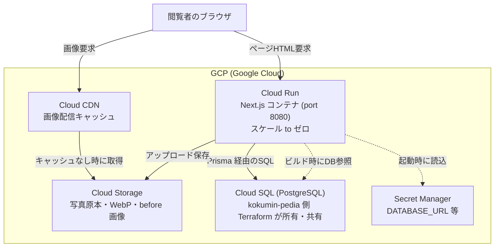
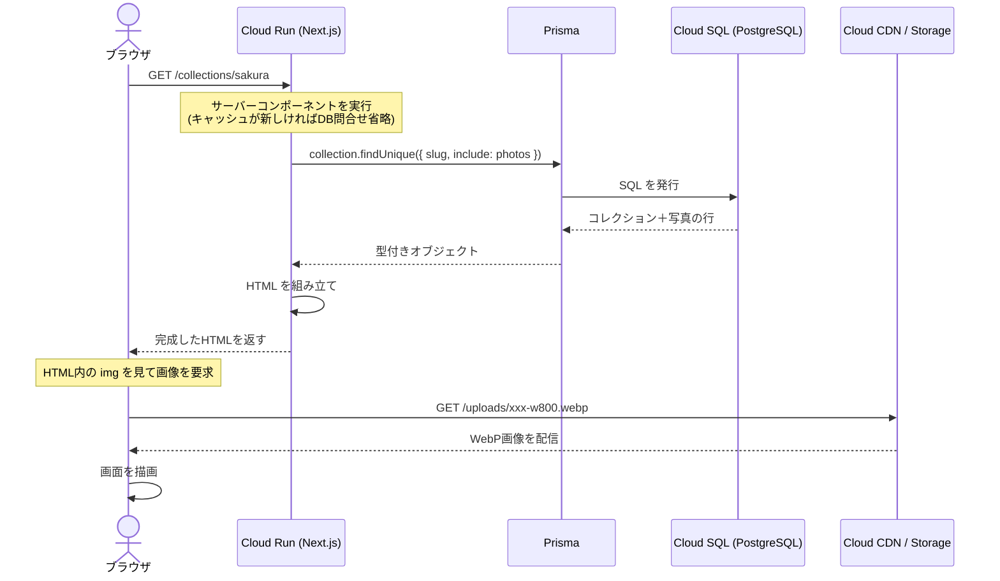
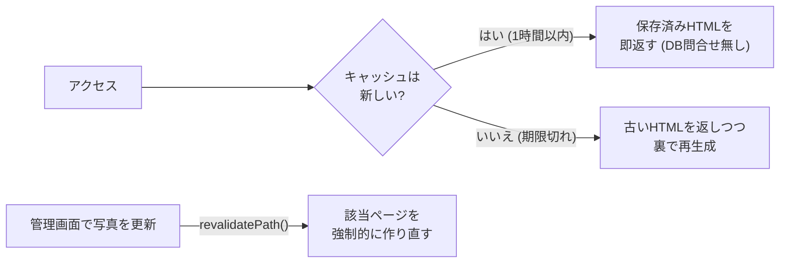
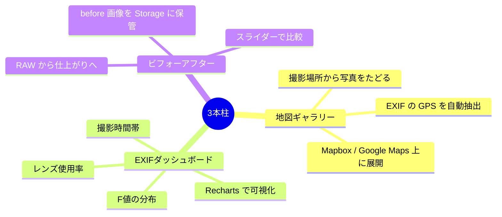

# 04. アーキテクチャ全体像ガイド

## このドキュメントの目的

kskphotos が「ブラウザでページを開いてから画面が表示されるまで」に、内部で何がどう動いているのかを解説します。クラウド（GCP）上のどの部品が、どの順番で、どんな役割を果たすのか。そして Next.js がページをいつ・どのように生成しているのか（レンダリング戦略）。

このドキュメントは「システム全体を一枚の地図として頭に入れる」ためのものです。個々の機能の中身（地図ギャラリーや EXIF 抽出の実装詳細）は、後続のドキュメントへ誘導します。

> 前提知識: [01. プロジェクト全体像ガイド](./01-project-overview.md)（何を作るか・技術スタック）と [02. GCP Terraform ガイド](./02-gcp-terraform.md)（インフラ構築）を先に読むと理解がスムーズです。

---

## 1. なぜこのサイトを作るのか（狙い）

kskphotos は、ひとつのサイトで3つの目的を同時に果たすことを狙っています。

| 目的 | 内容 |
|------|------|
| **写真ポートフォリオ** | 撮影した作品を見てもらう。サイトの「顔」 |
| **撮影依頼の商用サイト** | 出張撮影・ポートレートの依頼を受ける（家族写真・七五三・プロフィール・イベント等）。問い合わせ・予約まで完結させる |
| **技術ショーケース** | サイト自体が制作実績。Next.js + GCP + Terraform で作り込み、「Web 制作も IT サポートもできる」ことを証明する |

つまり「作品を見せる」「仕事を受ける」「技術力を示す」を1サイトに重ねています。そのため、ただ写真を並べるのではなく、他のフォトグラファーのサイトにはない**3本柱の差別化機能**（地図ギャラリー / EXIF ダッシュボード / ビフォーアフター。後述）を備えています。

商用サイトである以上、表示は速く・安定していて・運用コストは安い必要があります。この要求が、次に説明するアーキテクチャ（構成）の選択理由に直結しています。

---

## 2. システム構成図

まずは全体像です。ブラウザからリクエストが届いてから、データベースや画像にたどり着くまでの部品とデータの流れを示します。

各部品の役割をまとめます。すべて GCP（Google のクラウド）上にあります。

| 部品 | 役割 | ポイント |
|------|------|---------|
| **ブラウザ** | 閲覧者の端末 | ページ本体と画像を別々に取りに行く |
| **Cloud Run** | Next.js アプリを動かすコンテナ実行環境 | リクエストが来た時だけ起動。来ないときはゼロ台（=料金ゼロ） |
| **Cloud CDN** | 画像を世界各地のキャッシュから高速配信 | 一度配信した画像を貯めておき、2回目以降は速い |
| **Cloud Storage** | 写真ファイルの保管庫（バケット名 `kskphotos-photos`） | 原本・閲覧用 WebP・ビフォー画像を置く |
| **Cloud SQL** | PostgreSQL データベース | 写真のタイトルや EXIF などの「情報」を保存。姉妹サイト kokumin-pedia と共有 |
| **Secret Manager** | パスワードや接続文字列の金庫 | `DATABASE_URL` 等を安全に保管し、起動時に注入 |

> Cloud SQL の所有について: データベース本体は姉妹サイト kokumin-pedia 側の Terraform が作成・管理しています。kskphotos は Secret Manager に保存された `DATABASE_URL` を読み取って接続するだけです（詳細は [02. GCP Terraform ガイド](./02-gcp-terraform.md)）。

### 2-1. 「コンテナ」「スケール to ゼロ」とは

- **コンテナ**: アプリと、その動作に必要なもの（Node.js など）を一式まとめて箱詰めしたもの。どこに持っていっても同じように動きます。kskphotos では `app/Dockerfile` がこの箱の作り方の設計図です。`output: "standalone"`（`app/next.config.ts`）の指定により、実行に必要な最小限だけを箱に詰め、`node server.js` で `port 8080` を起動します。
- **スケール to ゼロ**: アクセスが無いときはコンテナの台数を**ゼロ**にして、課金も止める仕組み。個人サイトはアクセスが途切れる時間が長いので、これで月額を $0〜5 に抑えられます。代わりに、しばらくアクセスが無かった後の最初の1回だけ起動待ち（コールドスタート）が発生します。

### 2-2. データと画像で経路が分かれている理由

ページの「文章・構造（HTML）」と「画像」は別々に取得されます。

- **HTML** は Cloud Run（Next.js）が生成して返す。
- **画像** は Cloud CDN → Cloud Storage から配信される。画像は重く、何度も同じものが要求されるため、CDN にキャッシュさせて Cloud Run の負担とコストを下げます。

> なお Cloud CDN は現時点で構成上「保留」の段階です（コスト見積との乖離を理由に意図的に未適用）。CDN を経由しない場合は、後述の `/uploads` ルートが Cloud Storage の公開 URL へリダイレクトして画像を配信します。

---

## 3. リクエスト〜レンダリングのシーケンス

次に、実際に1ページを表示するときの「会話」を時系列で見ます。例として **コレクション詳細ページ `/collections/[slug]`**（`app/src/app/collections/[slug]/page.tsx`）を開く流れです。

ここで重要なのは、ページの中身を組み立てる処理が**サーバー側（Cloud Run の中）**で動く点です。Prisma を使ったデータベース問い合わせはブラウザではなくサーバーで実行され、ブラウザには完成した HTML だけが届きます。

ポイントを補足します。

1. ブラウザはまず HTML を Cloud Run に要求します。
2. Next.js のサーバーコンポーネントが Prisma 経由で Cloud SQL に問い合わせ、必要なデータ（コレクションとそれに紐づく公開写真）を取得します。これは `app/src/app/collections/[slug]/page.tsx` の `prisma.collection.findUnique(...)`（`include: { photos: ... }` で公開写真を同時取得）に対応します。
3. 取得データをはめ込んで HTML を完成させ、ブラウザへ返します。
4. ブラウザは届いた HTML の中の `` を見て、**改めて**画像を CDN / Storage に取りに行きます（経路が分かれている、の実例）。
5. 画像 URL は `next/image` のカスタムローダー（`app/src/lib/image-loader.ts`）によって、要求された表示幅に合った事前生成 WebP（例: `...-w800.webp`）へ自動的に書き換えられます。実行時に画像変換をしないので、Cloud Run の CPU を消費しません。

`/gallery`（`app/src/app/gallery/page.tsx`）も同じ骨格で、`prisma.photo.findMany({ where: { isPublished: true } })` で公開写真を全件取得し、`<PhotoGallery>` に渡してグリッド／地図ビューを描きます。

---

## 4. レンダリング戦略（いつページを作るか）

Next.js には「ページをいつ生成するか」の選択肢が複数あります。kskphotos が採用しているものを、初心者向けにかみ砕いて説明します。

### 4-1. App Router と React Server Components（RSC）

- **App Router**: `app/src/app/` 配下のフォルダ構成が、そのまま URL になる仕組み。`collections/[slug]/page.tsx` というファイルが `/collections/(任意の文字列)` という URL に対応します。`[slug]` の角カッコは「ここは可変」という意味です。
- **React Server Components（RSC）**: ページ部品を**サーバー側で実行**する React のしくみ。`async function` のコンポーネント内で直接 `await prisma....` と書けるのはこのためです（`app/src/app/page.tsx` などが該当）。データベース接続情報がブラウザに漏れず、ブラウザに送るコードも軽くなります。地図やグラフのように「ブラウザ側で動く必要がある」部品だけ、別途クライアントコンポーネント（`"use client"`）にします。

### 4-2. 静的生成 + ISR（revalidate）

毎回アクセスのたびにデータベースへ問い合わせると、表示が遅くなり、コストもかかります。そこで kskphotos の公開ページは **ISR（Incremental Static Regeneration / 増分的な静的再生成）** を使っています。

- 各ページに `export const revalidate = 3600;` を書いています（`app/src/app/page.tsx`、`gallery/page.tsx`、`collections/[slug]/page.tsx` など）。
- これは「一度作った HTML を**最大3600秒（1時間）キャッシュ**して使い回し、期限が切れたら裏側で作り直す」という意味です。ほとんどの閲覧者には、出来合いの速い HTML が返ります。

### 4-3. オンデマンド再検証（更新したらすぐ反映）

「1時間待たないと反映されない」では、写真を追加・編集したときに困ります。そこで**オンデマンド ISR** も併用しています。

`app/src/lib/revalidate.ts` の `revalidatePhotoPages()` が、管理画面での更新時に `revalidatePath("/")` などを呼び、トップ・`/gallery`・`/works`・`/dashboard`・コレクション系（`/collections` と `/collections/[slug]`）・該当写真の詳細（`/gallery/[id]`）／比較（`/gallery/[id]/compare`）ページを**まとめて作り直し**ます。これで「普段は1時間キャッシュで速い、でも更新したら即反映」を両立しています。

### 4-4. generateStaticParams（ビルド時に DB を見る）

`/collections/[slug]` のような可変 URL のページは、「どんな slug があるか」をあらかじめ知っておくと、ビルド時に全ページを先回りして作っておけます。これを担うのが `generateStaticParams()` です。

`app/src/app/collections/[slug]/page.tsx` では、ビルド時に `prisma.collection.findMany({ where: { isPublished: true }, select: { slug: true } })` を実行して公開コレクションの slug 一覧を取得し、その分だけページを静的生成します。

ここで一つ重要な含意があります。**ビルドの最中にデータベースへ接続が必要**ということです。そのため `app/Dockerfile` のビルド段階では `ARG DATABASE_URL` を受け取り、`npm run build` の前に環境変数として渡しています（コメントにも「ISR ページが generateStaticParams で DB を参照するため、ビルド時に DB 接続が必要」と明記）。

| 戦略 | 何をするか | 採用箇所の例 |
|------|-----------|-------------|
| RSC | サーバー側でデータ取得＋HTML生成 | 公開ページ全般 |
| ISR (`revalidate`) | HTMLを一定時間キャッシュ→裏で再生成 | `/`, `/gallery`, `/collections/[slug]` |
| オンデマンド再検証 | 更新時に該当ページを即作り直し | `revalidatePhotoPages()` |
| `generateStaticParams` | ビルド時にDBを見て可変URLを先に生成 | `/collections/[slug]` |

---

## 5. データベース接続と画像の扱い（仕組みの裏側）

### 5-1. Prisma で Cloud SQL につなぐ

データベース操作は **Prisma**（型安全な ORM。SQL を直接書かずに `prisma.photo.findMany()` のように呼べる道具）で行います。接続のセットアップは `app/src/lib/prisma.ts` にあり、`PrismaPg` アダプタに `process.env.DATABASE_URL`（= Secret Manager 由来の接続文字列）を渡してクライアントを作ります。開発中は接続を使い回す（ホットリロードで接続が増えすぎないよう `globalForPrisma` に保持する）工夫も入っています。

### 5-2. 画像の保存先は環境で切り替わる

画像の保存は `app/src/lib/storage.ts` が担当し、環境変数 `GCS_BUCKET_NAME` の有無で動きが変わります。

- **本番（GCS_BUCKET_NAME あり）**: Cloud Storage のバケットに保存。Cloud Run 上ではサービスアカウントによる自動認証（ADC）で書き込みます。長期キャッシュ（`max-age=31536000, immutable`）を付けて配信効率を上げています。
- **開発（なし）**: ローカルの `public/uploads` に保存。

保存先がどちらでも、アプリが扱う URL は `/uploads/<ファイル名>` に統一されています。本番では、イメージに焼き込まれた静的ファイル（`public/uploads`）が優先されます。ビルド後に管理画面からアップロードした画像（イメージに焼き込まれていない分）は、`app/src/app/uploads/[...path]/route.ts` が受け止め、`https://storage.googleapis.com/<bucket>/uploads/...` へ 302 リダイレクトして配信します。

> 補足: Cloud Run のコンテナ本体は使い捨て（リクエストごとに作り直される可能性がある）なので、コンテナのローカル FS に書いたファイルは残りません。だからこそ本番では保存先を Cloud Storage（GCS）に寄せており、管理画面からのアップロード・削除は GCS 上で永続化されます。RAW（ARW）など大きなファイルを扱うため、`app/next.config.ts` で Server Actions のサイズ上限を `200mb` に引き上げています。

---

## 6. 3本柱（差別化機能）の仕組み概観

このサイトの「売り」である3つの機能が、上記アーキテクチャの上でどう成り立つかを概観します。詳細は後続ドキュメントに譲ります。

| 機能 | ざっくりした仕組み | 関連ページ |
|------|-------------------|-----------|
| **地図ギャラリー** | 写真をアップロードしたとき `exifr` で EXIF（撮影情報）から GPS 座標を取り出し DB に保存。それを地図上にピン表示する | `/gallery`（地図ビュー） |
| **EXIF ダッシュボード** | DB に貯めた EXIF を集計（レンズ別件数・F値分布・時間帯など）し、`Recharts` でグラフ化。サーバー側で集計してから描画 | `/dashboard` |
| **ビフォーアフター** | RAW から現像した「仕上がり」と「素」の2枚を用意し、スライダーで重ねて比較。画像は Cloud Storage に保管 | `/gallery/[id]/compare` |

これら3機能は共通して、「サーバー側（RSC）で Prisma が Cloud SQL からデータを取り、HTML を組み立てて返す。画像は Storage / CDN から配信する」という本ドキュメントの基本フローに乗っています。地図やグラフのように操作が必要な部分だけがブラウザ側で動きます。

- 地図ギャラリー・EXIF 抽出の詳細 → ギャラリー機能ガイド（後続予定）
- EXIF ダッシュボード・ビフォーアフターの詳細 → ダッシュボード／比較ガイド（後続予定）

---

## 7. まとめ

- kskphotos は「作品を見せる・仕事を受ける・技術を示す」を1サイトに重ねた商用ポートフォリオです。
- インフラは **Cloud Run（スケール to ゼロ）+ Cloud SQL + Cloud Storage（+ CDN）** で、低コストかつ速い表示を狙っています。
- ページは **App Router + RSC** でサーバー側に組み立て、**ISR（revalidate）+ オンデマンド再検証**で「普段は速く・更新は即反映」を両立。可変 URL は **generateStaticParams** でビルド時に先回り生成（そのためビルド時に DB 接続が必要）。
- データは **Prisma 経由で Cloud SQL**、画像は **環境で切り替わる Storage 配信**。HTML と画像は別経路で取得されます。

次のステップとして、3本柱の中身は後続のギャラリー機能ガイドで詳しく見ていきます。

---

## 関連ドキュメント

- [01. プロジェクト全体像ガイド](./01-project-overview.md) — 何を作るか・技術スタック・ページ構成
- [02. GCP Terraform ガイド](./02-gcp-terraform.md) — インフラの構築方法・モジュール構成
