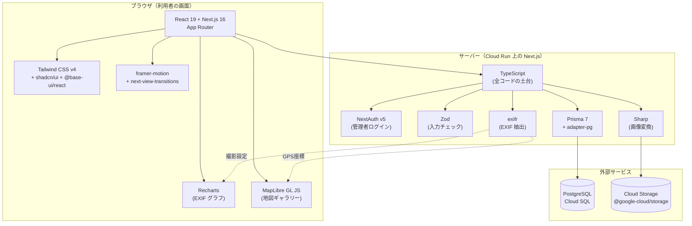
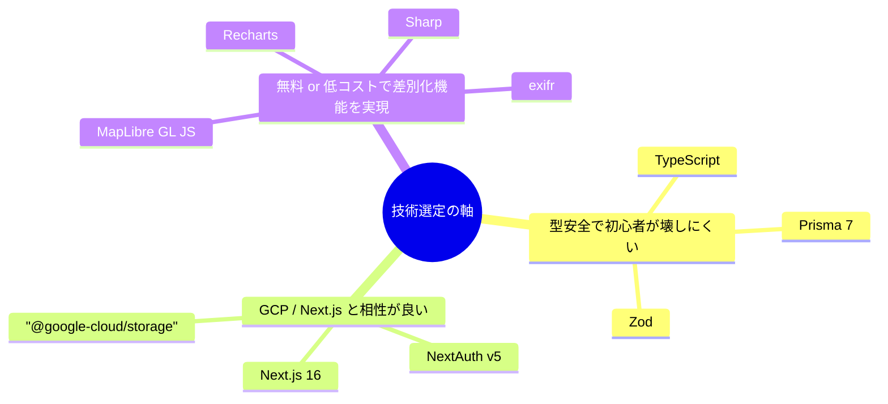

# 05. 技術スタックと採用理由

## このドキュメントの目的

kskphotos がどんな技術（ライブラリ・フレームワーク）で作られているか、そして**なぜその技術を選んだのか**を、プログラミング初心者の方でも読めるように解説します。

採用技術の一つひとつを次の3点セットで説明します。

1. **これは何？** — どんな道具なのかをかみ砕いて
2. **なぜ採用したか** — このサイトのどの機能・要件に効くのか
3. **代替案と比較** — 他の選択肢ではなく、なぜこれを選んだのか

すべての記述は、実際のソースコード（`app/` ディレクトリ）と依存定義（`app/package.json`）を確認したうえで書いています。「使っていると書いてあるが実は使っていない」ということがないよう、各技術の**実際の使用箇所（ファイル名）**を併記します。

> 補足: ここでの「依存（dependency）」とは、自分で書かずに借りてくる**外部の部品（ライブラリ）**のことです。`package.json` というファイルに「どの部品をどのバージョンで使うか」が一覧で書かれています。

---

## 1. 全体像 — 技術同士の関係

まず、どの技術がどの役割を担い、どうつながっているのかを俯瞰します。

ざっくり言うと、**TypeScript** を共通言語に、**Next.js 16 + React 19** が画面とサーバー処理の骨格を担い、**Prisma** が PostgreSQL とのやり取りを、**Sharp / exifr** が写真の処理を、**Recharts / MapLibre** が「差別化機能」（EXIF ダッシュボードと地図ギャラリー）の見た目を担当しています。

---

## 2. バージョン早見表

`app/package.json` の記載と一致させた一覧です（執筆時点）。

| 技術 | バージョン | 区分 | 主な使用箇所 |
|------|-----------|------|-------------|
| Next.js | 16.2.9 | フレームワーク | `src/app/`（全ページ） |
| React / React DOM | 19.2.4 | UI ライブラリ | 全コンポーネント |
| TypeScript | ^5 | 言語 | 全 `.ts` / `.tsx` |
| prisma / @prisma/client | ^7.8.0 | ORM | `src/lib/prisma.ts` |
| @prisma/adapter-pg | ^7.8.0 | DB アダプタ | `src/lib/prisma.ts` |
| @auth/prisma-adapter | ^2.11.2 | 認証用 DB 連携 | `src/lib/auth.ts` |
| Tailwind CSS | ^4 | CSS | `src/app/globals.css` |
| shadcn | ^4.11.0 | UI 部品生成 | `src/components/ui/` |
| @base-ui/react | ^1.5.0 | UI プリミティブ | `src/components/ui/button.tsx` ほか |
| Recharts | ^3.8.1 | グラフ | `src/components/dashboard/exif-charts.tsx` |
| maplibre-gl | ^5.24.0 | 地図 | `src/components/gallery/photo-map.tsx` |
| exifr | ^7.1.3 | EXIF 抽出 | `src/lib/exif.ts` |
| sharp | ^0.34.5 | 画像処理 | `src/lib/images.ts` |
| next-auth | ^5.0.0-beta.31 | 認証 | `src/lib/auth.ts` |
| zod | ^4.4.3 | バリデーション | `src/app/admin/photos/actions.ts` |
| framer-motion | ^12.40.0 | アニメーション | `src/components/motion-provider.tsx` ほか |
| next-view-transitions | ^0.3.5 | 画面遷移演出 | `src/app/layout.tsx` |
| @google-cloud/storage | ^7.21.0 | クラウド保存 | `src/lib/storage.ts` |
| lucide-react | ^1.17.0 | アイコン | `src/components/gallery/photo-map.tsx` ほか |

> バージョン表記の `^`（キャレット）は「この番号以上で、メジャー番号は上げない範囲なら更新OK」という意味です。例えば `^7.8.0` は 7.x の新しい修正版は受け入れるが、8.0.0 には自動で上がらない、という指定です。Next.js（`16.2.9`）と React（`19.2.4`）は `^` の付かない**固定指定**で、勝手にバージョンが動かないようにしています。

---

## 3. 言語とフレームワーク

### TypeScript — すべての土台

**これは何？**
JavaScript に「型（type）」という安全装置を足した言語です。型とは「この変数には数値が入る」「この関数は文字列を返す」といった**データの種類のラベル**で、書いている途中に種類の取り違えをエディタが指摘してくれます。

**なぜ採用したか**
このサイトは初心者本人がメンテナンスするため、「実行する前に間違いに気づける」ことが重要です。例えば `src/lib/exif.ts` では、抽出した EXIF を `ExtractedExif` という型（`cameraModel: string | null` など）で定義しています。`| null`（値がない場合もある）まで型で明示するので、「値が無いケースの考慮漏れ」をコンパイル時に防げます。

**代替案と比較**

| 選択肢 | 比較 |
|--------|------|
| 素の JavaScript | 手早く書けるが、タイプミスや「無いはずの値」を実行時まで気づけない |
| **TypeScript（採用）** | 書く量は増えるが、Next.js も Prisma も型を前提に作られており相性が良い |

---

### Next.js 16（App Router） — Web フレームワーク

**これは何？**
React を使った Web サイトを「ページ単位」で作るための土台（フレームワーク）です。**App Router** は Next.js の比較的新しいルーティング方式で、`src/app/` フォルダの**フォルダ構成がそのまま URL になる**のが特徴です（例: `src/app/gallery/page.tsx` → `/gallery`）。

**なぜ採用したか**
このサイトは「写真を見せる公開ページ」と「写真を登録する管理ページ」の両方を持ち、サーバー側で写真や EXIF をデータベースから取り出して描画する必要があります。Next.js はサーバー側処理（Server Components やサーバーアクション）とブラウザ側の動き（`"use client"` を付けたコンポーネント）を一つの仕組みで扱えます。実際 `src/app/layout.tsx` がサイト全体の枠（ヘッダー・フッター・フォント設定）を担う**ルートレイアウト**として機能しています。

> 用語: **Server Components** はサーバー側だけで実行され HTML を生成する部品、**サーバーアクション**はフォーム送信などをサーバー側の関数で受け取る仕組み（`"use server"` を付けて定義。例: `src/app/admin/photos/actions.ts`）です。

**代替案と比較**

| 選択肢 | 比較 |
|--------|------|
| Create React App など純粋な SPA | サーバー描画やルーティングを自前で組む必要があり、SEO（検索エンジン対策）にも弱い |
| Astro / SvelteKit | 静的サイトには良いが、本プロジェクトの React + Prisma 連携の実例・情報量で Next.js が有利 |
| **Next.js 16（採用）** | Cloud Run の「スケール to ゼロ（使われない時はコンテナを止める）」とも相性がよく、姉妹サイトとも技術を揃えられる |

### React 19 — UI を組み立てる部品システム

**これは何？**
画面を「コンポーネント」という小さな部品の組み合わせで作るライブラリです。ボタン1個、カード1枚を部品として定義し、組み合わせてページを作ります。

**なぜ採用したか**
Next.js が React を前提にしているため必然の採用ですが、地図やグラフのような「データに応じて見た目が変わる」UI を宣言的に書けるのが効きます。例えば `src/components/gallery/photo-map.tsx` では、`useRef` / `useEffect` という React の仕組みを使って地図の生成と後片付け（クリーンアップ）を管理しています。

**代替案と比較**

| 選択肢 | 比較 |
|--------|------|
| Vue / Svelte | いずれも良い選択肢だが、Next.js・shadcn/ui・Recharts など本プロジェクトの周辺部品が React 前提 |
| **React 19（採用）** | エコシステムが最大で、採用市場でも需要が高く技術ショーケースとして価値がある |

---

## 4. データベース層

### Prisma 7 + PostgreSQL + @prisma/adapter-pg

**これは何？**

- **PostgreSQL（ポストグレス）** … データを表形式でしっかり保存する定番のデータベース。写真情報・予約・ブログ記事などを保管します。
- **Prisma** … プログラムから PostgreSQL を**型安全に**操作する道具（ORM = Object-Relational Mapping）。SQL を直接書かず、`prisma.user.findUnique(...)` のような JavaScript の関数でデータを読み書きできます。
- **@prisma/adapter-pg** … Prisma を `pg`（PostgreSQL 用の接続ドライバ）経由でつなぐための**アダプタ（変換コネクタ）**。

**なぜ採用したか**
`src/lib/prisma.ts` を見ると、`new PrismaPg({ connectionString: process.env.DATABASE_URL })` で作ったアダプタを `new PrismaClient({ adapter })` に渡しています（`PrismaClient` 自体は `@/generated/prisma/client` という、Prisma が自動生成する型付きクライアントから読み込んでいます）。Prisma 7 系では、この**ドライバアダプタ方式**を使うことで、接続方法を明示的にコントロールできます。さらに同ファイルでは、開発中に接続が無限に増えないよう `globalForPrisma` にクライアントを**使い回す**工夫（本番では使い回さない）も入っています。

実際の認証処理 `src/lib/auth.ts` でも `prisma.user.findUnique({ where: { email } })` のように、型補完が効いた形でデータベースを操作しています。

**代替案と比較**

| 選択肢 | 比較 |
|--------|------|
| 生の SQL を手書き | 自由だが、タイプミスや型の食い違いが実行時まで分からない |
| TypeORM / Drizzle | 有力な競合。Drizzle は軽量だが、Prisma はスキーマ定義から型とマイグレーションを自動生成でき初心者に優しい |
| **Prisma 7 + adapter-pg（採用）** | 型安全・自動生成・ドキュメントの豊富さで初心者の学習コストが低い |

> なお PostgreSQL は姉妹サイト kokumin-pedia と Cloud SQL を**共有**しています（CLAUDE.md 記載）。コスト面でこの構成が効いています。

---

## 5. 認証と入力チェック

### NextAuth v5（next-auth） — 管理者ログイン

**これは何？**
「誰がログインしているか」を扱う認証ライブラリです。Google ログインなどの面倒な処理を肩代わりしてくれます。

**なぜ採用したか**
このサイトでは、写真を登録・編集できる**管理画面（`/admin`）**だけを保護したいという要件があります。`src/lib/auth.config.ts` の `authorized` コールバックで、URL が `/admin` で始まりかつ未ログインならアクセスを拒否する、という1か所のルールでガードしています。本番では Google ログイン（`src/lib/auth.config.ts` の `providers: [Google]`）を使い、`src/lib/auth.ts` では開発時やフラグ（`ALLOW_EMAIL_SIGNIN=true`）有効時のみ、メールアドレスでの簡易ログイン（Credentials プロバイダ）を追加で許す、という安全側の切り替えも実装されています。ログイン情報の保管には **Prisma アダプタ**（`@auth/prisma-adapter` の `PrismaAdapter`）を使い、データベースと連携しています。

**代替案と比較**

| 選択肢 | 比較 |
|--------|------|
| 認証を自前実装 | パスワード保管やセッション管理に高いセキュリティ知識が必要でリスクが大きい |
| Auth0 / Clerk（外部 SaaS） | 高機能だが課金が発生し、個人サイトには過剰 |
| **NextAuth v5（採用）** | Next.js 専用に作られ、Google ログインを数行で導入でき無料 |

### Zod — 入力データのチェック（バリデーション）

**これは何？**
「送られてきたデータが期待どおりの形か」を検査する道具です。ルールを定義しておくと、合致しないデータを弾いてくれます。

**なぜ採用したか**
管理画面のフォームから来たデータをそのままデータベースに入れると、空のタイトルや長すぎる文章が混入する恐れがあります。`src/app/admin/photos/actions.ts` では `z.object({ title: z.string().trim().min(1, "タイトルは必須です").max(200), ... })` のようにルールを定義し、`safeParse` で安全に検証してから保存しています。エラーメッセージを日本語で指定できるのも利点です。

**代替案と比較**

| 選択肢 | 比較 |
|--------|------|
| 手書きの `if` 文で検証 | ルールが増えると煩雑で抜け漏れが出やすい |
| Yup / Valibot | 競合だが、Zod は TypeScript の型を**スキーマから自動で割り出せる**（`z.infer`）点が強い |
| **Zod（採用）** | 1つの定義から「実行時チェック」と「型」の両方が得られ二重管理が不要 |

---

## 6. 写真処理（このサイトの心臓部）

### exifr — EXIF メタデータの自動抽出

**これは何？**
写真ファイルに埋め込まれた **EXIF**（撮影時の情報: カメラ・レンズ・絞り・GPS 座標など）を読み取るライブラリです。

**なぜ採用したか**
本サイトの差別化機能「地図ギャラリー」と「EXIF ダッシュボード」は、写真から自動で情報を取り出せることが前提です。`src/lib/exif.ts` の `extractExif` で `exifr.parse(buffer, { tiff: true, exif: true, gps: true, ... })` を呼び、カメラ・レンズ名・焦点距離・絞り・ISO、そして**緯度経度（latitude / longitude）**まで取り出しています。必要なセグメントだけを `true` にし、`makerNote` などは `false` にして無駄な読み取りを省く調整も施されています。さらに RAW（ARW など）ファイルからプレビュー JPEG を取り出す `extractPreviewJpeg` もこのファイルにあり、まずファイル内の最大 JPEG を直接走査し、見つからなければ `exifr.thumbnail` で取り出す、という二段構えになっています。

**代替案と比較**

| 選択肢 | 比較 |
|--------|------|
| exiftool（外部コマンド） | 高機能だが別途インストールが必要で、サーバー環境への依存が増える |
| exif-parser など | 機能が限定的で GPS や RAW プレビューに弱い |
| **exifr（採用）** | 純 JavaScript で動き、GPS 抽出と読み取り範囲の細かな制御ができる |

### Sharp — 画像のリサイズ・変換

**これは何？**
画像を高速にリサイズ・圧縮・形式変換する定番ライブラリです。内部で C 言語の高速な画像エンジン（libvips）を使っています。

**なぜ採用したか**
α7R IV の写真は非常に高解像度（約6100万画素）なので、そのまま配信すると重すぎます。`src/lib/images.ts` の `processImage` では Sharp を使い、アップロード時に一気に複数の成果物を**事前生成**しています。

- `.rotate()` で EXIF の向き情報を物理的な回転に反映
- フルサイズ JPEG（最大 2560px、`mozjpeg` で高圧縮）
- 配信用の WebP バリアント4種（400 / 800 / 1600 / 2560px）
- 読み込み中に表示する極小のぼかしプレースホルダー（`blurDataUrl`、横16pxの WebP）

こうして実行時の画像最適化を不要にし、表示を高速化しています。

**代替案と比較**

| 選択肢 | 比較 |
|--------|------|
| jimp（純 JS） | インストールは楽だが速度が遅く、大量・高解像度処理に不向き |
| ImageMagick（外部コマンド） | 強力だが別途インストールと運用が必要 |
| **Sharp（採用）** | Node.js から直接呼べて速く、WebP 出力にも対応 |

### @google-cloud/storage — 写真の保存先（GCS）

**これは何？**
Google Cloud Storage（GCS）という**クラウド上のファイル置き場**を操作するライブラリです。

**なぜ採用したか**
Cloud Run のコンテナはリクエストごとに使い捨てられるため、写真をコンテナ内に保存しても消えてしまいます。そこで `src/lib/storage.ts` の `saveFile` は、環境変数 `GCS_BUCKET_NAME` があれば GCS へ、なければローカルのファイルに保存する、と**本番と開発で保存先を自動で切り替え**ています。GCS 保存時には `cacheControl: "public, max-age=31536000, immutable"` を付け、ブラウザ・CDN に1年間キャッシュさせて配信を高速化しています。認証は Cloud Run 上では ADC（サービスアカウントによる自動認証）で行われます。

**代替案と比較**

| 選択肢 | 比較 |
|--------|------|
| AWS S3 | 定番だが、本プロジェクトはインフラを GCP に統一している |
| コンテナ内 / DB に保存 | 使い捨てコンテナでは消える、または DB を肥大化させる |
| **@google-cloud/storage（採用）** | GCP 公式で Cloud Run の認証（ADC）と自然に連携 |

---

## 7. 見た目とインタラクション

### Tailwind CSS v4 + shadcn/ui + @base-ui/react

**これは何？**

- **Tailwind CSS v4** … `class="flex gap-4"` のように、HTML のクラス名で直接スタイルを書く方式（ユーティリティファースト）の CSS フレームワーク。
- **shadcn/ui** … 出来合いの UI 部品（ボタン・カード等）の**コードを自分のプロジェクトにコピーして使う**仕組み。`src/components/ui/` がそれです。
- **@base-ui/react** … その部品の「中身の挙動」（開閉やキーボード操作など）を担う、見た目を持たない土台（プリミティブ）。

**なぜ採用したか**
`src/app/globals.css` は冒頭で `@import "tailwindcss"` / `@import "tw-animate-css"` / `@import "shadcn/tailwind.css"` を読み込んでおり、この土台の上に成り立っています。例えば `src/components/ui/button.tsx` は `@base-ui/react/button` の `Button` を土台に、`class-variance-authority`（後述）でスタイルのバリエーション（`default` / `outline` / `ghost` など）を定義しています。**部品が自分のコードとして手元にある**ため、サイト独自のトーン（モノクロ基調など）に自由に作り替えられます。

> 補助役として、クラス名の重複を賢く結合する `clsx` + `tailwind-merge`（`src/lib/utils.ts` の `cn` 関数）、見た目のパターン定義に `class-variance-authority`、アニメーション用に `tw-animate-css`、アイコンに `lucide-react` を併用しています。

**代替案と比較**

| 選択肢 | 比較 |
|--------|------|
| 従来の CSS / Sass | クラス設計の自由度は高いが、命名や肥大化の管理が大変 |
| Material UI / Chakra UI | すぐ使えるが、デザインを大きく変えにくく独自トーンを出しづらい |
| **Tailwind + shadcn/ui（採用）** | 部品が手元コードなので自由に改変でき、デザインの差別化に向く |

### Recharts — EXIF ダッシュボードのグラフ

**これは何？**
React 用のグラフ描画ライブラリです。棒グラフ・円グラフ・散布図などを React の部品として書けます。

**なぜ採用したか**
差別化機能の一つ「EXIF ダッシュボード」を実現する中核です。`src/components/dashboard/exif-charts.tsx` では Recharts を使い、

- レンズ使用率（横棒グラフ `BarChart`、`layout="vertical"`）
- カテゴリー比率（円グラフ `PieChart`）
- 焦点距離 × 絞りの分布（散布図 `ScatterChart`）
- ISO 感度の分布（棒グラフ `BarChart`）

を描いています。`ResponsiveContainer` で画面幅に自動追従し、色は CSS 変数（`var(--chart-1)` など）でサイトのトーンに合わせています。

**代替案と比較**

| 選択肢 | 比較 |
|--------|------|
| Chart.js | 高機能だが React 以外の流儀で、React への統合に一手間かかる |
| D3.js | 最強の自由度だが学習コストが非常に高い |
| **Recharts（採用）** | React の部品として宣言的に書け、初心者でも扱いやすい |

### MapLibre GL JS（maplibre-gl） — 地図ギャラリー

**これは何？**
ブラウザ上にインタラクティブな地図を表示するオープンソースのライブラリです（有料の Mapbox GL JS から派生した無料版）。

**なぜ採用したか**
差別化機能「地図ギャラリー」の中核です。`src/components/gallery/photo-map.tsx` で、exifr が抽出した GPS 座標（緯度経度）を持つ写真だけを地図上にピン表示します。地図タイルには無料の **CARTO Dark Matter**（ダークテーマのラスタータイル）を使い、各ピンを写真サムネイル入りのカスタムマーカーにし、クリックで写真の詳細ページ（`/gallery/{id}`）へ飛ぶようにしています。複数の写真が収まるよう `fitBounds` で表示範囲も自動調整します。

> 注: CLAUDE.md や `01-project-overview.md` には「Mapbox / Google Maps」と書かれていますが、実装は無料の **MapLibre GL JS** に決まっています。本ドキュメントが現状の正です。

**代替案と比較**

| 選択肢 | 比較 |
|--------|------|
| Google Maps | 高機能だが API キーと従量課金が必要 |
| Mapbox GL JS | 高品質だが利用量で課金が発生する |
| **MapLibre GL JS（採用）** | Mapbox 互換の API を無料で使え、無料タイルと組み合わせれば運用コストゼロ |

### framer-motion / next-view-transitions — 動きの演出

**これは何？**

- **framer-motion** … React 要素にアニメーション（フェードイン、スクロール連動など）を簡単に付けるライブラリ。
- **next-view-transitions** … ページ間を移動するときに、ブラウザ標準の「View Transitions」を使ってなめらかに切り替える Next.js 向けライブラリ。

**なぜ採用したか**
このサイトは「技術ショーケース」でもあるため、上質な動きで印象を高めたい狙いがあります。`src/app/layout.tsx` でサイト全体を `<ViewTransitions>` で包み、ページ遷移を滑らかにしています。framer-motion はヒーローのスクロール演出（`src/components/home/hero-section.tsx`）や数値カウントアップ（`src/components/count-up.tsx`）などで使用。重要なのは `src/components/motion-provider.tsx` で、framer-motion の `<MotionConfig reducedMotion="user">` を全体に適用し、OS の「視差効果を減らす」設定を尊重して**アクセシビリティに配慮**している点です。

**代替案と比較**

| 選択肢 | 比較 |
|--------|------|
| 素の CSS アニメーション | 単純なものには十分だが、スクロール連動や状態変化の制御は煩雑 |
| GSAP | 強力だが React との統合に手間がかかる |
| **framer-motion + next-view-transitions（採用）** | React に馴染み、宣言的に書け、アクセシビリティ対応もしやすい |

---

## 8. まとめ — 選定の軸

本プロジェクトの技術選定には、一貫した3つの軸があります。

- **型安全で壊しにくい** … 初心者本人が一人でメンテナンスするため、実行前に間違いに気づける TypeScript / Prisma / Zod を土台に。
- **GCP・Next.js と相性が良い** … インフラを GCP に統一し、姉妹サイトとも技術を揃えてコストと学習を効率化。
- **低コストで差別化機能を実現** … 地図・グラフ・EXIF・画像処理を、課金の発生しない無料ライブラリ（MapLibre / Recharts / exifr / Sharp）で実装。

「採用担当者へのショーケース」としては、地図・データ可視化・画像最適化・認証・型安全な DB アクセスという、実務で頻出するテーマを一通りカバーしている点が見どころです。
