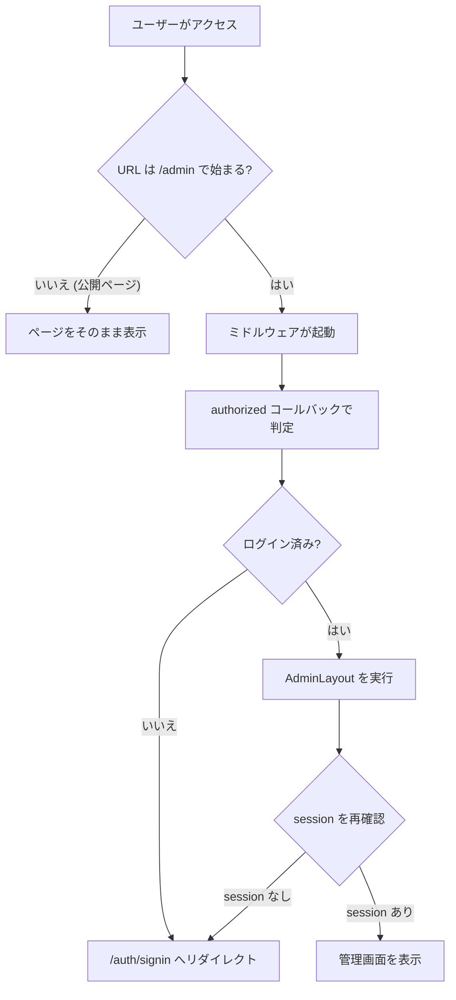
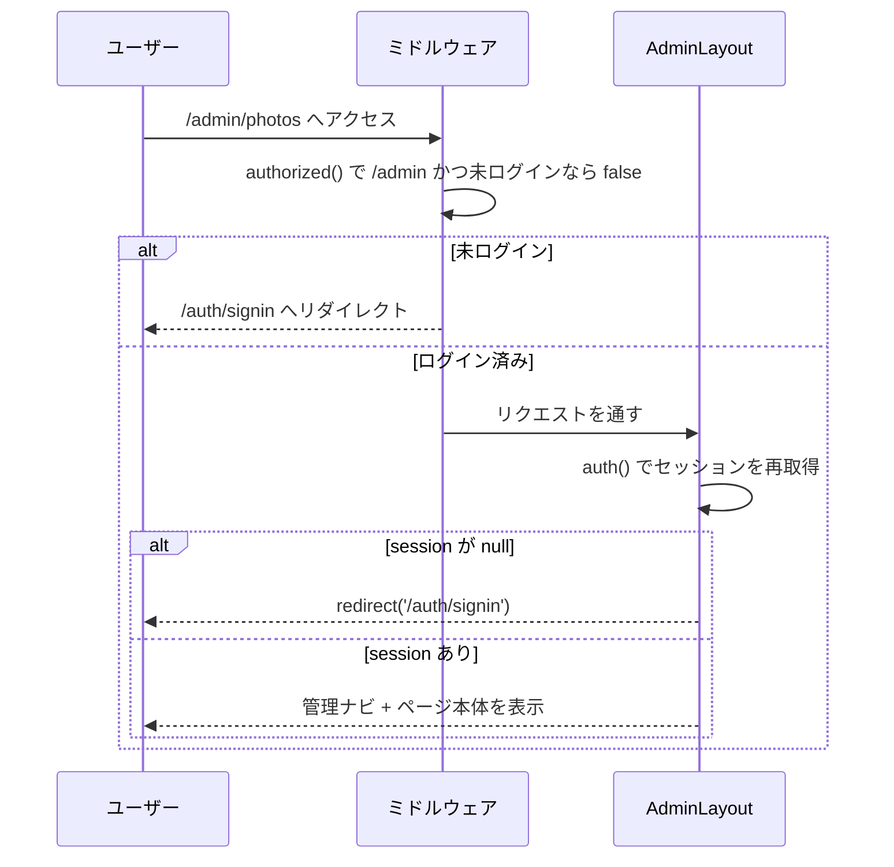
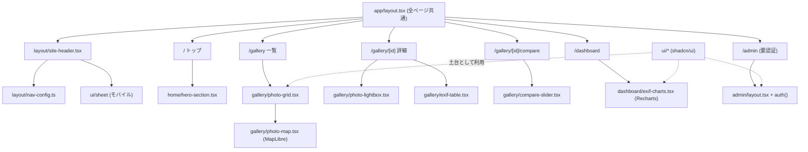

# 06. ミドルウェアとコンポーネント設計

## このドキュメントの目的

このサイトには2つの「縁の下の力持ち」があります。1つは **ミドルウェア** — すべてのリクエストの入口に立ち、管理画面へのアクセスを見張る門番です。もう1つは **コンポーネント** — 地図・グラフ・ビフォーアフタースライダーといった画面パーツの実体です。

このドキュメントでは、

- ミドルウェア (`app/src/middleware.ts`) が何をしているのか
- NextAuth.js による認証の仕組みと、ミドルウェアとの関係
- ギャラリー・ダッシュボード・ヘッダーなど主要コンポーネントの「役割」と「なぜそう作ったか」

を、実際のコードに沿って解説します。専門用語は初めて出てきたときにかみ砕いて説明します。

---

## 1. ミドルウェアとは何か

**ミドルウェア (middleware)** とは、ユーザーがどのページにアクセスしても、そのページ本体が表示される**前**に必ず1回実行される処理のことです。日本語にすると「中間処理」。たとえるなら、ビルのすべての来訪者がエレベーターに乗る前に通る**受付カウンター**です。

Next.js では、`app/src/middleware.ts` という決まった名前のファイルを置くと、Next.js が自動的にそれを「受付」として扱ってくれます。ここで以下のようなことができます。

- アクセスを許可するか、別ページへ**リダイレクト**（転送）するか判断する
- ログインしているかどうかをチェックする（**認証ガード**）

このサイトのミドルウェアは、まさに**管理画面 (`/admin`) の認証ガード**として使われています。

### 実際のコード

`app/src/middleware.ts` は、たった数行です。

```ts
import NextAuth from "next-auth";
import { authConfig } from "@/lib/auth.config";

export default NextAuth(authConfig).auth;

export const config = {
  matcher: ["/admin/:path*"],
};
```

ポイントは2つです。

| 行 | 意味 |
|----|------|
| `export default NextAuth(authConfig).auth` | 認証設定 (`authConfig`) を読み込み、NextAuth が用意した「ログイン状態をチェックする関数」をミドルウェア本体として使う |
| `matcher: ["/admin/:path*"]` | このミドルウェアを動かす対象を `/admin` 以下の全ページに限定する |

**matcher（マッチャー）** とは「どの URL のときに受付を働かせるか」を指定する設定です。`/admin/:path*` は「`/admin` で始まるすべてのページ」という意味のパターンです。つまりギャラリーやブログなどの公開ページではミドルウェアは動かず、管理画面に入ろうとしたときだけ門番が立ちます。公開ページに余計なチェックを挟まないことで、表示が速く保たれます。

---

## 2. NextAuth による認証の仕組み

このサイトの認証（ログインの仕組み）は **NextAuth.js v5**（パッケージ名 `next-auth`、`package.json` では `^5.0.0-beta.31`）で作られています。NextAuth は「Google でログイン」などのログイン機能をまとめて提供してくれるライブラリです。

認証まわりのコードは、役割の違いで2つのファイルに分かれています。これは**意図的な分割**で、理由は後述します。

| ファイル | 役割 |
|---------|------|
| `app/src/lib/auth.config.ts` | 認証の「基本ルール」。ミドルウェアでも使える軽量な設定 |
| `app/src/lib/auth.ts` | 上の設定に DB 接続などを足した「フル機能」の設定 |

### 2-1. auth.config.ts — 軽量な基本ルール

`auth.config.ts` には、ログイン方法とアクセス判定のルールが書かれています。

```ts
export const authConfig = {
  providers: [Google],
  session: { strategy: "jwt" },
  pages: {
    signIn: "/auth/signin",
  },
  callbacks: {
    async authorized({ auth, request }) {
      const isAdmin = request.nextUrl.pathname.startsWith("/admin");
      if (isAdmin && !auth) return false;
      return true;
    },
    // ...signIn / jwt / session コールバック
  },
} satisfies NextAuthConfig;
```

ここで使われている用語を整理します。

- **providers（プロバイダ）**: ログインの手段。ここでは `Google`（Google アカウントでログイン）を採用。
- **session.strategy = "jwt"**: ログイン状態を **JWT（ジェイ・ダブリュー・ティー）** という署名付きの文字列でブラウザの Cookie に持たせる方式。サーバー側でセッション情報を DB に保存しない分、動作が軽く、Cloud Run のように「使われない時はゼロまで縮む」環境と相性が良い設計です。
- **pages.signIn = "/auth/signin"**: 未ログインの人を送り込むログインページの場所。
- **callbacks（コールバック）**: 認証の途中でこちらの処理を差し込むための関数群。

特に重要なのが `authorized` コールバックです。これは**ミドルウェアから呼ばれる関数**で、「このリクエストを通してよいか」を判定します。中身は「アクセス先が `/admin` で、かつログインしていない (`!auth`) なら拒否 (`return false`)」というシンプルなルールです。拒否されると NextAuth が自動的に `pages.signIn` で指定したログインページへ転送します。

残りのコールバックの役割は次のとおりです。

| コールバック | 役割 |
|------------|------|
| `signIn` | ログイン試行時に、`ADMIN_EMAIL` が設定されていればログイン者のメールがそれと一致するか確認。一致しなければログイン拒否（＝オーナー本人だけ管理画面に入れる）。`ADMIN_EMAIL` 未設定なら誰でも許可（`return true`） |
| `jwt` | ログイン成功時にトークンへ `role: "ADMIN"` を埋め込む |
| `session` | トークンの情報をアプリ側で使う `session` オブジェクトへ写し、`user.id`（`token.sub`）と `role` を持たせる |

> 補足: `signIn` コールバックは `ADMIN_EMAIL` が「未設定なら全員通す」挙動です。本番では必ず `ADMIN_EMAIL` を設定して、オーナー以外を弾くようにします。

### 2-2. auth.ts — DB 接続を足したフル設定

`auth.ts` は、`auth.config.ts` の内容を取り込んだうえで、データベース連携を追加します。

```ts
export const { handlers, auth, signIn, signOut } = NextAuth({
  ...authConfig,
  adapter: PrismaAdapter(prisma),
  providers: [
    ...authConfig.providers,
    ...(emailSignInEnabled ? [ Credentials({ /* ... */ }) ] : []),
  ],
});
```

- **adapter: PrismaAdapter(prisma)**: ユーザー情報を Prisma 経由で PostgreSQL に保存・参照するための接続。
- **Credentials プロバイダ（条件付き）**: Google ログインの一時的な代替として、メールアドレスだけで入れるログイン手段。ただし無条件ではありません。`auth.ts` 冒頭の `emailSignInEnabled` が `true` のとき（開発環境、または本番で `ALLOW_EMAIL_SIGNIN=true` のとき）だけ有効になります。さらに `ADMIN_EMAIL` と一致しないメールは弾かれます（本番で `ADMIN_EMAIL` 未設定なら拒否、開発時のみ任意メールを許可）。コード内のコメントにも「パスワードなしのため、不要になったら環境変数を false に戻すこと」と注意書きがあります。

`auth.ts` が `export` する `auth` / `signIn` / `signOut` は、ページやレイアウトから呼び出して使います（後述の管理画面レイアウトで登場）。

### 2-3. なぜ設定ファイルを2つに分けるのか

ミドルウェアは **Edge ランタイム** という特殊な軽量環境で動くことがあり、ここでは Prisma（DB 接続）のような重いライブラリを直接使えません。そこで、

- **ミドルウェアからは** DB を含まない軽い `auth.config.ts` だけを読み込む
- **ページ／サーバー処理からは** DB 接続込みの `auth.ts` を使う

という分担にしています。これは NextAuth v5 で推奨される「分割パターン」で、門番（ミドルウェア）を軽量に保つための設計です。

---

## 3. リクエスト処理フロー

管理画面にアクセスしたとき、リクエストがどう流れるかを図にすると次のようになります。



ここで注目すべきは、チェックが**二重**になっている点です。



### 2段構えにしている理由

`app/src/app/admin/layout.tsx`（管理画面の共通レイアウト）の冒頭にも、独立した認証チェックがあります。

```ts
export default async function AdminLayout({ children }) {
  const session = await auth();
  if (!session) redirect("/auth/signin");
  // ...管理ナビゲーション + Sign Out ボタン + children
}
```

ミドルウェアで弾いているのに、レイアウトでももう一度 `auth()` を呼んでチェックしています。これは「門番（ミドルウェア）をすり抜けても、部屋の中（ページ本体）で再度確認する」という**多層防御**です。加えて、このレイアウトでは管理メニュー（Dashboard / Photos / Collections / Bookings / Blog）を並べ、`session.user?.email`（ログイン中のメール）を表示し、Server Action（`"use server"`）で `signOut({ redirectTo: "/" })` を呼ぶサインアウトボタンを置いています。認証チェックとログイン情報の表示を同じ場所で完結させる構成です。

---

## 4. 主要コンポーネントの責務と採用理由

ここからは画面パーツ（コンポーネント）の話です。**コンポーネント**とは「再利用できる UI の部品」のことで、React ではボタンも地図も1つの関数として書きます。

このサイトのコンポーネントは役割ごとにフォルダ分けされています。

| フォルダ | 役割 |
|---------|------|
| `components/gallery/` | ギャラリー（グリッド・地図・拡大表示・ビフォーアフター・EXIF表） |
| `components/dashboard/` | EXIF ダッシュボードのグラフ |
| `components/layout/` | ヘッダーなど全ページ共通の枠 |
| `components/home/` | トップページ専用パーツ（ヒーローなど） |
| `components/ui/` | shadcn/ui のベース部品（ボタン・カードなど） |

まず前提として、コードに頻出する `"use client"` という1行を説明します。これは「このコンポーネントはブラウザ側で動く（**クライアントコンポーネント**）」という宣言です。クリック・ドラッグ・スクロールへの反応や、地図・グラフのような動的描画が必要なものには付けます。逆にこれが無いものは**サーバーコンポーネント**で、サーバー側で HTML を作って返すだけの軽い部品です（例: `exif-table.tsx`）。

### 4-1. gallery/photo-map.tsx — 地図ギャラリー（MapLibre）

撮影地を地図上にピン表示する、差別化機能の1つです。

- **採用ライブラリ: MapLibre GL JS**（`maplibre-gl ^5.24.0`）。Mapbox から派生したオープンソースの地図ライブラリで、**API キーや利用料が不要**な点が選定理由です。背景の地図タイルには CARTO の「Dark Matter」（ラスタータイル）を使い、サイト全体のダークなトーンに揃えています。
- **動作**: `useEffect`（画面表示後に動く処理）の中で地図を生成。`photos` のうち緯度経度 (`latitude` / `longitude`) を持つものだけを抽出し、写真サムネイルを円形にあしらった**カスタムマーカー**を立てます。マーカーをクリックすると `/gallery/[id]` の写真詳細へ遷移し、ホバーで撮影地名のポップアップが出ます。
- **賢い初期表示**: 全マーカーを囲む範囲 (`fitBounds`) に自動でズーム。GPS 付き写真が無いときは「GPS 情報付きの写真がまだありません」と案内します。
- **後始末**: `useEffect` の戻り値でマーカーと地図インスタンスを破棄し、メモリリークを防いでいます。

### 4-2. gallery/compare-slider.tsx — ビフォーアフター（自前実装）

RAW（撮って出し）と現像後を、中央のつまみを左右にドラッグして見比べるスライダーです。差別化機能の3本柱の1つで、`/gallery/[id]/compare` ページで使われます。

- **採用理由: あえてライブラリを使わず自前実装**。やっていることは「2枚の画像を重ね、上の画像（RAW 側）を `clipPath: inset(...)` で途中まで切り抜き、つまみの位置 `position` を `useState` で管理する」だけ。外部ライブラリを足さずに済むため、依存を増やさず軽量に保てます。左上に「RAW」、右上に「Edited」のラベルを重ねて、どちらが現像前後かを示します。
- **操作**: マウスでもタッチでも扱えるよう **Pointer イベント**（`onPointerDown` / `Move` / `Up`）で統一。`setPointerCapture` でドラッグ中に指が要素外へ出ても追従します。
- **気の利いた演出**: 初回表示時、スライダーが自動で一往復（正弦波カーブで 50 → 92 → 8 → 50%）して「ここは動かせますよ」と知らせます。ユーザーが触った瞬間に自動演出は中断 (`sweepDone`)。また `useReducedMotion()` で「動きを減らす」OS 設定を尊重し、その場合は演出を出しません（アクセシビリティ配慮）。
- 画像は Next.js の `<Image>` を `priority` 付きで使い、比較ページで両画像を即座に読み込みます。

### 4-3. gallery/photo-grid.tsx — フォトグリッド（一覧）

ギャラリー一覧の本体で、`PhotoCard`（1枚分のカード）と `PhotoGallery`（一覧全体）の2つを持ちます。

- **レイアウト**: CSS の **Masonry 風カラム**（`columns-1 sm:columns-2 lg:columns-3`）で、高さの違う写真をタイル状に隙間なく並べます。
- **切り替え UI**: 画面右上のボタンで**グリッド表示 ⇄ 地図表示**を `view` ステートで切り替え。地図側は `photo-map.tsx` を呼び出します。
- **カテゴリーフィルタ**: All / Portrait / Landscape / Event / Street / Architecture / Food / Other で絞り込み（`category` ステート）。
- **演出**: `framer-motion` でスクロール時のフェードイン、カテゴリー切替時のクロスフェード。各カードにはタイトルと、カテゴリー名、焦点距離・F値・シャッター速度・ISO をモノスペースで並べた EXIF キャプションを表示します。RAW（`beforeUrl`）がある写真には、カテゴリー名の隣に「· RAW」というラベルを添えます。
- ページ内リンクには `next-view-transitions` を使い、一覧 → 詳細の画面遷移を滑らかにつなぎます。表示は `thumbnailUrl`（軽い縮小版）優先、`blurDataUrl` があれば読み込み中にぼかしプレースホルダを出します。

### 4-4. gallery/photo-lightbox.tsx — 拡大表示（ライトボックス）

写真詳細ページで、メイン画像をクリックすると全画面で写真を見られる機能です。

- **採用理由: ブラウザ標準の `<dialog>` 要素を活用し、JS ライブラリを使わない**。コード内コメントにある通り、「フォーカストラップ（Tab キーがダイアログ外へ逃げない）・ESC で閉じる・最前面（トップレイヤー）表示」を**ブラウザが標準で担保**してくれるため、軽量かつアクセシブルに作れます。
- 開く処理は `dialogRef.current?.showModal()`、閉じるのは `close()`。画像の外側（`<dialog>` 自身）のクリックで閉じる挙動も実装。
- 開閉アニメーションは CSS の `@starting-style` で行い、ここでも JS を使いません。下部に撮影設定 (EXIF) を重ねて表示します。

### 4-5. gallery/exif-table.tsx — EXIF 詳細表

写真詳細ページに置く、撮影情報の一覧表です。

- **特徴: サーバーコンポーネント**（`"use client"` が無い）。データを並べて表示するだけで操作が無いため、サーバー側で HTML を作る方が軽量です。
- カメラ・レンズ・焦点距離・F値・シャッター速度・ISO・ホワイトバランス・測光モード・解像度・撮影地を、Lucide のアイコン付きで表示。`value` が `null` の項目は `filter` で除外し、データがある項目だけをきれいに並べます。

### 4-6. dashboard/exif-charts.tsx — EXIF ダッシュボード（Recharts）

撮影データを集計してグラフ化する、差別化機能の1つ。`/dashboard` ページで `ExifDashboard` として使われます。

- **採用ライブラリ: Recharts**（`recharts ^3.8.1`）。React 向けのグラフライブラリで、宣言的に（`<BarChart>` などのタグを書くだけで）グラフを描けます。
- **構成**: 上段に「総撮影枚数 / 使用レンズ数 / 撮影場所数」の数値カード（`CountUp` でカウントアップ演出）、下段に4種のグラフを配置。

  | グラフ | 種類 | 内容 |
  |--------|------|------|
  | レンズ使用率 | 横棒 (Bar) | 撮影枚数の多いレンズ順 |
  | カテゴリー比率 | 円 (Pie) | 被写体ジャンルの割合 |
  | 焦点距離 × 絞り | 散布図 (Scatter) | 1枚ごとの設定分布（Y軸を `reversed` にして f値が小さいほど上） |
  | ISO感度の分布 | 縦棒 (Bar) | 感度帯ごとの枚数 |

- 集計は `countBy` という小さなヘルパー関数で行い、色は CSS 変数 (`--chart-1` 等) でサイトのトーンに統一しています。

### 4-7. layout/site-header.tsx + nav-config.ts — ヘッダーとナビ定義

全ページ共通のヘッダーです。ナビゲーションの**項目リストはコードから分離**して `nav-config.ts` に置いています。

- **nav-config.ts**: 各メニューを `{ title, en, href }` で定義。`title` が日本語の主ラベル、`en` が装飾用の英字サブラベルです。来訪者の動線順に「ギャラリー → 実績 → 料金 → ブログ → プロフィール」を並べた `mainNav` と、「ご依頼 / お問い合わせ」の `secondaryNav` に分かれています。**メニューを増やすときはこのファイルを1行足すだけ**で済む、という分離が設計上のポイントです。
- **site-header.tsx**: `usePathname()` で現在ページを判定し、デスクトップでは `mainNav` を表示（その右に「ご依頼・ご相談」ボタンを併設）。アクティブなメニューには下線のドットを付けます。トップページではヒーロー写真に重なる**透過ヘッダー**にし、24px を超えてスクロールするとブラー背景に切り替わる演出 (`scrolled` ステート) も実装。モバイルでは `ui/sheet`（後述）によるドロワーメニューに切り替わり、こちらは `mainNav` と `secondaryNav` を両方並べます。

### 4-8. home/hero-section.tsx — トップのヒーロー

トップページ最上部の、全画面写真とタイトルを見せる区画です。

- **パララックス**: `framer-motion` の `useScroll` / `useTransform` で、スクロールに応じて背景写真をゆっくり動かし・拡大し、暗くオーバーレイしていきます。
- **ファインダー HUD 演出**: 四隅にカメラのファインダーのような枠を描き、メイン写真（`photos[0]`）の**実際の EXIF**（機種・レンズ・F値・シャッター速度・ISO・撮影地）を `DecodeText` でカタカタとデコード表示。「写真サイトらしさ」を演出する技術ショーケースになっています。
- タイトル「KSK Works」は、印画紙に像が浮かぶように `blur` と `brightness` が変化しながら現れる「現像」アニメーションです。

### 4-9. ui/* — shadcn/ui のベース部品

`components/ui/` には `button.tsx` / `card.tsx` / `dialog.tsx` / `sheet.tsx` / `tabs.tsx` などが入っています（ほかに `badge` / `input` / `label` / `navigation-menu` / `select` / `separator` / `switch` / `textarea` も）。これらは **shadcn/ui** という仕組みで導入した汎用 UI 部品です。

shadcn/ui の特徴は、npm から install して使うライブラリではなく、**部品のソースコード自体を自分のプロジェクトにコピーして持つ**点。そのため自由に手を入れられ、見た目（Tailwind CSS クラス）をサイトのトーンに合わせて調整できます。上で説明した独自コンポーネント（地図やグリッド）は、この `ui/*` を土台 (`Button` / `Card` / `Sheet` など) として組み立てています。

---

## 5. コンポーネント構成図

主要なルート（ページ）から、どのコンポーネントが使われるかの関係を図にします。`ui/*` は各コンポーネントの土台として共通利用されます。



---

## まとめ

| 観点 | 設計の要点 |
|------|-----------|
| 認証ガード | ミドルウェアは `/admin` 以下だけを見張り、未ログインなら `/auth/signin` へ転送 |
| 設定の分割 | `auth.config.ts`（軽量・ミドルウェア用）と `auth.ts`（DB込み・ページ用）に分離 |
| 多層防御 | ミドルウェアに加え、`admin/layout.tsx` でも `auth()` で再チェック |
| 地図 | MapLibre + CARTO タイルでキー・利用料なしの地図ギャラリー |
| ビフォーアフター | ライブラリ不使用、`clipPath` と Pointer イベントで自前実装 |
| 拡大表示 | ブラウザ標準 `<dialog>` でアクセシビリティと軽量さを両立 |
| グラフ | Recharts で宣言的に4種のチャートを描画 |
| ナビ | `nav-config.ts` に項目を外出しし、追加・並べ替えを容易に |
| 土台 | `ui/*`（shadcn/ui）をコピーして保持し、独自コンポーネントの基盤に |
