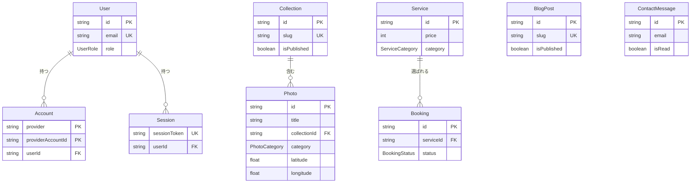
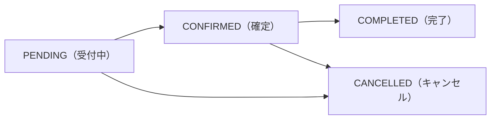

# 07. データモデル（Prisma）ガイド

## このドキュメントの目的

kskphotos の「データの設計図」を解説します。サイトが扱う情報 — 写真、撮影サービス、撮影依頼、ブログ、お問い合わせ、そして管理者ログイン — を、データベースの中でどんな「箱」に、どんな「項目」で保存しているのかをまとめたものです。

このデータ設計は `app/prisma/schema.prisma` という 1 つのファイルに書かれています。**Prisma（プリズマ）** とは、データベースを TypeScript から型安全に操作するためのツール（ORM = Object-Relational Mapper）で、「テーブル」をプログラム側のオブジェクトとして扱えるようにしてくれます。`schema.prisma` はその設計図にあたり、ここに書いた `model`（モデル）が、そのまま PostgreSQL のテーブルになります。

このドキュメントを読むと、次のことが分かります。

- どんなモデル（＝データの箱）があり、それぞれ何のためにあるのか
- 各モデルがどう繋がっているのか（リレーション）
- 写真の EXIF / GPS など、専門的なフィールドが何を表すのか
- `enum`（選択肢の固定リスト）の各値の意味

---

## 1. 用語の準備（初心者向け）

本文に入る前に、最低限の言葉を押さえておきます。

| 用語 | 意味（かみ砕いた説明） |
|------|----------------------|
| **モデル / テーブル** | データの「箱」。例：「写真」「撮影依頼」など。Excel の 1 シートに近い |
| **フィールド / カラム** | 箱の中の「項目」。Excel の列にあたる。例：写真の `title`（タイトル） |
| **レコード / 行** | 1 件分のデータ。例：写真 1 枚。Excel の 1 行にあたる |
| **`@id`（主キー）** | 各レコードを一意に区別する背番号。重複しない |
| **`cuid()`** | 衝突しにくいランダムな ID を自動生成する関数。背番号の中身に使う |
| **`@unique`** | その項目は重複してはいけない、という制約（例：メールアドレス） |
| **`@default(...)`** | 値を指定しなかったときの初期値 |
| **リレーション** | モデル同士の繋がり。「この写真はどのコレクションに属するか」など |
| **`?`（クエスチョン）** | フィールドの型に付くと「省略可能（空でもよい）」を意味する |
| **`[]`（角カッコ）** | 「複数持てる」を意味する。`String[]` なら文字列の配列、`Photo[]` なら写真を複数 |
| **`enum`** | あらかじめ決めた選択肢だけを許す型。例：撮影依頼の状態（受付中・確定 など） |

このプロジェクトのデータベースは **PostgreSQL**（ポストグレス、オープンソースのリレーショナル DB）で、姉妹サイト「こくみんPedia+」と Cloud SQL 上で共有しています。Prisma の出力先は `app/src/generated/prisma` に設定されており、ここに自動生成された型付きクライアントを使ってアプリから DB を操作します。

---

## 2. モデル全体像（ER 図）

まず全体の地図を見ます。下の図は **ER 図（Entity-Relationship Diagram、実体関連図）** と呼ばれるもので、「どんなデータの箱があり、互いにどう繋がっているか」を表します。

図中の線 `||--o{` は **1 対多**（1 つの親が、0 個以上の子を持つ）を表します。

> 補足：`PK` は主キー、`UK` は一意制約（unique）、`FK` は外部キー（他のモデルを指す参照）を表します。`Account` のように `PK` が 2 行あるのは、2 項目の組み合わせで 1 件を特定する「複合主キー」です。`BlogPost` と `ContactMessage` は他のモデルと直接の線で繋がっていません。これらは単独で完結する「独立したデータ」だからです。

モデルは全部で **10 個** あります。役割ごとに 4 つのグループに分けて整理すると分かりやすくなります。

| グループ | モデル | 役割 |
|---------|--------|------|
| 認証（管理者ログイン） | `User` / `Account` / `Session` | 管理者だけがログインするための NextAuth.js 用 |
| 写真 | `Collection` / `Photo` | ポートフォリオの中身。シリーズ単位の `Collection` と 1 枚ずつの `Photo` |
| 商売 | `Service` / `Booking` / `CaseStudy` | 撮影メニュー（`Service`）・依頼（`Booking`）・実績（`CaseStudy`） |
| 読み物・連絡 | `BlogPost` / `ContactMessage` | ブログ記事と、お問い合わせメッセージ |
| サイト設定 | `SiteProfile` | プロフィールページ（`/about`）の内容。サイト全体で 1 行だけ持つ |

> 注：`docs/01-project-overview.md` の旧表記は「8 モデル」ですが、現在の `schema.prisma` には 10 モデルあります。

### CaseStudy（実績＝お仕事の記録）
`/works` のタイムラインに出す案件ログ。`BlogPost` 同様、他モデルと線で繋がらない独立データ。主なフィールド：`date`（実施日）・`type`（`PHOTO`/`WEB`/`IT`）・`title`（一文の公開説明）・`thumbnailUrl`/`linkUrl`（任意）・`isPublished`（**掲載可否＝本人の掲載許可の管理**。未許可は非公開か匿名表記）。管理画面は `/admin/case-studies`、初期1件は `prisma/case-studies-data.ts` を createOnly でデプロイ時に投入。

---

## 3. 認証グループ（管理者ログイン）

このサイトでログインするのは **管理者（サイトオーナー本人）だけ** です。一般の閲覧者はログインしません。認証には **NextAuth.js v5** というライブラリを使っており、`User` / `Account` / `Session` の 3 モデルは NextAuth が定める標準の形に合わせています。

なぜ 3 つに分かれているのか、をイメージで言うと次の通りです。

- `User` … 「あなたは誰か」（人そのもの）
- `Account` … 「どの方法でログインしたか」（Google ログインなど外部サービスとの紐付け）
- `Session` … 「今ログイン中かどうか」（ログイン状態の一時的な券）

### 3-1. User（利用者 = 管理者）

ログインする人そのものを表します。このサイトでは管理者 1 人だけを想定しています。

| フィールド | 型 | 意味 |
|-----------|----|------|
| `id` | String（cuid） | 利用者の背番号（主キー） |
| `name` | String? | 表示名（省略可） |
| `email` | String（@unique） | メールアドレス。重複不可、ログインの軸になる |
| `emailVerified` | DateTime? | メール確認が済んだ日時（未確認なら空） |
| `image` | String? | プロフィール画像の URL（省略可） |
| `role` | UserRole | 権限。初期値は `ADMIN`（管理者） |
| `accounts` | Account[] | この人に紐づくログイン方法（複数可） |
| `sessions` | Session[] | この人の現在のログインセッション（複数可） |
| `createdAt` / `updatedAt` | DateTime | 作成日時 / 最終更新日時（自動記録） |

`role` には `enum UserRole` を使います。

| 値 | 意味 |
|----|------|
| `ADMIN` | 管理者。現在はこの 1 種類のみ |

> 設計メモ：いまは権限が `ADMIN` だけですが、`enum` にしておくことで将来「編集者」「閲覧専用」などの役割を増やしたくなったとき、安全に拡張できます。

### 3-2. Account（外部ログインとの紐付け）

「Google でログイン」などの **外部認証プロバイダ** と `User` を結びつけるためのモデルです。アクセストークンなど、外部サービスとやり取りするための情報を保管します。これも NextAuth.js の標準フィールド構成です。

| フィールド | 型 | 意味 |
|-----------|----|------|
| `userId` | String | どの `User` のものか（外部キー） |
| `type` | String | 認証の種類（例：`oauth`） |
| `provider` | String | 認証プロバイダ名（例：`google`） |
| `providerAccountId` | String | プロバイダ側でのアカウント ID |
| `refresh_token` / `access_token` | String? | トークン類。期限切れ更新や API 呼び出しに使う |
| `expires_at` | Int? | アクセストークンの有効期限（UNIX 時刻） |
| `token_type` / `scope` / `id_token` / `session_state` | String? | OAuth の付随情報 |

このモデルの主キーは `@@id([provider, providerAccountId])` です。これは「`provider` と `providerAccountId` の **組み合わせ** で 1 件を特定する」という意味（複合主キー）で、「同じ Google アカウントを二重に登録しない」を保証します。また `onDelete: Cascade` が付いており、**親の `User` が削除されると、その `Account` も自動的に一緒に消えます**（連鎖削除）。

### 3-3. Session（ログイン状態の券）

ログイン中であることを示す一時的な券です。ブラウザに保存されたトークンと、ここに記録されたトークンが一致するかでログイン状態を判定します。

| フィールド | 型 | 意味 |
|-----------|----|------|
| `sessionToken` | String（@unique） | セッションを識別するトークン。重複不可 |
| `userId` | String | どの `User` のセッションか（外部キー） |
| `expires` | DateTime | セッションの有効期限 |
| `createdAt` / `updatedAt` | DateTime | 作成 / 更新日時 |

`Session` も `onDelete: Cascade` で `User` に連結しており、ユーザー削除時に一緒に消えます。

---

## 4. 写真グループ（ポートフォリオの中身）

サイトの主役です。`Collection`（シリーズ）と `Photo`（1 枚の写真）の 2 モデルで構成され、「1 つのコレクションが複数の写真を含む（1 対多）」関係になっています。

### 4-1. Collection（写真のシリーズ・まとまり）

「桜2024」「夜の街スナップ」のように、テーマでまとめた写真群を表します。ギャラリーをシリーズ単位で見せるための箱です。

| フィールド | 型 | 意味 |
|-----------|----|------|
| `id` | String（cuid） | 背番号（主キー） |
| `title` | String | シリーズ名 |
| `slug` | String（@unique） | URL に使う短い識別子（例：`sakura-2024`）。重複不可 |
| `description` | String? | 説明文（省略可） |
| `isPublished` | Boolean | 公開中か。初期値 `true` |
| `sortOrder` | Int | 表示順。小さいほど先。初期値 `0` |
| `photos` | Photo[] | このシリーズに含まれる写真たち（1 対多の「多」側） |
| `createdAt` / `updatedAt` | DateTime | 作成 / 更新日時 |

> `slug`（スラッグ）とは、URL に埋め込むための人間が読める短い文字列のこと。`id` の代わりに `/gallery/sakura-2024` のような分かりやすい URL を作れます。

### 4-2. Photo（1 枚の写真）

このプロジェクトで最も項目数が多く、サイトの差別化機能（地図ギャラリー・EXIF ダッシュボード・ビフォーアフター）を支える中心的なモデルです。フィールドが多いので、意味のまとまりごとに分けて説明します。

**基本情報**

| フィールド | 型 | 意味 |
|-----------|----|------|
| `id` | String（cuid） | 背番号（主キー） |
| `title` | String | 写真のタイトル |
| `description` | String? | 説明・撮影ストーリー（省略可） |
| `slug` | String?（@unique） | URL 用の識別子（省略可、付ける場合は重複不可） |

**コレクションとの関係**

| フィールド | 型 | 意味 |
|-----------|----|------|
| `collectionId` | String? | 所属する `Collection` の ID（無所属でもよいので `?`） |
| `collection` | Collection? | 紐づくコレクション本体への参照 |

このリレーションは `onDelete: SetNull` です。`Account` / `Session` の `Cascade`（連鎖削除）と異なり、**コレクションが削除されても写真は消えず、`collectionId` が空（null）に戻るだけ** です。シリーズを解体しても写真自体は残したい、という意図を表しています。

**画像 URL（ビフォーアフター対応）**

| フィールド | 型 | 意味 |
|-----------|----|------|
| `imageUrl` | String | 完成版（現像後 JPEG）の画像 URL。必須 |
| `beforeUrl` | String? | 現像前（RAW 相当）の画像 URL。ビフォーアフター比較に使う |
| `thumbnailUrl` | String? | 一覧表示用の小さいサムネイル画像 |
| `blurDataUrl` | String? | 読み込み中に表示するごく小さなぼかし画像（プレースホルダ） |

`beforeUrl` がある写真だけが、ビフォーアフター比較（`/gallery/[id]/compare`）の対象になります。

**カテゴリ・タグ・現像レシピ**

| フィールド | 型 | 意味 |
|-----------|----|------|
| `category` | PhotoCategory | 写真のジャンル（必須、選択肢は後述の enum） |
| `tags` | String[] | 自由なタグの配列（例：`["桜","夕景"]`） |
| `developNotes` | String? | Lightroom での現像調整メモ（現像レシピ） |

**撮影場所（地図ギャラリー）**

| フィールド | 型 | 意味 |
|-----------|----|------|
| `location` | String? | 場所名（例：「東京・代々木公園」） |
| `latitude` | Float? | 緯度。地図上のピンの南北位置 |
| `longitude` | Float? | 経度。地図上のピンの東西位置 |

`latitude`（緯度）と `longitude`（経度）は、地図上に写真を配置するための座標です。地球上の位置を数値で表すもので、この 2 つが揃っていると Mapbox / Google Maps 上にピンとして展開できます。値は EXIF の GPS 情報から自動抽出されるか、手動で付与します。α7R VI は本体に GPS を内蔵していないため、Sony Creators' App による Bluetooth 連携で位置情報を写真に付けるか、後から手動で入力する運用です。

**EXIF（撮影時の自動記録メタデータ）**

| フィールド | 型 | 意味 |
|-----------|----|------|
| `cameraModel` | String? | カメラ機種（例：`ILCE-7RM6`） |
| `lensMake` | String? | レンズメーカー |
| `lensModel` | String? | レンズ機種 |
| `focalLength` | Float? | 焦点距離（mm）。画角の広さ・望遠の度合い |
| `aperture` | Float? | 絞り値（F 値）。小さいほど背景がよくボケる |
| `shutterSpeed` | String? | シャッタースピード（例：`1/250`） |
| `iso` | Int? | ISO 感度。高いほど暗所に強いがノイズが増える |
| `dateTaken` | DateTime? | 撮影日時 |
| `whiteBalance` | String? | ホワイトバランス設定 |
| `meteringMode` | String? | 測光モード |
| `imageWidth` / `imageHeight` | Int? | 画像の幅・高さ（ピクセル） |

**EXIF（イグジフ）** とは、撮影時にカメラが写真ファイルに自動で埋め込む撮影情報のことです（Exchangeable Image File Format の略）。「いつ・どのカメラとレンズで・どんな設定で撮ったか」が記録されます。これらは画像アップロード時に **exifr**（イグジファー、EXIF 読み取りライブラリ）で自動抽出されてここに保存され、EXIF ダッシュボード（`/dashboard`）でレンズ使用率・F 値分布・撮影時間帯などのグラフに集計されます。Lightroom で書き出した JPEG でも EXIF は保持される運用です。

**表示制御**

| フィールド | 型 | 意味 |
|-----------|----|------|
| `isPortfolio` | Boolean | トップページの代表作（「撮る」フィルムストリップ）に出すか。初期値 `false` |
| `isPublished` | Boolean | 公開中か。初期値 `true` |
| `isHero` | Boolean | トップのヒーローセクション候補。指定写真から訪問ごとに1枚ランダム表示。未指定ならポートフォリオで代替。初期値 `false` |
| `sortOrder` | Int | 表示順。初期値 `0` |
| `createdAt` / `updatedAt` | DateTime | 作成 / 更新日時 |

`Photo` には `@@index([category])` / `@@index([isPortfolio])` / `@@index([dateTaken])` という **インデックス** が 3 つ設定されています。インデックスとは「よく使う検索を速くするための索引」で、本の巻末索引と同じ発想です。カテゴリでの絞り込み、トップ用代表作の取得、撮影日時での並べ替え・集計（ダッシュボード）が高速になります。

---

## 5. 商売グループ（撮影メニューと依頼）

撮影依頼を受けるための 2 モデルです。`Service`（メニュー）に対して `Booking`（依頼）がぶら下がる「1 対多」の関係です。

### 5-1. Service（撮影サービス・料金メニュー）

提供メニューと料金を表します。

**料金体系（2026年6月〜・時間制）**：撮影料金は「ジャンル別の固定プラン」をやめ、**時間制1本**にしています（1時間 ¥14,000／30分延長ごと +¥6,000／全データ込み／レタッチは撮影1時間につき10枚込み／出張費は別途実費）。理由は明瞭さ — 「なぜポートレートとファミリーで値段が違うのか」を説明できる根拠が（開業準備期の経験では）まだ無いため、誰でも説明できる時間単価に統一しました。商用・政治も**撮影単価は同じ**で、差は「使用権」ではなく「打ち合わせ・修正・調整という手間＝時間」で吸収します（写真の著作権は撮影者に残るため使用権で課金する法的根拠自体はあるが、運用・契約が重いので現段階では採らない）。

この時間制の料金表は **`/services` ページにコードで実装**（`RATE_TABLE` 等の定数）しており、`Service` テーブルには持たせていません。そのため `Service` の役割は次の2つに絞られます：

1. **`/booking` 予約フォームの選択肢**（「出張撮影（時間制）」「政治・選挙撮影」「商用・法人」など。撮影系は `price=0`）
2. **`/services` の Web/IT メニュー表示**（`WEB_PRODUCTION` / `IT_SUPPORT` のみ `price` を表示）

旧・撮影メニュー（ポートレート/ファミリー/イベント等の個別プラン）は `prisma/services-data.ts` の `RETIRED_SERVICE_IDS` に列挙し、`seedServices()` が毎回 `isActive=false` にして非公開化します（本番は createOnly のため、これで確実に旧メニューを畳む）。

| フィールド | 型 | 意味 |
|-----------|----|------|
| `id` | String（cuid） | 背番号（主キー） |
| `title` | String | メニュー名 |
| `description` | String | 説明文（必須） |
| `price` | Int | 料金（円、整数） |
| `duration` | String? | 所要時間（例：「約60分」） |
| `category` | ServiceCategory | サービス種別（必須、選択肢は後述） |
| `imageUrl` | String? | メニューの紹介画像 URL |
| `features` | String[] | 含まれる内容のリスト（例：`["納品20枚","出張可"]`） |
| `isActive` | Boolean | 受付中か。初期値 `true` |
| `sortOrder` | Int | 表示順。初期値 `0` |
| `bookings` | Booking[] | このサービスへの依頼（1 対多の「多」側） |
| `createdAt` / `updatedAt` | DateTime | 作成 / 更新日時 |

### 5-2. Booking（撮影依頼）

`/booking` フォームから送られてくる撮影依頼 1 件を表します。

| フィールド | 型 | 意味 |
|-----------|----|------|
| `id` | String（cuid） | 背番号（主キー） |
| `name` | String | 依頼者名（必須） |
| `email` | String | 連絡先メール（必須） |
| `phone` | String? | 電話番号（省略可） |
| `serviceId` | String? | 希望サービスの ID（未指定でもよい） |
| `service` | Service? | 紐づくサービス本体への参照 |
| `preferredDate` | DateTime? | 希望日時 |
| `location` | String? | 希望撮影場所 |
| `message` | String | 依頼本文（必須） |
| `status` | BookingStatus | 対応状況。初期値 `PENDING` |
| `adminNote` | String? | 管理者用の内部メモ（依頼者には非公開） |
| `createdAt` / `updatedAt` | DateTime | 作成 / 更新日時 |

`Booking` には `@@index([status])` と `@@index([createdAt])` が設定され、状況での絞り込み（例：未対応だけ表示）や、新着順の一覧表示が速くなります。

なお `Booking` から `Service` への参照には `onDelete` の指定がありません。Prisma の既定では、参照されている `Service` を削除しようとすると **削除が拒否される（Restrict 相当）** ため、依頼が紐づくサービスは誤って消せないようになっています。

---

## 6. 読み物・連絡グループ

他のモデルと直接繋がらない、独立した 2 モデルです。

### 6-1. BlogPost（ブログ記事）

撮影記やお知らせを書く記事です。`/blog` 一覧と `/blog/[slug]` 詳細に対応します。

| フィールド | 型 | 意味 |
|-----------|----|------|
| `id` | String（cuid） | 背番号（主キー） |
| `title` | String | 記事タイトル |
| `slug` | String（@unique） | URL 用の識別子。重複不可 |
| `content` | String | 本文（必須） |
| `excerpt` | String? | 一覧用の抜粋・要約 |
| `coverImage` | String? | アイキャッチ画像 URL |
| `categories` | String[] | 記事カテゴリの配列 |
| `isPublished` | Boolean | 公開中か。初期値 `false`（最初は下書き） |
| `publishedAt` | DateTime? | 公開日時 |
| `createdAt` / `updatedAt` | DateTime | 作成 / 更新日時 |

`@@index([isPublished, publishedAt])` という **複合インデックス** があります。これは 2 つの項目をまとめた索引で、「公開済みの記事を公開日時順に取り出す」という一覧表示の定番処理を高速化します。`isPublished` の初期値が `false` なのは、書きかけ記事を誤って公開しないための安全側の設計です。

### 6-2. ContactMessage（お問い合わせ）

`/contact` フォームから届く一般的な問い合わせを表します。撮影依頼（`Booking`）とは別物で、こちらは雑多な連絡用です。

| フィールド | 型 | 意味 |
|-----------|----|------|
| `id` | String（cuid） | 背番号（主キー） |
| `name` | String | 送信者名（必須） |
| `email` | String | 連絡先メール（必須） |
| `subject` | String? | 件名（省略可） |
| `message` | String | 本文（必須） |
| `isRead` | Boolean | 既読フラグ。初期値 `false`（最初は未読） |
| `createdAt` | DateTime | 受信日時 |

`@@index([isRead])` と `@@index([createdAt])` により、未読だけの抽出や新着順表示が速くなります。`ContactMessage` には `updatedAt` がありません。問い合わせは「届いた内容を後から書き換えない」性質のため、更新日時を持たない設計です。

### 6-3. SiteProfile（プロフィールページの内容）

プロフィールページ `/about`（氏名・肩書き・自己紹介・撮影機材・撮影ポリシー・プロフィール写真）の内容を保持します。管理画面 `/admin/profile` から編集でき、保存すると `/about` に反映されます。サイト全体で**常に 1 行だけ**持つ「シングルトン」設計で、主キー `id` は固定値 `"singleton"` を使います（`cuid()` ではない）。

| フィールド | 型 | 意味 |
|-----------|----|------|
| `id` | String | 主キー。固定値 `"singleton"`（常に 1 行のため） |
| `name` | String | 氏名・名義（初期値 空文字） |
| `tagline` | String | 肩書き（初期値 空文字） |
| `bio` | String | 自己紹介本文（初期値 空文字） |
| `profileImage` | String? | プロフィール写真の公開 URL（省略可） |
| `profileBlur` | String? | 写真読み込み時の blur プレースホルダ（data URL、省略可） |
| `gearBody` | String[] | カメラ。各行 `"名称 \| 補足"` 形式の文字列配列 |
| `gearLenses` | String[] | レンズ。同上 |
| `gearSoftware` | String[] | ソフトウェア。同上 |
| `policyBadge` | String | 撮影ポリシーのバッジ文言（例 `No Generative AI`、空でバッジ非表示） |
| `policy` | String | 撮影ポリシー本文（空で `/about` のポリシー欄ごと非表示） |
| `createdAt` / `updatedAt` | DateTime | 作成 / 更新日時 |

DB に行が無いときは `lib/profile.ts` の `DEFAULT_PROFILE`（既定の文言）を表示し、テーブル未作成などの DB エラー時も既定値にフォールバックしてページが落ちないようにしています。テキストの保存はサーバーアクション、写真のアップロードは Route Handler `/api/admin/profile/image`（Cloud Run で multipart を扱うため）に分けています。機材の各行は「名称 ｜ 補足」を `|` で区切り、表示時に `parseGearItem` で分解します。

---

## 7. リレーション早見表

モデル同士の繋がりと、親を削除したときの挙動（`onDelete`）をまとめます。

| 親モデル | 子モデル | 関係 | 親削除時の挙動 | 意味 |
|---------|---------|------|--------------|------|
| User | Account | 1 対多 | `Cascade`（連鎖削除） | ユーザーを消すとログイン紐付けも消える |
| User | Session | 1 対多 | `Cascade`（連鎖削除） | ユーザーを消すとセッションも消える |
| Collection | Photo | 1 対多 | `SetNull`（参照を空に） | シリーズを消しても写真は残る |
| Service | Booking | 1 対多 | 既定（Restrict 相当） | 依頼が紐づくサービスは消せない |

このように「消えてほしいもの（認証情報）」「残ってほしいもの（写真）」「消されては困るもの（依頼の付いたサービス）」で削除の振る舞いを使い分けているのが、この設計のポイントです。

---

## 8. enum（選択肢）一覧

`enum` は「決められた値だけを許す」型です。タイプミスや想定外の値が入るのを防ぎ、画面のフィルタやバッジ表示を作りやすくします。本スキーマには 4 つあります。

### UserRole（利用者の権限）

| 値 | 意味 |
|----|------|
| `ADMIN` | 管理者（現在はこの 1 種類のみ） |

### PhotoCategory（写真のジャンル）

| 値 | 意味 |
|----|------|
| `PORTRAIT` | ポートレート（人物） |
| `LANDSCAPE` | 風景 |
| `EVENT` | イベント |
| `STREET` | スナップ・街角 |
| `ARCHITECTURE` | 建築 |
| `FOOD` | 料理・物撮り |
| `OTHER` | その他 |

### ServiceCategory（撮影サービスの種別）

| 値 | 意味 |
|----|------|
| `PORTRAIT` | ポートレート撮影 |
| `FAMILY` | 家族写真 |
| `EVENT` | イベント撮影 |
| `COMMERCIAL` | 商用・商品撮影 |
| `LOCATION` | ロケーション撮影（出張） |

> `PhotoCategory` と `ServiceCategory` はどちらも `PORTRAIT` / `EVENT` を持ちますが、別々の enum です。写真のジャンル分類と、販売メニューの分類は目的が違うため、独立して定義・拡張できるようにしています。

### BookingStatus（撮影依頼の状況）

| 値 | 意味 |
|----|------|
| `PENDING` | 受付中（未対応、初期値） |
| `CONFIRMED` | 確定（日程合意済み） |
| `COMPLETED` | 完了（撮影・納品済み） |
| `CANCELLED` | キャンセル |

依頼が来てから完了までの流れを、状態の遷移として表現したものです。

---

## 9. まとめ

- データの設計図は `app/prisma/schema.prisma` の 1 ファイルに集約され、9 個のモデルが定義されている。
- モデルは「認証（User/Account/Session）」「写真（Collection/Photo）」「商売（Service/Booking）」「読み物・連絡（BlogPost/ContactMessage）」の 4 グループに整理できる。
- 中心は `Photo`。EXIF・GPS・ビフォーアフター用 URL を持ち、サイトの 3 本柱（地図ギャラリー・EXIF ダッシュボード・ビフォーアフター）を支える。
- リレーションの削除挙動（`Cascade` / `SetNull` / 既定）を使い分け、「消すべきデータ」と「残すべきデータ」を明確にしている。
- `enum` で状態やカテゴリを固定し、データの一貫性を保っている。
