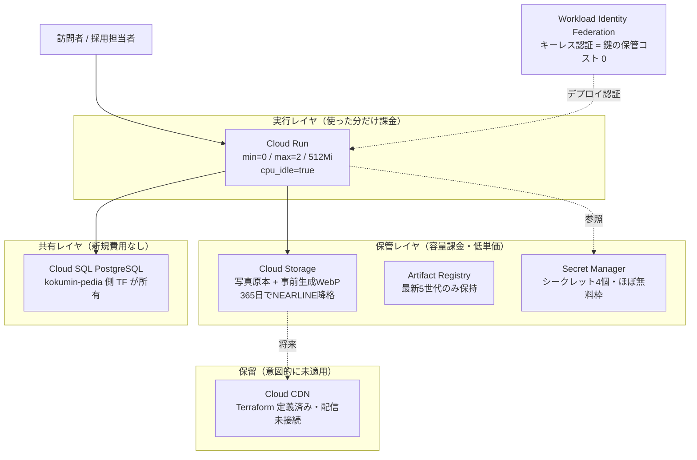

# 08. コスト最適化と訴求する強み

## このドキュメントの目的

kskphotos のインフラ**コスト設計の判断**と、このプロジェクトで**実証している技術的な強み**を、採用担当者向けに整理します。個人ポートフォリオでありながら「実装力（Next.js フルスタック）」と「クラウド力（GCP / IaC / CI-CD）」の両面を、誇張なく実物のコードで裏付けることを目的とします。

このドキュメントの記述はすべて `terraform/` 配下の実ファイルと `app/src` のソース、`app/package.json` を読んで裏付けています。

---

## 第1部: コスト設計

### 1-1. 月額コストの目安

GCP 各サービスの月額目安です（個人ポートフォリオの想定トラフィック）。Cloud SQL は姉妹サイト [こくみんPedia+](../kokumin-pedia/) と**共有**しており、DB 本体は kokumin-pedia 側の Terraform が所有します。

| サービス | 役割 | 月額目安 | 最適化のポイント |
|---------|------|---------|----------------|
| **Cloud Run** | Next.js コンテナ実行 | $0〜5 | スケール to ゼロ（無リクエスト時はインスタンス 0） |
| **Cloud SQL** | PostgreSQL | $7〜10（共有） | 姉妹サイトと 1 インスタンスを共有し、新規費用ゼロ |
| **Cloud Storage** | 写真原本・配信 WebP | $0.5〜2 | Standard クラスで保管。365 日経過分は NEARLINE へ自動降格 |
| **Cloud CDN** | 画像配信キャッシュ | （保留・未課金） | コスト見積との兼ね合いで意図的に未適用（後述） |
| **Artifact Registry** | コンテナイメージ保管 | ~$1 | 最新 5 世代のみ保持 + untagged は 7 日で自動削除 |
| **Secret Manager** | DATABASE_URL 等の秘匿 | ~$0 | 保持シークレットは 4 個と少なく、ほぼ無料枠内 |
| **Workload Identity Federation** | GitHub OIDC キーレス認証 | $0 | サービスアカウントキーの発行・保管コストが不要 |
| **合計（Cloud SQL を除く）** | — | **$2〜8/月** | Cloud SQL は kokumin-pedia 側で計上 |

> 「スケール to ゼロ」= アクセスが無い時間帯はコンテナのインスタンス数を 0 にし、その分の課金を止める仕組み。次のアクセス時に起動する（コールドスタートと引き換え）。

> 金額はいずれも個人ポートフォリオ規模での**概算**です。実トラフィックや保管容量で変動します。

### 1-2. コスト構造の全体像

### 1-3. 最適化の判断（なぜこの構成か）

#### スケール to ゼロ（Cloud Run）

`terraform/variables.tf` で Cloud Run の最小インスタンス数を `0`、最大を `2` に設定しています。

- `cloud_run_min_instances = 0` … リクエストが無ければインスタンスを落とし、待機コストを止める
- `cloud_run_max_instances = 2` … 個人サイトに過剰な水平スケールを許さず、想定外の課金を防ぐ
- `cloud_run_cpu = "1"` / `cloud_run_memory = "512Mi"` … 必要十分な最小サイズ

加えて `terraform/modules/cloud-run/main.tf` のコンテナ定義で `cpu_idle = true`（リクエスト処理外で CPU 課金を止める）と `startup_cpu_boost = true`（起動時だけ CPU を増やしコールドスタートを短縮）を併用しています。「コストを切り詰めつつ、その副作用（コールドスタート）を起動ブーストで緩和する」という、トレードオフを理解した上での設定です。

> Cloud Run のファイルシステムは**揮発的**（インスタンスが落ちると消える）です。そのためユーザーがアップロードした画像は Cloud Storage に保存する前提で、`app/src/lib/storage.ts` は `GCS_BUCKET_NAME` があれば GCS、無ければローカル FS へ書く実装です。ローカル保存は開発用フォールバックであり、本番では永続化されません。

#### Cloud SQL の共有

`terraform/variables.tf` の `cloudsql_connection_name`（`kskphotos-prod:asia-northeast1:kokumin-pedia-db`）が示すとおり、DB インスタンスは kokumin-pedia 側の Terraform が作成・所有し、kskphotos はそれに**相乗り**します。kskphotos の Terraform は DB 本体を一切作らず、`resources.tf` の `secret_env_vars` で Secret Manager の `DATABASE_URL`（`database_url_secret_id`）を Cloud Run に注入するだけです。Cloud Run 側は `modules/cloud-run/main.tf` の `volumes` ブロックで Cloud SQL インスタンスを `/cloudsql` にマウントして接続します。

DB は「常時起動で止められない＝固定費が最も重い」リソースです。これを 2 サイトで 1 インスタンスに集約することで、kskphotos 単体の新規 DB 費用をゼロにしています。所有権を片側（kokumin-pedia）に寄せ、もう片側は接続情報を参照するだけ、という責務分離も明確です。

#### Cloud CDN は「保留」段階（正直な現状）

Cloud CDN は `terraform/modules/storage/main.tf` にバックエンドバケット（`google_compute_backend_bucket` の `enable_cdn = true`）・URL マップ・HTTP プロキシ・グローバル転送ルールとして**定義済み**です。一方で、アプリ側ソース（`app/src`）はこの CDN の URL を参照しておらず、画像配信は CDN 経路に**まだ接続していません**（ビルド後にアップロードされた画像は `app/src/app/uploads/[...path]/route.ts` が `storage.googleapis.com` の公開 URL へ直接リダイレクトして配信します）。

これはコスト見積との乖離による**意図的な保留**です。常時稼働する CDN があるかのようには書きません。現状の画像高速化は、CDN ではなく後述の**ビルド時の WebP 事前生成パイプライン**で実現しており、CDN は「トラフィックが増えた時に IaC のスイッチで有効化できる状態を用意してある」という位置づけです。

#### Artifact Registry を最小に保つ

`terraform/modules/artifact-registry/main.tf` のクリーンアップポリシーで、

- 最新 5 世代のイメージのみ `KEEP`（`keep_count = 5`）
- タグ無し（untagged）イメージは 7 日（`older_than = "604800s"`）経過で `DELETE`

を設定しています。CI/CD が push 毎にイメージを積み上げてもストレージが青天井にならず、保管課金を抑えます。ロールバック用に直近数世代は残す、という運用上の落としどころも両立しています。

#### OIDC でキー管理コストをゼロに

`terraform/modules/iam/main.tf` の Workload Identity Federation により、GitHub Actions は**サービスアカウントキー（JSON）を持たずに** GCP 認証します。

- 鍵ファイルの発行・ローテーション・漏洩対応といった**運用コストが構造的に発生しない**
- 認証トークンは短寿命で、リポジトリ単位に制限（`attribute_condition = "assertion.repository == 'KayuChusan/kskphotos'"`）

金額としては $0 ですが、「管理し続けるコスト（と漏洩リスク）を設計で消す」という、運用視点のコスト最適化です。

---

## 第2部: 訴求する強み

「強み軸 / kskphotos での実証 / 採用観点での意味」で整理します。**クラウド力**と**実装力**の両面をカバーします。

### 2-1. クラウド力（GCP / IaC / CI-CD）

| 強み軸 | kskphotos での実証（具体ファイル・機能） | 採用観点での意味 |
|--------|----------------------------------------|----------------|
| **IaC 全レイヤを Terraform 化** | `terraform/` をモジュール分割（`cloud-run` / `iam` / `artifact-registry` / `storage`）。`resources.tf` から呼び出し、`outputs.tf` で接続値を公開 | クリック操作でなく宣言的にインフラを再現・レビューできる。手順書ではなくコードでインフラを語れる |
| **キーレス CD（WIF / OIDC）** | `modules/iam/main.tf` の Workload Identity Pool + Provider。`attribute_condition` で `KayuChusan/kskphotos` リポジトリに限定 | クラウドのセキュリティ慣行（長期鍵を持たない）を実装に落とせる。鍵漏洩という典型インシデントを設計で予防 |
| **最小権限の IAM 設計** | Cloud Run SA は `secretmanager.secretAccessor` と `cloudsql.client` のみ。CI/CD SA は `artifactregistry.writer` / `run.developer` / `serviceAccountUser` / `cloudsql.client` 等に限定（`modules/iam/main.tf`） | 「とりあえず Owner」を避け、役割ごとに権限を絞れる。権限の最小化を説明できる |
| **コストを設計判断にできる** | スケール to ゼロ、Cloud SQL 共有、Artifact Registry の世代保持、CDN の意図的保留（第1部参照） | 技術選定をコストとトレードオフで語れる。過剰投資をしない判断力 |
| **マルチサービス構成の運用** | Cloud Run / Cloud SQL / Cloud Storage / Artifact Registry / Secret Manager を連携。Secret 本体は Terraform 管理外（`gcloud` で別途作成）にして秘匿値をコードから隔離（`resources.tf` のコメント） | 単一サービスでなく、依存関係を持つ構成全体を組める。秘匿情報の扱いを分けられる |
| **CI/CD パイプライン構築** | `ci.yml`（PR: postgres サービス起動 → prisma generate / db push → lint → type-check → Vitest → build）/ `deploy.yml`（main push: WIF 認証 → Cloud SQL Auth Proxy → ビルド → Artifact Registry → Cloud Run） | テストを通さないコードは出荷されない仕組みを作れる。ビルド時 DB 依存（後述）まで理解した上でパイプラインを組める |

> **ビルド時に DB が必要な理由まで理解している点**: kskphotos は ISR（後述）と `generateStaticParams` を使うため `next build` がビルド時に DB へクエリします。CI ではそのために `postgres:16` のサービスコンテナを立てて `DATABASE_URL` を向け、deploy では Cloud SQL Auth Proxy（`cloud-sql-proxy`）を TCP で立ててビルドから接続します。「なぜ CI に DB が要るのか」を説明できることは、フレームワークの内部挙動とインフラを橋渡しできる証拠です。

### 2-2. 実装力（Next.js フルスタック）

| 強み軸 | kskphotos での実証（具体ファイル・機能） | 採用観点での意味 |
|--------|----------------------------------------|----------------|
| **型安全フルスタック** | TypeScript strict + Prisma 7（`app/src/lib/prisma.ts` で `@prisma/adapter-pg` の `PrismaPg` を使用）+ 入力検証に Zod 4。DB からフォーム入力まで型で繋ぐ | フロント・バック・DB を一貫した型で守れる。実行時エラーを設計段階で減らせる |
| **モダンな描画戦略（RSC + ISR）** | Next.js 16 App Router の React Server Components。ISR（`revalidate = 3600`）+ `generateStaticParams` でビルド時に静的化し、`app/src/lib/revalidate.ts` の `revalidatePath` でオンデマンド再生成 | 「速い／安い／鮮度」のバランスを描画戦略で設計できる。最新のレンダリングモデルを使いこなせる |
| **独自の画像配信パイプライン** | `app/src/lib/images.ts` がアップロード時に Sharp で WebP の複数幅（`VARIANT_WIDTHS = [400, 800, 1600, 2560]`）と blur プレースホルダを事前生成。`image-loader.ts`（next/image カスタムローダー）が表示幅に合う事前生成 WebP へ URL を書き換え、**実行時の画像変換を行わない** | 既製機能を使うだけでなく、Cloud Run の CPU 消費とレイテンシを抑える最適化を自作できる。性能とコストを実装で詰められる |
| **差別化機能の作り込み（3 本柱）** | 地図ギャラリー（`components/gallery/photo-map.tsx`: MapLibre GL JS + `lib/exif.ts` の GPS）/ EXIF ダッシュボード（`components/dashboard/exif-charts.tsx`: Recharts）/ ビフォーアフター（`components/gallery/compare-slider.tsx`） | データ可視化・地図・インタラクティブ UI と幅広い UI 領域を実装できる |
| **認証とアクセス制御** | NextAuth v5（`lib/auth.ts` / `lib/auth.config.ts`）+ `src/middleware.ts` が `matcher: ["/admin/:path*"]` で `/admin` をガード | 公開サイトに管理者領域を安全に同居させられる。認可の境界を設計できる |
| **テストの導入** | Vitest 4。EXIF 抽出ロジック `lib/exif.ts` に `exif.test.ts` で **44 ケース**（`vitest run` で 44 passed を実測確認。`it.each` によるパラメタライズ込み）。RAW 判定・シャッター速度整形・EXIF フィールドマッピング・壊れたバッファでも例外を投げないことまで検証 | ロジックの正しさをテストで担保する習慣がある。エッジケース（壊れた入力）まで考慮できる |
| **モダン UI スタック** | Tailwind v4 + shadcn/ui + `@base-ui/react`、framer-motion、next-view-transitions（`app/package.json` で確認） | 最新の UI エコシステムを組み合わせて、見栄えと体験を両立できる |

> EXIF（Exchangeable Image File Format）= 写真に埋め込まれた撮影情報（レンズ・F 値・シャッター速度・GPS 等）。kskphotos はこれを `exifr` で自動抽出し、地図とダッシュボードという差別化機能の原資にしています。

### 2-3. このポートフォリオの読み方（両面の証明）

| 見せたいこと | 何を見れば伝わるか |
|------------|------------------|
| クラウド／インフラを設計できる | `terraform/`（モジュール分割・WIF・最小権限）、第1部のコスト判断 |
| CI/CD を組める | `.github/workflows/ci.yml` / `deploy.yml`、キーレス認証 |
| フルスタックで作れる | `app/src`（RSC + ISR、型安全、独自画像パイプライン、3 本柱、テスト） |
| トレードオフを判断できる | スケール to ゼロのコールドスタート対策、Cloud CDN の意図的保留 |

---

## 正直な現状（誇張しない範囲）

採用担当者に対して、できていることと未着手・保留を区別して明記します。

- **Cloud CDN は保留段階**: Terraform に定義はあるが、アプリの画像配信経路には未接続。常時稼働の CDN がある、とは書きません。現状の画像高速化はビルド時の WebP 事前生成で実現しています。
- **アップロード永続化は Cloud Storage 前提**: Cloud Run のファイルシステムは揮発的。ローカル保存はあくまで開発用フォールバックで、本番では永続化しません。
- **可用性の範囲**: kskphotos にはクロスリージョン DR・マルチ AZ 冗長・Redis 等のキャッシュ層は**ありません**。個人ポートフォリオに見合うコストと複雑さの範囲に意図的にとどめています。
- **Cloud SQL の所有**: DB 本体は kokumin-pedia 側の Terraform が所有。kskphotos は接続情報を参照するだけで、DB のライフサイクルは管理していません。

---

## 関連ドキュメント

- [01. プロジェクト全体像ガイド](./01-project-overview.md)
- [02. GCP Terraform ガイド](./02-gcp-terraform.md)
- [03. GitHub Actions CI/CD ガイド](./03-github-actions.md)
