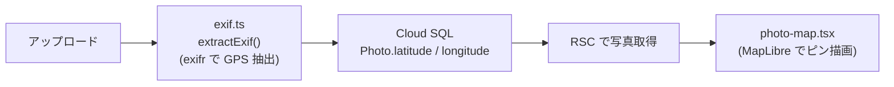

# 09. 面接想定 Q&A

## このドキュメントの目的

kskphotos の技術選定について、「**なぜそうしたのか**」を面接で問われたときに即答できる形で Q&A 化したものです。各回答は、このリポジトリの実際のコード・構成ファイルに基づいています（憶測は書きません）。

このサイトは「写真ポートフォリオ＋撮影依頼の商用サイト＋技術ショーケース」を1つに重ねたものです。そのため Q&A も、本サイトの2つの訴求軸に沿って構成しています。

| 訴求軸 | 何を示すか |
|--------|-----------|
| **アプリ実装力** | Next.js 16（App Router / RSC）でのフルスタック実装、型安全な DB アクセス、画像最適化、地図・可視化 |
| **クラウド力** | GCP のサービス選定、Terraform による IaC、OIDC キーレス CD、コスト設計 |

> 前提知識: [04. アーキテクチャ全体像ガイド](./04-architecture.md)（全体の動き）と [05. 技術スタックと採用理由](./05-tech-stack-rationale.md)（各ライブラリの選定理由）を読むと、各回答の背景が掴めます。

---

## 1. インフラ・クラウドに関する Q&A

### Q1. なぜ Cloud Run（スケール to ゼロ）を選んだのか？ GKE ではない理由は？

**A.** これは個人運用の商用サイトで、アクセスが途切れる時間が長いという前提があるためです。Cloud Run は「リクエストが来た時だけコンテナを起動し、来ないときは台数ゼロ（=課金ゼロ）」にできます（`docs/04-architecture.md` の構成、月額目安 $0〜5）。コンテナは `app/Dockerfile` で Next.js の `standalone` 出力をビルドし、`node server.js` を `port 8080` で起動するだけの最小構成です。

GKE（Google Kubernetes Engine、Kubernetes のマネージドサービス）を選ばなかった理由は明確です。

- **常時コストが発生する**: GKE はクラスタのコントロールプレーンやノードが基本的に動き続けるため、アクセスがない時間も課金されます。個人サイトには過剰です。
- **運用負荷が見合わない**: ノードのスケーリング・アップグレード・ネットワーク設計など、Kubernetes の運用知識が前提になります。1コンテナのステートレスな Web アプリに、その複雑さは不要です。
- **要件がステートレス1サービス**: 状態は Cloud SQL と Cloud Storage に外出ししているので（後述）、アプリ自体はステートレス。これは Cloud Run が最も得意とする形です。

**正直に言うと**、トレードオフはコールドスタートです。しばらくアクセスがなかった後の最初の1回だけ起動待ちが発生します。商用とはいえ写真ポートフォリオであり、ミリ秒単位の常時低レイテンシより、コストとシンプルさを優先する判断をしました。

### Q2. なぜ Cloud SQL を姉妹サイトと「共有」しているのか？ 所有境界はどう扱っている？

**A.** PostgreSQL インスタンスは固定費（月額 $7〜10 目安）が一番大きいリソースです。kskphotos と姉妹サイト kokumin-pedia の両方で別々に立てると費用が二重になるため、1つの Cloud SQL インスタンスを共有し、データベース（スキーマ）を分けて同居させています。

重要なのは**所有境界（誰がそのリソースを作る・壊す権限を持つか）を明確に分けている**点です。

- データベース本体（Cloud SQL インスタンス）は、**姉妹サイト kokumin-pedia 側の Terraform が作成・管理**します。kskphotos の Terraform はこれを所有しません。
- それを裏付けるのが、本リポジトリの Terraform モジュール構成です。`terraform/modules/` には `cloud-run` / `iam` / `artifact-registry` / `storage` の4つだけが存在し、**Cloud SQL を作るモジュールは存在しません**。「コードに無い＝作っていない＝所有していない」という形で境界がはっきりしています。
- kskphotos 側は、Secret Manager に保存された接続文字列 `DATABASE_URL` を読み取って**接続するだけ**です（`app/src/lib/prisma.ts` が `process.env.DATABASE_URL` を `PrismaPg` アダプタに渡す）。

この「片方が所有し、もう片方は接続だけ」という設計により、二重課金を避けつつ、誰がインスタンスのライフサイクルに責任を持つかを曖昧にしないようにしています。共有による結合は、論理データベースの分離で吸収しています。

### Q3. WIF / OIDC でキーレス CD にした意義は？

**A.** CI/CD から GCP を操作する際、サービスアカウントの**鍵（JSON キー）を GitHub に保存しない**ためです。`.github/workflows/deploy.yml` では Workload Identity Federation（WIF。GitHub Actions の OIDC トークンを GCP の権限と短命に交換する仕組み）を使っています。

```yaml
permissions:
  id-token: write   # OIDC トークンの発行に必要
  contents: read

# ...
- name: Authenticate to Google Cloud
  uses: google-github-actions/auth@v2
  with:
    workload_identity_provider: ${{ secrets.GCP_WIF_PROVIDER }}
    service_account: ${{ secrets.GCP_SA_EMAIL }}
```

意義は3点です。

- **長期間有効な秘密鍵が存在しない**: 鍵ファイルがそもそも無いので、漏洩・ローテーション忘れというリスク自体が消えます。発行されるのは実行のたびに使い捨てられる短命トークンです。
- **誰が・どのリポジトリから来たかを GCP 側で検証できる**: OIDC トークンには発行元（リポジトリやブランチ）の情報が含まれるため、信頼するワークフローだけに権限を絞れます。
- **GitHub に置くのは識別子だけ**: Secrets に入れているのは WIF プロバイダ名（`GCP_WIF_PROVIDER`）とサービスアカウントのメール（`GCP_SA_EMAIL`）で、これらは権限そのものではありません。

これは、クラウドのセキュリティで近年標準になりつつある「鍵を配らない（キーレス）」運用を実装できていることの証明になります。

### Q4. Cloud CDN は使っているのか？ 画像はどこから配信される？

**A.** Cloud CDN は構成上は想定していますが、現時点では**「保留」段階で意図的に未適用**です。コスト見積との兼ね合いで、常時稼働の CDN をまだ入れていません（`docs/04-architecture.md` 2-2 節に明記）。「あるかのように書かない」のがこのプロジェクトのドキュメント方針なので、ここは正直に「今は入れていない」と説明します。

CDN を介さない現状での画像配信は、**2段構え**になっています。実装を素直に書くと次の通りです。

1. **本番では、写真はコンテナイメージに焼き込まれた静的ファイルとして配信されます。** `deploy.yml` のステップが GCS のマスター（`gs://kskphotos-photos/uploads`）を `gcloud storage rsync` でビルドコンテキストの `public/uploads` に同期し、`app/Dockerfile` が `COPY --from=builder /app/public ./public` でイメージに含めます。Next.js（Cloud Run）はこれを通常の静的配信で返すため、ほとんどの画像はここで完結します。
2. **ビルド後に管理画面からアップロードされた分だけ、フォールバック経路に乗ります。** その経路が `app/src/app/uploads/[...path]/route.ts` です。ルートのコメントにも「イメージに焼き込まれた静的ファイルが優先され、ビルド後にアップロードされた分だけがここに到達する」と明記されており、到達したリクエストは GCS の公開 URL（`https://storage.googleapis.com/<bucket>/uploads/...`）へ **302 リダイレクト**します。

キャッシュについては、混同しやすいので2つを切り分けて押さえておきます。

- **GCS に保存するオブジェクト自体**には、長期キャッシュヘッダ `public, max-age=31536000, immutable` を付けています（`app/src/lib/storage.ts` の `saveFile`）。ファイル名がタイムスタンプ付きで一意なので immutable 扱いが安全で、ブラウザ／中間キャッシュ側での再取得を強く抑えられます。
- **フォールバックの 302 リダイレクト応答**自体には、短めの `public, max-age=3600` を付けています（リダイレクト先の解決結果をしばらく使い回す用途）。

要点は、「常時稼働の CDN がある」とは書かない一方で、静的焼き込み＋ GCS 長期キャッシュで実用上のキャッシュ効率は確保している、という現状を正確に説明できることです。CDN は将来 Terraform で追加できる位置づけにありますが、今は入れていません。

---

## 2. 画像配信・アプリ実装に関する Q&A

### Q5. なぜ「実行時に画像変換しない」設計（事前 WebP ＋ カスタムローダー）にしたのか？

**A.** Cloud Run の CPU 消費とレイテンシをゼロに近づけ、スケール to ゼロのコストメリットを守るためです。`next/image` は通常、実行時にサーバー側で Sharp による最適化（リサイズ・WebP 変換）を行いますが、それを**やめています**。

代わりに、**アップロード時に**最適化を全部済ませます。`app/src/lib/images.ts` の `processImage()` が、Sharp で次を一括事前生成します（EXIF Orientation を物理回転に反映したうえで生成）。

- フルサイズ JPEG（最大 2560px、`mozjpeg`）
- 配信用 WebP バリアント 4幅（`VARIANT_WIDTHS = [400, 800, 1600, 2560]`）
- blur プレースホルダー（base64 data URL）

そして表示時は、`next/image` の**カスタムローダー** `app/src/lib/image-loader.ts` が、要求された表示幅に合うバリアントへ URL を書き換えるだけにします。

```ts
const variant =
  VARIANT_WIDTHS.find((v) => v >= width) ??
  VARIANT_WIDTHS[VARIANT_WIDTHS.length - 1];
return `${base}-w${variant}.webp`;
```

設計上のポイントは、`images.ts` の `VARIANT_WIDTHS` とローダーの `VARIANT_WIDTHS` を**必ず一致させる**ことです（どちらのファイルにも「一致させること」とコメントを書いています）。生成済みの幅以外を要求すると 404 になるため、ここを単一の真実として揃えています。

利点は、(1) リクエスト時に変換コストがかからずコールドスタートや CPU 課金に効かない、(2) 表示は常に事前生成された静的ファイルなのでキャッシュと相性が良い、の2点です。トレードオフは、対応する幅をアップロード時に決め打ちすることですが、写真ポートフォリオでは表示サイズが安定しているため許容できます。

### Q6. なぜ地図に MapLibre GL JS を選んだのか？

**A.** 地図ギャラリーは「撮影場所から写真をたどる」という差別化機能の柱で、ベクター／ラスター地図をブラウザで滑らかに描く必要があります。MapLibre GL JS（`maplibre-gl@^5.24.0`）を選んだ理由は次の通りです。

- **API キー課金が原則不要**: Mapbox GL JS は商用利用でアクセスに応じた課金が発生し得ますが、MapLibre はそのフォークで OSS。タイル提供元を自由に選べます。本サイトではダークテーマに合う CARTO Dark Matter のラスタータイル（`photo-map.tsx` の `MAP_STYLE`）を使い、地図そのものに固定費を発生させていません。これは「低コストで差別化機能を実現」という方針（`docs/05-tech-stack-rationale.md`）と一致します。
- **クライアント側で完結**: 地図はユーザー操作（パン・ズーム・ピンのクリック）が必要なので、`photo-map.tsx` は `"use client"` のクライアントコンポーネントにし、ピンやポップアップを `maplibregl.Marker` / `Popup` で構築しています。サーバー側のレンダリング負荷はかけません。

> 補足: CLAUDE.md には「Mapbox/Google Maps 上に展開」という当初の表現が残っていますが、実装は MapLibre GL JS に確定しています（`app/package.json` と `photo-map.tsx` が事実）。

### Q7. EXIF の GPS をどう抽出し、地図化しているのか？

**A.** 「アップロード時に抽出 → DB に保存 → 地図で描画」という、サーバーとクライアントで役割を分けたデータフローです。

1. **抽出（サーバー）**: 写真アップロード時に `app/src/lib/exif.ts` の `extractExif(buffer)` が `exifr` で EXIF を解析します。`gps: true` を指定し、`exifr` が度分秒から十進度へ変換済みの `data.latitude` / `data.longitude` を取り出して `ExtractedExif.latitude` / `longitude` に格納します（GPS 以外にもレンズ・F値・ISO・撮影日時など、ダッシュボード用の情報を同時に抽出）。
2. **保存**: 抽出値を Prisma 経由で `Photo` レコードの `latitude` / `longitude` 列に保存します。
3. **描画（クライアント）**: 地図ビューでは `photo-map.tsx` が、座標を持つ写真だけに絞り込んでピンを立てます。

```ts
const withCoords = photos.filter(
  (p): p is Photo & { latitude: number; longitude: number } =>
    p.latitude != null && p.longitude != null
);
```

各ピンはサムネイル入りのカスタムマーカーで、クリックで写真詳細（`/gallery/${photo.id}`）へ遷移します。座標を持つ写真が複数あれば `map.fitBounds()` で全ピンが収まるように自動ズームし、GPS 情報付きの写真がゼロなら専用メッセージ（「GPS 情報付きの写真がまだありません」）を表示します。

ポイントは**重い解析をブラウザでやらない**ことです。EXIF 解析（`exifr`）は Node 側で1回だけ行い、結果を DB に蓄積。ブラウザには座標済みのデータだけが届くので、地図描画は軽量です。なお、Lightroom で現像・書き出しした後も EXIF が保持される撮影ワークフロー（CLAUDE.md）が前提になっています。

---



---

## 3. レンダリング・テスト・CI/CD に関する Q&A

### Q8. ISR / generateStaticParams の「ビルド時に DB 接続が必要」という問題をどう解決したか？

**A.** これは実務でハマりやすい論点なので、面接で説明できると強い箇所です。

`/collections/[slug]` のような可変 URL ページは、`generateStaticParams()` で「どんな slug があるか」を**ビルド時に**取得して、全ページを先回り生成します（`prisma.collection.findMany({ where: { isPublished: true }, select: { slug: true } })`）。`docs/04-architecture.md` の通り、ISR（`revalidate = 3600`）と組み合わせて「普段は速い・更新は即反映」を両立しています（写真詳細 `/gallery/[id]` などでも同じパターンを使っています）。

含意は、**`next build` の最中にデータベース接続が必要**ということです。これを2つの環境それぞれで解決しています。

- **CI（PR チェック）**: `.github/workflows/ci.yml` で GitHub Actions の `services` として `postgres:16` を立て、`DATABASE_URL` をそこに向けます。ビルド前に `prisma db push` でスキーマを反映し、`generateStaticParams` が空でも成立する状態を作ってから `npm run build` します。ワークフローのコメントにも「next build は generateStaticParams でビルド時に DB へ接続するため、CI でも Postgres サービスを用意」と明記しています。
- **本番デプロイ**: `.github/workflows/deploy.yml` で、本番の Cloud SQL に対し **Cloud SQL Auth Proxy**（DB へ安全に TCP 接続するための公式プロキシ）を `--port 5432` で立て、`docker build --network=host` のビルドコンテナから接続させます。接続文字列は Secret Manager（`kskphotos-database-url`）から取り出し、`?host=/cloudsql/...`（Unix ソケット形式）を `@localhost:5432` の TCP 形式へ書き換えてビルド引数 `DATABASE_URL` に渡します。`app/Dockerfile` 側も `ARG DATABASE_URL` で受け取る作りです（コメント: 「ISR ページが generateStaticParams で DB を参照するため、ビルド時に DB 接続が必要」）。

要するに、「ビルド時 DB 接続」という制約を、CI では使い捨ての Postgres、本番では Auth Proxy 経由の安全な接続、という形で**環境ごとに正しく満たした**のがこの解決策です。

### Q9. テスト戦略は？

**A.** Vitest（`vitest@^4.0.0`）を使い、**ロジックが複雑で壊れると影響が大きい箇所に重点投資**する方針です。代表が EXIF 解析（`app/src/lib/exif.ts`）で、テスト `app/src/lib/exif.test.ts` は **44 ケース**あります（`npx vitest run` で 44 passed を実測確認）。

カバーしている観点は、たとえば次のように具体的です。

- **RAW 判定** `isRawFile()` の拡張子テーブル・大文字小文字非依存・拡張子なしファイル（`it.each` で多数）
- **シャッタースピード整形** `1/250` 形式への変換、1秒以上の扱い
- **EXIF フィールドのマッピング**、`FNumber` を `ApertureValue` より優先するなどの優先順位
- **フォールバック**（`ExifImageWidth` / `ExifImageHeight` への退避）
- **埋め込み JPEG 抽出**（`extractPreviewJpeg()`：最大マーカーペアの選択、しきい値以下の無視、破損バッファでも例外を投げず `null` を返す堅牢性）
- **異常系**（`exifr` が `null` を返す／例外を投げるケースで空 EXIF を返す）

加えて、Vitest は CI のゲートに組み込まれています（`ci.yml`: `lint → type-check（tsc --noEmit）→ test:run → build`）。つまり PR 時点で、型・規約・テスト・ビルドが**すべて緑でないとマージできない**設計です。TypeScript を strict で運用しているので、型チェック自体も実質的な回帰テストとして機能しています。

> 戦略の意図: 全ファイル網羅ではなく、(1) ユーザー入力（多様なカメラの EXIF）に晒され、(2) 純粋関数として切り出せてテストしやすい箇所、を優先しています。これは限られた工数で品質を担保する現実的な判断です。

### Q10. フルスタックを Next.js 1本で構成した利点と注意点は？

**A.** フロント・サーバー・API を Next.js 16（App Router）に集約しています。

**利点:**

- **型と知識の一気通貫**: 同じ TypeScript で UI からサーバー処理まで書け、React Server Components（RSC）のサーバーコンポーネント内で直接 `await prisma...` と書けます（`docs/04-architecture.md` 4-1 節）。DB の型（Prisma 生成）がそのまま画面まで流れるので、層をまたぐ変換ミスが減ります。
- **運用がシンプル**: デプロイ対象が Cloud Run 上の1コンテナだけ。フロントとバックを別サービスに分けないので、Q1 のスケール to ゼロ構成とそのまま噛み合います。
- **RSC で重い処理をサーバーに寄せられる**: EXIF 集計や DB 問い合わせはサーバー側で完結し、ブラウザには軽い HTML だけ届く。地図（MapLibre）・グラフ（Recharts）など操作が要る部分だけ `"use client"` にする、というメリハリが付けられます。

**注意点（正直に）:**

- **クライアント／サーバー境界の意識が必須**: `"use client"` の付け忘れ・付け過ぎは、バンドル肥大やシークレット漏洩の原因になります。境界設計を常に意識する必要があります。
- **ビルド時 DB 接続という落とし穴**: Q8 の通り、`generateStaticParams` のせいでビルドに DB が要る。これを知らないと CI・本番ビルドが落ちます（本プロジェクトは対処済み）。
- **状態は外部に逃がす前提**: Cloud Run のファイルシステムは揮発的（リクエストごとに作り直され得る）です。そのためアップロード画像は Cloud Storage に永続化し、ローカル保存（`public/uploads`）は開発時のフォールバックに留めています（`docs/04-architecture.md` 5-2 節）。「フルスタック1本」でも、永続データは必ずアプリの外（Cloud SQL / Cloud Storage）に置く、という線引きを守っています。

---

## まとめ

| 問い | 一言での答え |
|------|------------|
| Cloud Run / スケール to ゼロ | アクセスが疎な個人商用サイトに最適。GKE は常時コストと運用が過剰 |
| Cloud SQL 共有 | 固定費の二重化を回避。所有は kokumin-pedia 側 Terraform、kskphotos は接続のみ（cloud-sql モジュール不在で境界を担保） |
| 実行時に画像変換しない | アップロード時に WebP を事前生成し、カスタムローダーで URL 差し替え。Cloud Run の CPU・レイテンシをゼロに |
| MapLibre | OSS でキー課金不要。クライアント完結で差別化機能を低コスト実現 |
| EXIF GPS の地図化 | サーバーで `exifr` 抽出 → DB 保存 → クライアントの MapLibre が座標付き写真だけ描画 |
| ビルド時 DB 接続問題 | CI は使い捨て Postgres、本番は Cloud SQL Auth Proxy 経由で接続 |
| WIF / OIDC | 長期鍵を配らないキーレス CD。短命トークンと発行元検証 |
| Cloud CDN / 画像配信 | CDN は保留（未適用）。本番は写真をイメージに焼き込んだ静的配信＋ GCS 長期キャッシュ、ビルド後分だけ GCS へ 302 フォールバック |
| テスト戦略 | Vitest で重要ロジックに集中投資（EXIF 44 ケース）＋ CI ゲート（lint/型/test/build） |
| Next.js 1本 | 型の一気通貫・運用簡素・RSC でサーバー寄せ。境界設計とビルド時 DB に注意、状態は外部へ |

---

## 関連ドキュメント

- [04. アーキテクチャ全体像ガイド](./04-architecture.md) — 全体の動き・レンダリング戦略
- [05. 技術スタックと採用理由](./05-tech-stack-rationale.md) — 各ライブラリの選定理由
- [03. GitHub Actions ガイド](./03-github-actions.md) — CI/CD パイプラインの詳細
