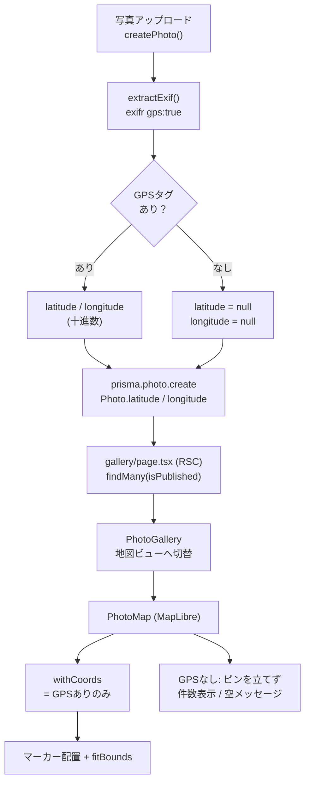
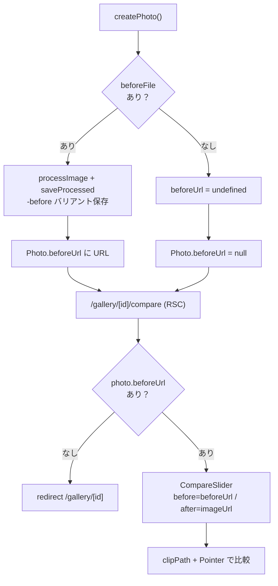
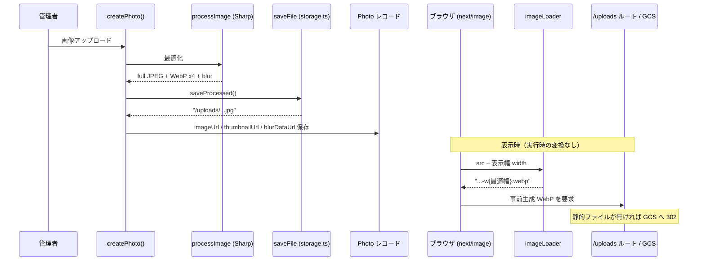

# 12. ギャラリー3本柱 機能ディープダイブ

## このドキュメントの目的

kskphotos の差別化機能である **3本柱**（地図ギャラリー / EXIF ダッシュボード / ビフォーアフター比較）について、それぞれの「データの流れ」を **end-to-end** で追いかけるためのガイドです。

[04-architecture.md](./04-architecture.md) はシステム全体の横の広がり、[06-middleware-and-components.md](./06-middleware-and-components.md) はコンポーネントごとの責務を扱います。本ドキュメントはそれらとは別の切り口で、**機能ごとの「縦の流れ」** に集中します。具体的には、各機能を次の 4 段階で実コードと一緒に追います。

1. **アップロード / 抽出** — 写真をアップした瞬間に何を取り出すか
2. **保存（DB / Storage）** — どこに何を保存するか
3. **取得（RSC）** — サーバーコンポーネントがどうデータを引くか
4. **表示（コンポーネント）** — 画面でどう見せるか

> 用語メモ
> - **EXIF**: 写真ファイルに埋め込まれた撮影情報（カメラ・レンズ・絞り・GPS など）のメタデータ。
> - **RSC（React Server Components）**: サーバー側で実行され、DB から直接データを引いて HTML を組み立てる React コンポーネント。本プロジェクトでは `page.tsx` がこれにあたります。
> - **アップロード処理の入口**は管理画面のサーバーアクション [`app/src/app/admin/photos/actions.ts`](../app/src/app/admin/photos/actions.ts) の `createPhoto()` です。3本柱はいずれもここから始まります。

---

## 0. 共通の入口 — `createPhoto()` で1枚を取り込む

3本柱はバラバラに見えて、入口は1つです。管理者が写真をアップロードすると `createPhoto(formData)` が走り、ここで「抽出 → 画像最適化 → 保存 → DB 登録」がまとめて行われます。

`createPhoto()` の中で起きる主なこと（[actions.ts](../app/src/app/admin/photos/actions.ts)）:

| 手順 | コード上の処理 | 関連する柱 |
|------|---------------|-----------|
| RAW なら JPEG プレビューを取り出す | `isRawFile()` → `extractPreviewJpeg()` | 共通 |
| 画像を最適化（WebP バリアント等を事前生成） | `processImage(sourceBuffer)` | 共通（画像配信） |
| バリアント一式を保存 | `saveProcessed()` → `saveFile()` | 共通（画像配信） |
| ビフォー画像があれば同様に処理・保存 | `beforeFile` → `processImage()` → `saveProcessed()` | ビフォーアフター |
| EXIF を**オリジナル**から抽出 | `extractExif(rawBuffer)` | 地図 / ダッシュボード |
| まとめて1レコードに保存 | `prisma.photo.create({ data: { ...exif, ... } })` | 全部 |

ポイントは、EXIF を最適化後の画像ではなく **オリジナル（RAW なら RAW 本体）の `rawBuffer`** から抜いていることです（[actions.ts:155](../app/src/app/admin/photos/actions.ts)）。

```ts
// EXIF はオリジナル（RAW なら RAW 本体）から抽出
const exif = await extractExif(rawBuffer);
// 寸法は sharp の処理結果（Orientation 反映済み）を優先
exif.imageWidth = processed.width || exif.imageWidth;
exif.imageHeight = processed.height || exif.imageHeight;
```

この `exif` オブジェクトには GPS（`latitude` / `longitude`）も、レンズ・絞り・ISO もすべて入っており、`...exif` でスプレッドして `Photo` レコードに一括保存されます。つまり**地図の座標もダッシュボードの集計値も、出どころは同じ1回の抽出**です。

> 正直メモ: 初期データ投入用に `prisma.config.ts` には `seed: "npx tsx prisma/seed.ts"` という設定があります。ただし `app/prisma/seed.ts` というファイル自体は**現状まだ作成されていません**（`app/prisma/` 配下にあるのは `schema.prisma` と `migrations/` のみ）。したがって現時点でデータが入る経路は、上記の管理画面アップロード（`createPhoto()`）だけです。なお Prisma 操作用の npm エイリアスは用意していないため、マイグレーション等は `npx prisma ...` を直接叩いて行います。

---

## 1. 地図ギャラリー — GPS から地図ピンまで

### 1-1. 抽出 — exifr が GPS を緯度経度に変換

地図の起点は EXIF の GPS です。[`app/src/lib/exif.ts`](../app/src/lib/exif.ts) の `extractExif()` は `exifr` ライブラリを `gps: true` で呼び出し、結果から緯度経度を取り出します（[exif.ts:82-83](../app/src/lib/exif.ts)）。

```ts
latitude: data.latitude ?? null,
longitude: data.longitude ?? null,
```

`exifr` は EXIF 内の度・分・秒（DMS）形式の生 GPS を、扱いやすい**十進数の `latitude` / `longitude`** に変換してくれます。GPS タグが無い写真（例: GPS を切って撮影、レタッチで除去された等）では両方とも `null` になります。この `null` の扱いが後段（表示）で効いてきます。

> 撮影環境メモ: α7R VI は本体に GPS を内蔵していません。位置情報は Creators' App の Bluetooth 連携、または手動付与で埋め込みます（[01-project-overview.md](./01-project-overview.md) の撮影環境表を参照）。そのため「GPS が無い写真」は普通に発生する前提です。

### 1-2. 保存 — `Photo.latitude` / `Photo.longitude`

抽出した値は [`schema.prisma`](../app/prisma/schema.prisma) の `Photo` モデルに、撮影場所として保存されます（[schema.prisma:100-103](../app/prisma/schema.prisma)）。

```prisma
// 撮影場所
location    String?
latitude    Float?
longitude   Float?
```

`Float?`（NULL 許容）なので、GPS が無い写真もエラーにならずそのまま保存されます。

### 1-3. 取得 — ギャラリー RSC が全件を引く

地図はギャラリーページの一機能です。[`app/src/app/gallery/page.tsx`](../app/src/app/gallery/page.tsx) は公開写真を全件取得してクライアントコンポーネントへ渡します。

```ts
const photos = await prisma.photo.findMany({
  where: { isPublished: true },
  orderBy: { createdAt: "desc" },
});
// ...
<PhotoGallery photos={photos} />
```

ここでは GPS の有無で絞り込みません。**緯度経度を含む全フィールドを丸ごと渡す**のがポイントで、地図用のフィルタは表示側で行います。

### 1-4. 表示 — `PhotoGallery` → `PhotoMap`（MapLibre）

`PhotoGallery`（[photo-grid.tsx](../app/src/components/gallery/photo-grid.tsx)）はグリッド表示と地図表示をトグルで切り替えるクライアントコンポーネントです。地図ボタンが押されると、カテゴリ絞り込み後の `filtered` を `PhotoMap` に渡します（[photo-grid.tsx:155](../app/src/components/gallery/photo-grid.tsx)）。

```tsx
) : (
  <PhotoMap photos={filtered} />
)}
```

地図本体は [`app/src/components/gallery/photo-map.tsx`](../app/src/components/gallery/photo-map.tsx) で、**MapLibre GL JS**（API キー不要のオープンソース地図ライブラリ）を使います。タイルは CARTO Dark Matter のラスタータイルで、これも利用キー不要です。

ここで GPS の有無を初めて選別します（[photo-map.tsx:35-38](../app/src/components/gallery/photo-map.tsx)）。

```ts
const withCoords = photos.filter(
  (p): p is Photo & { latitude: number; longitude: number } =>
    p.latitude != null && p.longitude != null
);
```

`withCoords`（座標を持つ写真だけ）に対してのみマーカーを生成します。各マーカーはサムネイル入りの丸いピンで、クリックすると `/gallery/{id}` の詳細へ飛びます（[photo-map.tsx:55-81](../app/src/components/gallery/photo-map.tsx)）。

そして、ピンが収まるように地図の表示範囲を自動調整します（`fitBounds`）。([photo-map.tsx:83-87](../app/src/components/gallery/photo-map.tsx))

```ts
if (withCoords.length > 0) {
  const bounds = new maplibregl.LngLatBounds();
  for (const p of withCoords) bounds.extend([p.longitude, p.latitude]);
  map.fitBounds(bounds, { padding: 80, maxZoom: 13, duration: 0 });
}
```

**GPS が無い写真の扱い**は次の通りで、地図上では明示的に存在を消しています。

- ピンは立たない（`withCoords` から除外されるため）。
- 左上に「`{件数} photos with GPS data`」とGPS付き枚数を表示（[photo-map.tsx:101-104](../app/src/components/gallery/photo-map.tsx)）。
- もし**1枚も GPS が無い**場合（`withCoords.length === 0`）は、地図の中央に「GPS 情報付きの写真がまだありません」というメッセージを重ねます（[photo-map.tsx:105-111](../app/src/components/gallery/photo-map.tsx)）。このとき地図は日本全体を映す初期表示（`DEFAULT_CENTER` = `[137.6, 36.2]` / `DEFAULT_ZOOM` = `4.5`）のままになります。

> 言い換えると、地図ビューでは **GPS 付きの写真だけが見える** ということです。グリッドビュー（カテゴリ絞り込み）には GPS の有無に関わらず全件出るので、両者は意図的に見える対象が異なります。

### 図1: 地図ギャラリーの縦の流れ



---

## 2. EXIF ダッシュボード — メタデータをグラフに集計

### 2-1. 抽出・保存 — 集計対象フィールド

ダッシュボードは新たに何かを抽出するわけではなく、**0章で `Photo` に保存済みの EXIF フィールドを再利用**します。グラフの集計対象になるのは主に次のフィールドです（すべて `Photo` モデル / [schema.prisma:93-117](../app/prisma/schema.prisma)）。

| フィールド | 型 | 使われるグラフ |
|-----------|----|--------------|
| `lensModel` | `String?` | レンズ使用率（横棒） |
| `category` | `PhotoCategory` | カテゴリー比率（円） |
| `focalLength` | `Float?` | 焦点距離 × 絞り（散布図 X軸） |
| `aperture` | `Float?` | 焦点距離 × 絞り（散布図 Y軸） |
| `iso` | `Int?` | ISO感度の分布（縦棒） |

`category` 以外は NULL 許容なので、値が無い写真は集計から自然に除外される作りになっています（後述）。

### 2-2. 取得 — ダッシュボード RSC が全件を引く

[`app/src/app/dashboard/page.tsx`](../app/src/app/dashboard/page.tsx) は公開写真を全件取得して `ExifDashboard` に渡すだけのシンプルな RSC です。

```ts
export const revalidate = 3600;

const photos = await prisma.photo.findMany({
  where: { isPublished: true },
});
// ...
<ExifDashboard photos={photos} />
```

**集計はサーバーで事前にやらず、写真の配列をそのままクライアントへ渡している**点が特徴です。集計ロジックは表示コンポーネント側に置かれています（写真枚数が個人ポートフォリオ規模で、ブラウザ側集計でも十分軽いという判断）。`revalidate = 3600` で1時間ごとに再生成されます。

### 2-3. 表示 — `ExifDashboard`（Recharts）

[`app/src/components/dashboard/exif-charts.tsx`](../app/src/components/dashboard/exif-charts.tsx) は **Recharts**（React 用の宣言的グラフライブラリ）で4種類のグラフ + 3つのサマリ数値を描きます。

まず上段のサマリカード（[exif-charts.tsx:199-234](../app/src/components/dashboard/exif-charts.tsx)）:

- **総撮影枚数** = `photos.length`
- **使用レンズ数** = `lensModel` の重複を除いた件数（`new Set(...)`）
- **撮影場所数** = `location` の重複を除いた件数（GPS 座標ではなく、テキストの `location` を数える点に注意）

各グラフの作りは次の通りです。

**レンズ使用率（横棒 / `BarChart`）** — `countBy(photos, p => p.lensModel)` でレンズ名ごとに枚数を数え、多い順にソートします（[exif-charts.tsx:57-84](../app/src/components/dashboard/exif-charts.tsx)）。`countBy` はキーが falsy（`null` 等）の項目を数えないので、レンズ情報の無い写真は自動的に除外されます（[exif-charts.tsx:46-55](../app/src/components/dashboard/exif-charts.tsx)）。

**カテゴリー比率（円 / `PieChart`）** — `category`（`PORTRAIT` 等の英語 enum）を `CATEGORY_LABELS` で日本語（ポートレート 等）に変換してから集計します（[exif-charts.tsx:86-120](../app/src/components/dashboard/exif-charts.tsx)）。色はサイトのトーンに合わせた CSS 変数（`--chart-1`〜`--chart-5`）を循環使用します。

**焦点距離 × 絞り（散布図 / `ScatterChart`）** — `focalLength` と `aperture` が**両方とも揃っている**写真だけを点として打ちます（[exif-charts.tsx:122-130](../app/src/components/dashboard/exif-charts.tsx)）。Y軸（絞り）は `reversed` で上下反転し、`f/2` のような開放側を上に表示します。1枚 = 1点なので「どの焦点距離でどの絞りを使いがちか」という撮影傾向が一目で分かります。

**ISO感度の分布（縦棒 / `BarChart`）** — 他と違い、ISO は連続値なので 4 つのバケットに分けて各帯の枚数を数えます（[exif-charts.tsx:164-197](../app/src/components/dashboard/exif-charts.tsx)）。コード上の区切りは「ラベル（範囲）」で次のようになっています。

| 表示ラベル | 実際の範囲（`min`〜`max`） |
|-----------|--------------------------|
| `100` | 0〜100 |
| `200-400` | 101〜400 |
| `800-1600` | 401〜1600 |
| `3200+` | 1601〜∞ |

ラベルはあくまで各バケットの目安表記で、判定は上表の `min`〜`max` の範囲で行われます（例えば ISO 500 は `800-1600` バケットに入ります）。`iso` が `null` の写真はどのバケットの範囲条件にも合致しないため数えられません。

各グラフは「対象データが0件なら `null` を返してカードごと描画しない」ガード（`if (data.length === 0) return null;`）を持つため、データが揃っていない段階でも空グラフが並ばないようになっています。ただし **ISO の縦棒だけは例外で、このガードを持たず常に表示されます**（全バケットが0件でも空の棒グラフが出ます）。

> まとめると、ダッシュボードは **「1回の抽出で `Photo` に貯めた EXIF を、表示時に数え直してグラフ化するだけ」** という構造です。新しい写真をアップするたびに（1時間の再生成を挟んで）グラフが育っていきます。

---

## 3. ビフォーアフター — RAW と仕上がりの比較

### 3-1. アップロード・保存 — `beforeUrl` の有無で機能が点く

ビフォーアフターは、メイン写真（仕上がり）に加えて**「ビフォー画像」を任意で一緒にアップロードしたときだけ**有効になる機能です。

`createPhoto()` では、フォームの `beforeFile` が存在する場合のみ、ビフォー画像もメインと同じ最適化パイプラインに通して保存し、その URL を `beforeUrl` に入れます（[actions.ts:137-152](../app/src/app/admin/photos/actions.ts)）。

```ts
let beforeUrl: string | undefined;
const beforeFile = formData.get("beforeFile") as File | null;
if (beforeFile && beforeFile.size > 0) {
  // ... RAW なら preview 抽出 → processImage → saveProcessed
  ({ imageUrl: beforeUrl } = await saveProcessed(
    beforeProcessed,
    `${timestamp}-${slug}-before`
  ));
}
```

`beforeFile` が無ければ `beforeUrl` は `undefined` のままで、[`schema.prisma`](../app/prisma/schema.prisma) の `beforeUrl String?`（[schema.prisma:89](../app/prisma/schema.prisma)）に NULL として保存されます。つまり **`Photo.beforeUrl` の有無 = 比較機能のスイッチ**です。

### 3-2. 取得・有効化条件 — `/gallery/[id]/compare`

比較は専用ルート [`app/src/app/gallery/[id]/compare/page.tsx`](../app/src/app/gallery/[id]/compare/page.tsx) で表示されます。この RSC は次の条件で「比較できる状態かどうか」を判定します（[compare/page.tsx:36-38](../app/src/app/gallery/[id]/compare/page.tsx)）。

```ts
const photo = await prisma.photo.findUnique({ where: { id } });
if (!photo || !photo.isPublished) notFound();
if (!photo.beforeUrl) redirect(`/gallery/${id}`);
```

- 写真が無い / 非公開 → `notFound()`（404）
- `beforeUrl` が無い → 通常の詳細ページへ `redirect`（比較画面は出さない）

さらに、ビルド時に静的生成する対象も `beforeUrl` を持つ写真に限定しています（[compare/page.tsx:16-22](../app/src/app/gallery/[id]/compare/page.tsx)）。

```ts
export async function generateStaticParams() {
  const photos = await prisma.photo.findMany({
    where: { isPublished: true, beforeUrl: { not: null } },
    select: { id: true },
  });
  return photos.map((p) => ({ id: p.id }));
}
```

導線側でも、写真詳細ページは `beforeUrl` がある写真にだけ「ビフォーアフターを見る」ボタンを出します（[gallery/[id]/page.tsx:74-87](../app/src/app/gallery/[id]/page.tsx)）。グリッドのフォトカードでも `beforeUrl` がある写真にだけ「· RAW」バッジが付きます（[photo-grid.tsx:76-78](../app/src/components/gallery/photo-grid.tsx)）。

比較画面では `CompareSlider` に「ビフォー = `beforeUrl`」「アフター = `imageUrl`（仕上がり本体）」を渡します（[compare/page.tsx:60-63](../app/src/app/gallery/[id]/compare/page.tsx)）。

### 3-3. 表示 — `CompareSlider` の仕組み

[`app/src/components/gallery/compare-slider.tsx`](../app/src/components/gallery/compare-slider.tsx) は外部ライブラリを使わず、CSS の `clipPath` と Pointer イベントだけで自前実装されています。

仕組みは「2枚を重ねて、上の1枚を右から切り取る」だけです（[compare-slider.tsx:97-120](../app/src/components/gallery/compare-slider.tsx)）。

- 背景に **アフター（仕上がり）** を全面表示。
- その上に **ビフォー（RAW）** を重ね、`clipPath: inset(0 {100 - position}% 0 0)` で右側を切り取る。
- `position`（0〜100）はスライダーの位置。ドラッグするとビフォーの見える幅が変わり、左がビフォー・右がアフターに見える。

スライダー位置は Pointer イベントで更新します。コンテナの矩形に対するカーソルの相対位置を 0〜100% に変換します（[compare-slider.tsx:55-62](../app/src/components/gallery/compare-slider.tsx)）。

```ts
const x = clientX - rect.left;
const percent = Math.max(0, Math.min(100, (x / rect.width) * 100));
setPosition(percent);
```

加えて初回表示時に「操作できること」を示す自動スイープ演出があります。`requestAnimationFrame` で正弦波を使い 50 → 92 → 8 → 50 と一往復し、ユーザーが触れた瞬間（`onPointerDown`）に `sweepDone` フラグで中断します（[compare-slider.tsx:33-53, 64-72](../app/src/components/gallery/compare-slider.tsx)）。`useReducedMotion`（OS のアニメ削減設定）が有効なら最初からスイープしません。

2枚とも `next/image` の `priority` で読み込むため、比較画面に入った瞬間に両画像が揃います。

### 図2: ビフォーアフターの有効化フロー



---

## 4. 画像配信の縦串 — 3本柱を支える共通基盤

3本柱の表示はすべて画像を伴います。その画像をどう速く配るかが、`processImage` → `imageLoader` → `saveFile`/`deleteFile` の3点セットです。これは「アップロード時に重い処理を全部済ませ、表示時は事前生成ファイルを選ぶだけ」という方針で貫かれています。

### 4-1. 事前生成 — `images.ts`（Sharp）

[`app/src/lib/images.ts`](../app/src/lib/images.ts) の `processImage()` は **Sharp**（高速な画像処理ライブラリ）でアップロード画像を最適化し、複数の成果物を**アップロード時に一括生成**します（[images.ts:31-64](../app/src/lib/images.ts)）。

- **フルサイズ JPEG**（最大 2560px、mozjpeg 品質88）→ `Photo.imageUrl` の本体
- **配信用 WebP バリアント** — 幅 `400 / 800 / 1600 / 2560` の4種（`VARIANT_WIDTHS`、品質82）
- **blur プレースホルダー** — 幅16pxの極小 WebP（品質30）を Base64 data URL 化（`blurDataUrl`）。読み込み中のぼかし表示に使う。

最初に `sharp(buffer).rotate()` を呼び、EXIF の Orientation（撮影時の向き）を物理回転として焼き込むため、表示側で向きを気にする必要がありません。

> 設計の狙い: バリアントを事前に作っておくことで、**実行時（リクエストごと）の画像変換をゼロにする**＝Cloud Run の CPU とレイテンシを節約する、というのが [image-loader.ts](../app/src/lib/image-loader.ts) のコメントにも明記された方針です。

### 4-2. 表示幅で選択 — `image-loader.ts`

[`app/src/lib/image-loader.ts`](../app/src/lib/image-loader.ts) は `next/image` の **カスタムローダー**です。Next.js 標準のオンデマンド最適化を使わず、要求された表示幅 `width` に対して「それ以上で最小のバリアント幅」を選び、URL を `.webp` バリアントへ書き換えるだけです（[image-loader.ts:24-33](../app/src/lib/image-loader.ts)）。

```ts
const base = match[1].replace(/-w\d+$/, "");
const variant =
  VARIANT_WIDTHS.find((v) => v >= width) ??
  VARIANT_WIDTHS[VARIANT_WIDTHS.length - 1];
return `${base}-w${variant}.webp`;
```

`/uploads/` 以外（外部画像など）や拡張子が合わないものはそのまま返します。重要なのは、ここの `VARIANT_WIDTHS`（`[400, 800, 1600, 2560]`）が `images.ts` の `VARIANT_WIDTHS` と**完全に一致していなければならない**点で、両ファイルのコメントで相互に注意書きがされています。生成した幅と探す幅がズレると、存在しない WebP を要求して404になるためです。

### 4-3. 保存先の切替 — `storage.ts`（GCS / ローカル）

[`app/src/lib/storage.ts`](../app/src/lib/storage.ts) は生成したバッファの保存先を環境変数で切り替えます（[storage.ts:40-60](../app/src/lib/storage.ts)）。

| 条件 | 保存先 | 用途 |
|------|--------|------|
| `GCS_BUCKET_NAME` が設定済み | Google Cloud Storage（`uploads/` プレフィックス） | 本番 |
| 未設定 | ローカル FS（`public/uploads/`） | 開発 |

どちらの場合も返す URL は `/uploads/<filename>` 形式で統一され、呼び出し側（`saveProcessed`）は保存先を意識しません。GCS 保存時は `cacheControl: public, max-age=31536000, immutable`（1年キャッシュ）を付けます。ファイル名がタイムスタンプ付きで一意なため、内容が変わらない前提で長期キャッシュにできます。削除も `deleteFile()` で同じく両環境に対応します。

**`/uploads/<filename>` という URL が実際にどう配信されるか**は、その写真がいつ追加されたかで分かれます（[uploads/[...path]/route.ts](../app/src/app/uploads/[...path]/route.ts)）。

- **ビルド時に `public/uploads/` に存在した静的ファイル** → イメージに焼き込まれ、そのまま静的配信される（こちらが優先）。
- **ビルド後に管理画面からアップロードされた分** → 静的ファイルが無いので `/uploads/[...path]` ルートハンドラに到達し、GCS の公開 URL（`https://storage.googleapis.com/<bucket>/uploads/...`）へ 302 リダイレクトして配信される（このリダイレクト応答自体は `max-age=3600`）。`GCS_BUCKET_NAME` 未設定なら 404 を返します。

> 正直メモ（誇張しないための注意）
> - **Cloud CDN は保留（未適用）** です。GCS のキャッシュヘッダや上記リダイレクトは効きますが、CDN 層は本ドキュメント時点では構成に入っていません。
> - **Cloud Run のローカルディスクは非永続**です。本番でローカル FS に書くとコンテナ再起動で消えるため、**本番は GCS 前提**（`GCS_BUCKET_NAME` を設定して使う）です。ビルド後アップロード分が GCS へ向く `/uploads` ルートハンドラも、この前提を支える仕組みです。
> - DR / マルチリージョンの仕組みはありません。
> - 共有 Cloud SQL は姉妹サイト kokumin-pedia と同一インスタンスですが（インスタンス本体は kokumin-pedia 側 Terraform が所有）、kskphotos は自分のデータベースに対してのみマイグレーションを行います。`reset` 等の破壊的操作は共有インスタンスでは避けてください。

### 図3: 1枚の画像が配信されるまで



---

## まとめ

| 柱 | 抽出 / 入力 | 保存 | 取得（RSC） | 表示 |
|----|-----------|------|------------|------|
| 地図ギャラリー | `extractExif()` の GPS | `Photo.latitude/longitude` | `gallery/page.tsx` 全件 | `PhotoMap`（MapLibre、GPS有りのみピン、`fitBounds`） |
| EXIF ダッシュボード | `extractExif()` の各値 | `Photo.lensModel/category/focalLength/aperture/iso` | `dashboard/page.tsx` 全件 | `ExifDashboard`（Recharts 4種） |
| ビフォーアフター | `beforeFile`（任意） | `Photo.beforeUrl` | `gallery/[id]/compare` で有無を判定 | `CompareSlider`（`clipPath` 自前実装） |

3本柱に共通する設計思想は **「アップロード時に1回だけ重い処理（抽出・最適化）を済ませ、表示時はDBの値と事前生成ファイルを選ぶだけにする」** ことです。EXIF は1回の抽出で地図にもダッシュボードにも回り、画像は1回の最適化で全幅のバリアントが揃います。この前倒しが、スケール to ゼロの Cloud Run でも軽快に動くギャラリーを成立させています。
