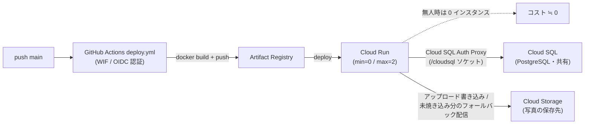

# ADR 001: 実行基盤に Cloud Run を採用（GKE ではなく）

> ADR（Architecture Decision Record）= 設計上の重要な判断を「背景・決定・理由・結果」の形で短く残す記録。後から「なぜこうしたか」を辿れるようにするためのもの。

- ステータス: 採用
- 日付: 2026-06-18

> 関連ドキュメント: [01. プロジェクト全体像](../01-project-overview.md) / [02. GCP Terraform ガイド](../02-gcp-terraform.md) / [03. GitHub Actions CI/CD ガイド](../03-github-actions.md) / [04. アーキテクチャ全体像](../04-architecture.md)

## 背景 (Context)

kskphotos は個人の写真ポートフォリオ兼撮影依頼サイトであり、同時に「Next.js のフルスタック実装力」と「GCP のクラウド/IaC/CI-CD 力」の両面を示す技術ショーケースでもあります。その一部として、コンテナ化した Next.js アプリ（`app/Dockerfile`）を GCP 上で動かす必要があります。実行基盤を選ぶうえで、次の制約・前提がありました。

| 観点 | kskphotos の実態 |
|------|------------------|
| トラフィック | 個人サイト。アクセスは断続的で、無人の時間帯が長い |
| 予算 | 月額数ドル規模に抑えたい（CLAUDE.md・[01](../01-project-overview.md) のコスト見積を参照） |
| 運用体制 | 一人運用。インフラ専任者はいない。本人はクラウド初学者 |
| アプリ形態 | Next.js 16 を `output: "standalone"`（`app/next.config.ts`）でビルドし、単一コンテナ（`node server.js`）で起動 |
| 依存サービス | Cloud SQL（PostgreSQL、姉妹サイト kokumin-pedia と共有・DB 本体は kokumin-pedia 側 Terraform が所有）、Cloud Storage、Artifact Registry |
| 状態 | アプリ自体はステートレス。永続データは外部（Cloud SQL / Cloud Storage）に逃がす設計 |

つまり「常時フル稼働するサービス」ではなく、「アクセスがあるときだけ動けばよい、状態を外に持つ単一コンテナ」を、低コスト・低運用負荷で安定して動かす基盤が求められていました。

「実行基盤」とはコンテナを動かす土台のことで、GCP では主に次の 2 つが候補になります。

- **GKE（Google Kubernetes Engine）** = Kubernetes（コンテナを束ねて運用する仕組み）のマネージド版。柔軟だが、クラスタやノードの管理が伴う。
- **Cloud Run** = コンテナを渡すだけで HTTP サービスとして動かしてくれるサーバーレス実行基盤。サーバーの台数管理を意識しなくてよい。

## 決定 (Decision)

コンテナ実行基盤として **Cloud Run を採用**します。GKE（Kubernetes）は採用しません。Cloud Run のリソースは Terraform モジュール `terraform/modules/cloud-run`（`google_cloud_run_v2_service`）で管理し、ルートの `terraform/resources.tf` から呼び出しています。

## 理由 / 代替案との比較

主な比較軸は「コスト」「運用負荷」「アプリ形態との適合」です。

| 比較軸 | Cloud Run（採用） | GKE（不採用） |
|--------|-------------------|----------------|
| 最小コスト | リクエストが無い間はインスタンス 0（`min_instance_count = 0`）。アイドル時は無料に近い。見積で月 $0〜5 | クラスタ／ノードが常時稼働し、無人時間帯も課金が続く。個人サイトには過剰 |
| 運用負荷 | コンテナイメージを渡すだけ。ノード・Pod・スケジューラ等の管理が不要 | クラスタ運用、ノードプール、アップグレード、YAML 群（Deployment / Service / Ingress 等）の管理が必要 |
| 学習コスト | HTTP コンテナの概念だけで運用開始できる | Kubernetes の習得が前提。初学者・一人運用には負担が大きい |
| スケール | リクエスト量に応じて自動。本構成は `min=0 / max=2`（`terraform/modules/cloud-run/variables.tf` のデフォルト）で上限も低く抑制 | 自前で HPA 等を構成。手数が増える |
| 可搬性 | 標準的な Dockerfile ベース。基盤を移しても通用する資産 | 同じく Docker は使えるが、k8s マニフェストは基盤固有の運用知識を要する |
| 状態管理 | ステートレス前提と相性が良い。状態は Cloud SQL / Cloud Storage に外出し | ステートフル運用も可能だが、本アプリには不要な機能 |

判断の骨子は次の 3 点です。

1. **低トラフィック × スケール to ゼロ = コスト最小化。** Cloud Run は `min_instance_count = 0`（`terraform/modules/cloud-run/variables.tf` の `min_instances` デフォルト 0）でリクエストが無い間インスタンスを 0 まで落とせます。さらにモジュールの `terraform/modules/cloud-run/main.tf` の `resources` ブロックで `cpu_idle = true`（リクエスト処理外で CPU 課金を止める）を設定しており、無人の時間帯の費用がほぼ発生しません。常時クラスタが回り続ける GKE では、この「使っていない間はタダ同然」が成立しません。

2. **Kubernetes 運用負荷の回避。** 一人運用かつ初学者という体制では、クラスタ・ノード・各種マニフェストの保守が継続的な負担になります。Cloud Run はコンテナイメージを渡すだけで動き、Terraform 上は `google_cloud_run_v2_service` 1 リソース（＋公開用の `google_cloud_run_v2_service_iam_member`：`allUsers` に `roles/run.invoker` を付与）で完結します。運用面の差は、Terraform で管理する対象の少なさにそのまま表れています。

3. **コンテナ（Dockerfile）ベースの可搬性。** アプリはマルチステージ構成の `app/Dockerfile`（`node:22-alpine` ベースの deps → builder → runner）でビルドし、`output: "standalone"` により最小の `server.js` だけで起動します（`CMD ["node", "server.js"]`、`PORT=8080`）。これは特定基盤に縛られない標準的なコンテナで、Cloud Run でも他のコンテナ基盤でも通用する資産です。デプロイは Artifact Registry へ push 後に Cloud Run へ反映する流れ（`.github/workflows/deploy.yml`、Workload Identity Federation による OIDC 認証）で、k8s 固有の知識を一切持ち込まずに回せます。これは「クラウド/IaC/CI-CD 側の見せ場」でもあり、Next.js 実装と並ぶ本ポートフォリオの両輪の一方を担います。

> 補足: 写真ファイルは**ビルド時**に GCS（`gs://kskphotos-photos/uploads`）から同期してイメージに焼き込み、実行時は基本的にコンテナ内の静的ファイルとして配信します（`deploy.yml` の rsync ステップ、`app/src/lib/storage.ts`）。ビルド後に管理画面からアップロードされた分だけが `app/src/app/uploads/[...path]/route.ts` 経由で GCS へリダイレクト配信されます。

## 結果 (Consequences)

- 良い点:
  - **コストが使用量に連動。** 無人時間帯はインスタンス 0 まで縮退し、月額を $0〜5 規模に抑えられる（個人サイトの実態に最適）。
  - **運用がシンプル。** クラスタ管理が不要。Terraform で扱うのは Cloud Run サービス 1 リソース中心で、変更の見通しが良い。
  - **基盤に縛られない。** 標準的な Dockerfile ＋ `standalone` 出力のため、将来別のコンテナ基盤へ移す際も資産を活かせる。
  - **依存サービスと素直に接続。** Cloud SQL は `cloudsql_connection_name` 指定時のみ Auth Proxy 用ボリュームを動的にマウントする構成（`main.tf` の `dynamic "volume_mounts"` / `dynamic "volumes"`）で、必要なときだけ繋がる。

- トレードオフ / 注意点:
  - **コールドスタート。** スケール to ゼロの裏返しとして、アクセスが途絶えた後の初回リクエストはインスタンス起動分だけ遅くなる。緩和策として `startup_cpu_boost = true`（起動時に CPU を増し、立ち上がりを速める）を設定済み。常時即応が必須なら `min_instances` を 1 以上に上げる選択肢もあるが、その場合は常時課金とのトレードオフになる。
  - **ファイルシステムは揮発的。** Cloud Run のコンテナ内ストレージは一時的で、再デプロイやスケールで失われる。そのためアップロードされた写真の永続化は Cloud Storage（GCS）を前提とし、ローカル FS への保存は開発時のフォールバック（非永続）に留めている（`app/src/lib/storage.ts`）。
  - **長時間処理・常駐ワーカー向きではない。** Cloud Run は HTTP リクエスト駆動が基本で、常駐バックグラウンド処理には不向き。ただし kskphotos はステートレスな Web 配信が中心で、この制約は問題にならない。
  - **画像配信 CDN は現時点で保留。** Cloud CDN は構成上の候補だが、コスト見積との兼ね合いで意図的に未適用。現状は GCS のキャッシュ制御（`Cache-Control: public, max-age=31536000, immutable`）と、ビルド時にイメージへ焼き込んだ静的配信でまかなっている。常時稼働の CDN は前提にしていない。
  - **k8s 固有の高度なオーケストレーションは使えない。** 複雑な Pod 間連携やステートフルセットなどが将来必要になった場合は再検討が要るが、現時点の要件では過剰機能であり該当しない。
