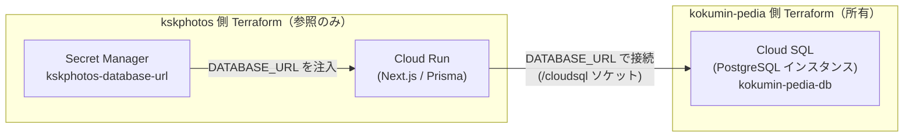

# ADR 002: Cloud SQL を姉妹サイトと共有

- ステータス: 採用
- 日付: 2026-06-18

> ADR（Architecture Decision Record）= 「なぜこの構成にしたか」を 1 件 1 ファイルで残す設計判断の記録。後から読む人（採用担当者・将来の自分）が背景まで理解できるようにする。

## 背景 (Context)

kskphotos は写真ポートフォリオ兼・撮影依頼の商用サイトであり、同時に「Next.js のフルスタック実装力」と「GCP のクラウド/IaC(Terraform)/CI-CD(OIDC) 運用力」の両面を見せる技術ショーケースでもあります。データは PostgreSQL（リレーショナル DB）に保存し、アプリは Prisma 7 + `@prisma/adapter-pg`（`PrismaPg`）でこの DB に接続します（`app/src/lib/prisma.ts`）。

ここで「DB を置く器」である **Cloud SQL インスタンス**（GCP のマネージド DB サーバー）をどう用意するかが課題でした。kskphotos には以下の制約・前提があります。

- **個人運用・小規模**: トラフィックは限定的で、Cloud Run はスケール to ゼロ（アクセスが無ければインスタンス 0 = 課金ほぼ 0）で運用している（`terraform/variables.tf` の `cloud_run_min_instances` 既定 `0`、`terraform.tfvars` でも `0`）。
- **コスト最優先**: Cloud Run / Storage / Artifact Registry など他サービスは無料枠内〜数ドルに収まる設計。`docs/02-gcp-terraform.md` のコスト内訳でも合計は「Cloud SQL 除く」で **$2〜11/月**。
- **常時起動が必要な唯一の重いリソースが DB**: Cloud SQL はスケール to ゼロできず、最小構成でも常時課金（月 $7〜10）が発生する。専用に 1 台立てると、サイト本体のコストより DB の固定費が支配的になってしまう。
- **姉妹サイトが既に Cloud SQL を運用中**: 同じ GCP プロジェクト（`kskphotos-prod`）で稼働する [kokumin-pedia](../../../kokumin-pedia/) が、自身の Terraform で Cloud SQL（PostgreSQL）インスタンスを所有・管理している。

この「DB の固定費だけが突出する」問題を、専用インスタンスの新設で解くか、既存インスタンスの共有で解くかを決める必要がありました。

## 決定 (Decision)

kskphotos 専用の Cloud SQL インスタンスは**立てない**。姉妹サイト kokumin-pedia が所有する既存の Cloud SQL（PostgreSQL）インスタンスを**共有**し、kskphotos 側は `DATABASE_URL` という接続文字列を Secret Manager から受け取って**接続するだけ**にする。インスタンス本体の作成・管理（プロビジョニング・バックアップ等）は kokumin-pedia 側 Terraform の所有とする。

## 理由 / 代替案との比較

DB インスタンスの調達方法を 2 案で比較しました。

| 観点 | 案A: 専用インスタンスを新設 | 案B: 姉妹サイトと共有（採用） |
|------|------|------|
| 月額固定費 | +$7〜10（kskphotos 単独で全額負担） | $7〜10 を 2 サイトで共有（実質の追加固定費はほぼ 0） |
| 管理対象 | kskphotos の Terraform が DB を作成・運用 | 接続情報を参照するだけ。DB 運用は持たない |
| 運用負荷 | バックアップ・パッチ・モニタリングを二重に持つ | 1 インスタンスに集約。運用は kokumin-pedia 側に一本化 |
| スケール to ゼロ | 不可（DB は常時起動・常時課金） | 同左だが、既に動いている 1 台に相乗りなので増分なし |

採用理由を初心者にも分かる形で整理すると次のとおりです。

- **固定費が二重にならない**: Cloud SQL は止められない常時課金リソース。同じプロジェクトで同種の PostgreSQL がすでに 1 台動いているのに、もう 1 台立てれば固定費が単純に倍増する。1 台に相乗りすれば、kskphotos のために新たに払う DB の固定費は実質ゼロに近い。
- **所有と責務をシンプルに分ける**: 「インスタンスを作る・守るのは kokumin-pedia、kskphotos は使うだけ」と境界を明確化。kskphotos の Terraform は DB リソース（`google_sql_database_instance` 等）を 1 つも持たず、Cloud SQL は外部所有として接続名（`terraform/variables.tf` の `cloudsql_connection_name`、既定 `kskphotos-prod:asia-northeast1:kokumin-pedia-db`）を受け取って `cloud-run` モジュールへ渡すだけ（`terraform/resources.tf`）。
- **アプリ実装が疎結合**: アプリは接続先がどう用意されたかを知らない。`app/src/lib/prisma.ts` も `app/prisma.config.ts` も `process.env.DATABASE_URL` を読むだけで、共有か専用かに依存しない。将来 kskphotos が成長して専用インスタンスへ移したくなっても、`DATABASE_URL`（Secret Manager の値）を差し替えるだけで切り替えられる。

この「インフラ（Terraform で所有境界を切る）」と「アプリ（`DATABASE_URL` だけに依存する疎結合実装）」の両面を、同じ判断のなかで一貫させている点が本 ADR の肝です。

### 接続の流れ

DB 本体は外部所有のまま、kskphotos は「接続情報」と「接続経路」だけを自前で用意します。

接続経路の具体は次のとおりで、いずれも「インスタンスの所有」とは独立しています。

- **実行時**: Cloud Run に共有インスタンスを Cloud SQL ソケット（`/cloudsql` にマウント）として接続し、Secret Manager の `DATABASE_URL` を環境変数で注入する（`terraform/modules/cloud-run/main.tf` の `cloud_sql_instance` ボリューム + `/cloudsql` マウント、`resources.tf` の `secret_env_vars.DATABASE_URL`）。実行時の権限は Cloud Run サービスアカウントの `roles/cloudsql.client` + `roles/secretmanager.secretAccessor`（`terraform/modules/iam/main.tf`）で最小限に絞っている。
- **ビルド時**: ISR ページが `generateStaticParams` でビルド中に DB を参照するため、`deploy.yml` で Cloud SQL Auth Proxy（DB へ安全に TCP 接続する公式ツール。本構成では v2.15.2 を取得）を立て、`docker build --network=host` から同じ共有インスタンスへ接続する。CI 側も WIF 経由のサービスアカウントに `roles/cloudsql.client` を付与している。

## 結果 (Consequences)

- 良い点:
  - DB の固定費を新たに増やさずに済む（$7〜10 を 2 サイトで共有）。kskphotos の追加コストは Cloud Run / Storage 等の従量分のみ。
  - kskphotos の Terraform から DB の運用責務（作成・バックアップ・パッチ）が消え、構成がシンプルになる。所有境界が「作る側＝kokumin-pedia / 使う側＝kskphotos」と明確。
  - アプリは `DATABASE_URL` のみに依存する疎結合。専用インスタンスへの将来移行は接続文字列の差し替えで済む。
- トレードオフ / 注意点:
  - **2 サイトが 1 インスタンスを共有する結合**: 同一インスタンスのため、リソース（CPU / メモリ / 接続数）や障害・メンテナンスのタイミングを共有する。一方の負荷がもう一方に影響しうる。
  - **論理的な分離は規律で担保する**: 同居しても互いのデータに踏み込まないよう、インスタンス内で **DB（データベース）またはスキーマ（テーブルの名前空間）を分け、接続ユーザーの権限も分離する**運用が前提。kskphotos は `DATABASE_URL` の接続先 DB / スキーマでこの境界を守る。
  - **所有境界をまたぐ変更の調整**: インスタンスのバージョンアップ・サイズ変更・停止は kokumin-pedia 側の管理。kskphotos 単独では変えられないため、影響のある変更は両者で調整が必要。
  - **DR・冗長性は本 ADR の範囲外**: 共有はあくまでコスト最適化のための同居であり、クロスリージョン DR・マルチ AZ・キャッシュ層（Redis 等）は kskphotos には設けていない。これらは現在の個人運用・小規模という前提では過剰なため、意図的に持たない判断としている。
