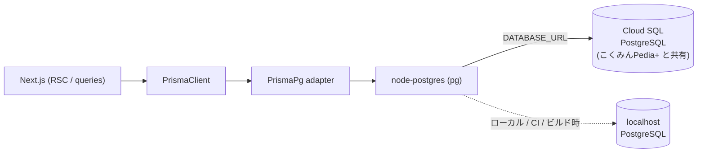

# ADR 003: Prisma driver adapter (@prisma/adapter-pg) を採用

- ステータス: 採用
- 日付: 2026-06-18
- 関連: [05. 技術スタックと採用理由](../05-tech-stack-rationale.md) / [07. データモデル(Prisma)ガイド](../07-data-model.md) / [03. GitHub Actions CI/CD ガイド](../03-github-actions.md)

> ADR（Architecture Decision Record）は「なぜこの設計にしたか」を 1 つの決定ごとに残す記録です。本書は DB への接続方式の決定を扱います。

## 背景 (Context)

kskphotos は PostgreSQL を ORM の **Prisma 7**（`prisma` / `@prisma/client` / `@prisma/adapter-pg` いずれも `^7.8.0`）経由で操作します。ORM とは、DB のテーブルを TypeScript の型付きオブジェクトとして扱える仕組みのことです。

DB 接続には、次の 2 つの「つなぎ方」のどちらかを選ぶ必要がありました。

1. **クエリエンジン同梱方式**（従来の Prisma の既定）— Prisma が同梱する Rust 製バイナリ（クエリエンジン）が DB へ直接つなぐ。
2. **driver adapter 方式** — JavaScript の DB ドライバ（ここでは node-postgres = `pg`）に接続を任せ、Prisma はその上に乗る。「driver adapter」とは、Prisma と JS ドライバの間に挟む変換アダプタのことです。

加えて kskphotos 固有の制約がありました。

- **接続先が環境ごとに違う**。本番（Cloud Run）からは Cloud SQL へ **Unix ソケット**（接続文字列の末尾に `?host=/cloudsql/<接続名>` を付ける形式。Cloud Run がコンテナ内 `/cloudsql` にソケットをマウントする）でつなぎ、ローカル・CI・ビルド時は **TCP の localhost** でつなぐ。接続文字列（`DATABASE_URL`）の差し替えだけで両方を切り替えたい。
  - ビルド時の事情: ISR ページ（`revalidate = 3600`）が `generateStaticParams` でビルド中に DB を読むため、`deploy.yml` は Cloud SQL Auth Proxy を `localhost:5432` に立て、ソケット指定を TCP に書き換えた `DATABASE_URL`（`sed` で `?host=/cloudsql/...` を除去し `@localhost:5432/` へ変換）でビルドします。
  - 各環境の TCP ポート: CI（GitHub Actions の postgres サービス）は `localhost:5432`、ビルド時の Auth Proxy も `localhost:5432`、ローカル開発（docker-compose のホスト側ポート）は `localhost:5433`。
- **DB 本体は姉妹サイト こくみんPedia+ 側の Terraform が所有**し、Cloud SQL（PostgreSQL）を共有する構成。kskphotos の Terraform は接続名（`cloudsql_connection_name`）を受け取って Cloud Run にマウントするだけで、DB インスタンスそのものは管理しません。つなぎ方の柔軟さは欲しいが、DB インスタンスの管理は kskphotos に持ち込まない。

> 補足: Prisma 7 では、これまで preview だった driver adapter が標準的な接続手段として位置づけられました。本 ADR はその方針に沿って、最初から adapter 方式を採用するものです。

## 決定 (Decision)

Prisma の接続を **driver adapter 方式**にし、node-postgres ベースの **`@prisma/adapter-pg`（`PrismaPg`）** を介して `PrismaClient` を生成します（`app/src/lib/prisma.ts`）。クエリエンジン同梱方式は使いません。

```ts
// app/src/lib/prisma.ts（抜粋）
import { PrismaClient } from "@/generated/prisma/client";
import { PrismaPg } from "@prisma/adapter-pg";

function createPrismaClient() {
  const adapter = new PrismaPg({ connectionString: process.env.DATABASE_URL });
  return new PrismaClient({ adapter });
}
```

スキーマ側（`app/prisma/schema.prisma`）も `provider = "prisma-client"` の新しいジェネレータを使い、生成物は `src/generated/prisma`（git 管理外）に出力します。`datasource db` は `provider = "postgresql"` のみで URL を持たず、接続情報は実行時に `DATABASE_URL` から adapter へ渡します（CLI 向けの接続設定は `app/prisma.config.ts` に集約）。

## 理由 / 代替案との比較

DB へのつなぎ方を「Prisma 同梱のクエリエンジン」に任せるか、「JS のドライバ（`pg`）」に任せるか、の二択です。

| 観点 | クエリエンジン同梱方式（不採用） | driver adapter 方式（採用 / `@prisma/adapter-pg`） |
|------|------------------------------|------------------------------------------------|
| Prisma 7 の位置づけ | 旧来の方式 | 標準的な接続手段として推奨 |
| DB との接続を担う主体 | 同梱の Rust バイナリ | JS ドライバ `pg`（Node.js ネイティブ） |
| Unix ソケット / TCP の切替 | 接続文字列頼み | `pg` が両形式を素直に解釈。Cloud SQL ソケット・Auth Proxy 経由 TCP の双方に同じコードで対応 |
| ランタイムへの収まり | Rust バイナリを抱える | JS で完結し、Cloud Run のコンテナに収めやすい |
| 接続の見通し | エンジン内部に隠れる | `new PrismaPg({ connectionString })` と明示的で、初心者でも何が起きているか追える |

要点を初心者向けにかみ砕くと、

- **「誰が DB につなぐか」を JS 側（`pg`）に寄せた**ので、接続のふるまいがコード上で見えやすく、追いやすい。
- **接続文字列 1 本で環境を切り替えられる**。`DATABASE_URL` を差し替えるだけで、本番（Cloud SQL の Unix ソケット）/ ビルド・CI（TCP `localhost:5432`）/ ローカル（`localhost:5433`）に対応します。`pg` がソケット形式・TCP 形式の両方を解釈してくれるため、アプリ側のコードは 1 つで済みます。
- **Prisma 7 の推奨に最初から乗る**ことで、後から方式変更する手戻りを避けられます。

`prisma.ts` は接続を 1 回だけ作る工夫もしています。`globalThis` にクライアントをキャッシュし、開発時（`NODE_ENV !== "production"`）のホットリロードで接続が増殖するのを防ぎます（本番ではキャッシュへ保存しません）。



この決定は「アプリ（Next.js フルスタック）」と「クラウド（Cloud Run / Cloud SQL / CI-CD）」の接点にあたります。アプリのコードを 1 本に保ったまま、環境差は接続文字列とインフラ側（Auth Proxy / ソケットマウント）で吸収する、という両面の設計判断です。

## 結果 (Consequences)

- 良い点:
  - **接続文字列だけで環境を切替**できる。Cloud SQL の Unix ソケット（本番 Cloud Run）と TCP `localhost`（ビルド時の Auth Proxy / CI / ローカル）を、同じアプリコードでカバー。
  - **接続のふるまいが明示的**で、`PrismaPg({ connectionString })` を読めば何をしているか分かる。学習・デバッグの見通しがよい。
  - **Prisma 7 の推奨方針に準拠**。将来のアップグレード時に方式変更の手戻りが起きにくい。
  - **JS 完結でコンテナに収めやすい**。Cloud Run（スケール to ゼロ）のイメージに無理がない。

- トレードオフ / 注意点:
  - **依存が 1 つ増える**。`@prisma/client` に加えて `@prisma/adapter-pg`（内部で `pg` を使う）を管理する必要がある。
  - **接続文字列の形式差に依存**する。本番のソケット指定 `?host=/cloudsql/...` を、ビルド時は TCP に書き換える処理（`deploy.yml` の `sed`）が必要で、ここを誤ると接続できない。実装と運用の両方で形式を意識する必要がある。
  - **接続プールやプロキシは別途の論点**。本 ADR は「つなぎ方」を決めるもので、PgBouncer 等のプーリングや常設の接続管理までは含まない（現状は実行時に Cloud SQL へソケット接続し、ビルド時のみ Auth Proxy を一時起動する）。
  - **DB インスタンス自体は kskphotos の管轄外**。Cloud SQL 本体は こくみんPedia+ 側 Terraform が所有・共有しているため、接続方式の変更はできても、インスタンス構成（容量・バージョン等）の変更は本リポジトリ単独では完結しない。
