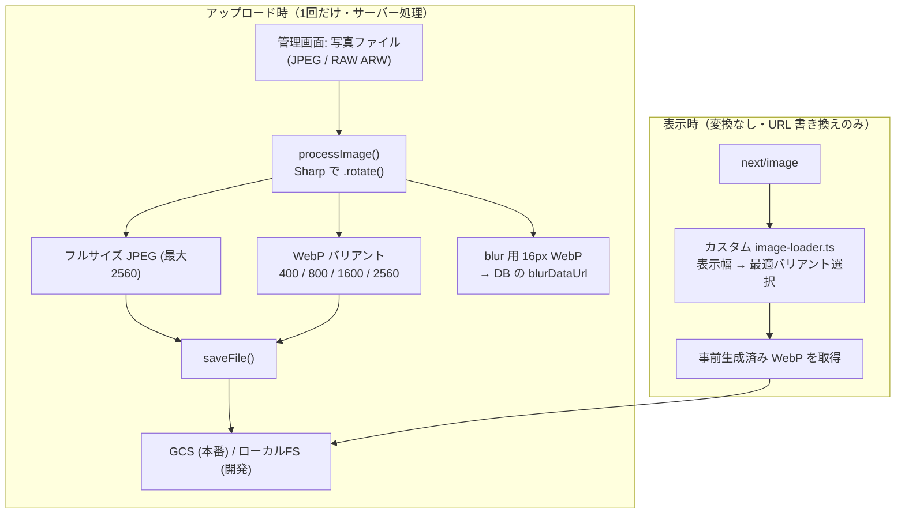

# ADR 004: 画像は事前生成 WebP + カスタムローダーで配信

- ステータス: 採用
- 日付: 2026-06-18

> ADR（Architecture Decision Record）= 「なぜこの設計にしたか」を1件ずつ記録する短い文書。

このサイトは「**Next.js フルスタック実装力**」と「**GCP のクラウド／IaC 力**」の両面を見せるためのポートフォリオです。本 ADR は、画像配信を題材に「アプリ実装の判断」と「Cloud Run のコストモデルに合わせたインフラ判断」が、どう一本につながっているかを記録します。

---

## 背景 (Context)

kskphotos は写真ポートフォリオサイトなので、1ページに高解像度の写真が何枚も並びます。撮影機材は Sony α7R VI（約6100万画素）で、RAW（ARW）→ Lightroom 現像 → JPEG 書き出しという流れのため、元画像は非常に大きいものです。これを「速く・安く」配信する仕組みが必要でした。

Next.js には標準で `next/image` という画像最適化機能があります。これは便利ですが、デフォルトでは **画像を表示するたびにサーバー側で変換**（リサイズ・WebP 化）します。kskphotos の実行基盤は以下の制約を持つため、この「実行時変換」がそのままだと噛み合いません。

| 制約 | 内容 | 出典 |
|------|------|------|
| Cloud Run はスケール to ゼロ | アクセスがないとコンテナが停止し、課金は実行中の CPU 時間に比例する。画像変換で CPU を回すと、その分そのまま費用になる | `CLAUDE.md`（GCP インフラ構成） |
| ファイルシステムが揮発的 | 実行時に変換した画像をローカルにキャッシュしても、コンテナ停止で消える。次のアクセスで再変換が必要になり、節約効果が薄い | Cloud Run の仕様（揮発前提） |
| 永続化は Cloud Storage 前提 | 画像原本・配信用ファイルは GCS に置く。常時稼働の Cloud CDN は、現状コスト見積との兼ね合いで「保留」（未適用） | `src/lib/storage.ts` / `CLAUDE.md` |

つまり「アクセスのたびに CPU で変換する」設計は、Cloud Run のコストモデルとも揮発ファイルシステムとも相性が悪い、という前提がありました。

> WebP（ウェッブピー）= Google が作った画像フォーマット。同じ見た目でも JPEG より軽くできるため、表示が速くなる。

---

## 決定 (Decision)

**画像変換は「アップロード時に1回だけ」行い、実行時（表示時）には一切変換しない。**

具体的には、管理画面から写真をアップロードした瞬間に [Sharp](https://sharp.pixelplumbing.com/)（`sharp` `^0.34.5`）で WebP の複数幅バリアントを事前生成して保存し、表示側は `next/image` の **カスタムローダー** で「表示幅にいちばん近い、事前生成済みの WebP ファイル」へ URL を差し替えるだけにします。

この方針は `app/next.config.ts` で `next/image` のデフォルト最適化を無効化し、自前ローダーを指定することで成立しています。

```ts
// app/next.config.ts
const nextConfig: NextConfig = {
  output: "standalone",
  images: {
    loader: "custom",                          // 標準の実行時最適化を使わない
    loaderFile: "./src/lib/image-loader.ts",   // 自前のローダーに差し替え
  },
  experimental: {
    serverActions: { bodySizeLimit: "200mb" }, // RAW (ARW) 直アップロードを許容
  },
};
```

---

## 仕組み（処理の流れ）

事前生成の本体は `app/src/lib/images.ts` の `processImage()` です。アップロード時に **フルサイズ JPEG・配信用 WebP バリアント・blur プレースホルダー** を一括で作ります。

- 配信用バリアント幅: `VARIANT_WIDTHS = [400, 800, 1600, 2560]`
- 各バリアント: `webp({ quality: 82 })`（`fit: "inside"` / `withoutEnlargement: true` で元画像より拡大はしない）
- フルサイズ: 最大 2560px の JPEG（`quality: 88, mozjpeg: true`）
- blur 用: 16px の極小 WebP（`quality: 30`）を base64 化した Data URL（読み込み中のぼかし表示用）
- `sharp(buffer).rotate()` で EXIF の Orientation（撮影時の縦横情報）を物理的な回転として焼き込み、ブラウザ依存の向き崩れを防止

> RAW（ARW など）の場合は、まず `app/src/lib/exif.ts` の `extractPreviewJpeg()` が RAW に埋め込まれたプレビュー JPEG を取り出し、その JPEG を `processImage()` に流します。RAW を直接デコードするのではなく、抽出済みプレビューを共通パイプラインに合流させる形です。

生成した一式は `app/src/app/admin/photos/actions.ts` の `saveProcessed()` が保存します。フルサイズ JPEG を1枚、WebP バリアントを幅の数だけ保存し、`-w800.webp` をサムネイル、blur Data URL を DB（`Photo.blurDataUrl`）へ格納します。

```ts
// app/src/app/admin/photos/actions.ts（抜粋）
const imageUrl = await saveFile(processed.full, `${baseName}.jpg`);
for (const v of processed.variants) {
  await saveFile(v.buffer, `${baseName}-w${v.width}.webp`); // 例: 169...-sakura-w800.webp
}
return { imageUrl, thumbnailUrl: `/uploads/${baseName}-w800.webp` };
```

表示側は `app/src/lib/image-loader.ts` のカスタムローダーが担当します。実行時の変換は行わず、**URL を書き換えるだけ**です。

```ts
// app/src/lib/image-loader.ts（抜粋）
const VARIANT_WIDTHS = [400, 800, 1600, 2560];

export default function imageLoader({ src, width }) {
  if (!src.startsWith("/uploads/")) return src;        // 事前生成対象外はそのまま
  const match = src.match(/^(.+)\.(jpg|jpeg|png|webp)$/i);
  if (!match) return src;
  const base = match[1].replace(/-w\d+$/, "");          // ベース名に正規化
  const variant =
    VARIANT_WIDTHS.find((v) => v >= width) ??           // 表示幅以上で最小のバリアント
    VARIANT_WIDTHS[VARIANT_WIDTHS.length - 1];
  return `${base}-w${variant}.webp`;                    // 事前生成済みファイルへ差し替え
}
```

> 注意点として、`images.ts` の `VARIANT_WIDTHS` とローダーの `VARIANT_WIDTHS` は **必ず一致させる** 必要があります（両ファイルのコメントにも明記）。片方だけ変えると、存在しない幅のファイルを指してしまうためです。

保存先は `app/src/lib/storage.ts` が環境によって切り替えます。`GCS_BUCKET_NAME` が設定されていれば本番として GCS、なければローカル開発としてファイルシステムに保存します。なお Cloud Run のファイルシステムは揮発的なので、このローカル保存はあくまで開発用フォールバックであり、永続化は GCS 前提です。GCS 保存時はファイル名がタイムスタンプ付きで一意なため、長期 immutable キャッシュを付けます。

```ts
// app/src/lib/storage.ts（GCS 保存時のメタデータ）
metadata: { cacheControl: "public, max-age=31536000, immutable" },
```

ビルド後に管理画面から追加された画像は、コンテナイメージに焼き込まれていないため `/uploads/*` ルートハンドラ（`app/src/app/uploads/[...path]/route.ts`）が GCS の公開 URL へ 302 リダイレクトして配信します（ビルド時に `public/uploads` へ焼き込まれた静的ファイルが優先され、そこに無い分だけがこのハンドラに到達します）。



---

## 理由 / 代替案との比較

検討した選択肢は3つです。

| 観点 | A. Next.js 標準（実行時最適化） | B. 常時稼働の専用画像CDN/変換サービス | C. 事前生成 WebP + カスタムローダー（採用） |
|------|------------------------------|--------------------------------|--------------------------------------|
| 変換タイミング | 表示のたび（実行時） | 表示時にエッジで変換 | アップロード時に1回だけ |
| Cloud Run の CPU 消費 | 大きい（変換のたびに CPU 課金） | ほぼ不要 | **ほぼ不要**（URL 書き換えのみ） |
| 揮発ファイルシステムとの相性 | 悪い（キャッシュが消え再変換） | 影響なし | **良い**（ファイルは GCS に永続） |
| 追加の月額コスト | 低いが CPU 増で間接コスト | 専用サービス費が発生しがち | **追加サービス不要**（GCS の静的配信で完結） |
| 実装の自前度 | 低い | 低い（外部依存） | 中（Sharp + ローダーを書く） |

**A（標準の実行時最適化）を避けた理由**: kskphotos は写真が主役で、表示される画像の枚数・解像度が多い。スケール to ゼロの Cloud Run では変換 CPU がそのまま費用になり、揮発ファイルシステムのためキャッシュも効きにくい。「同じ画像を何度も変換する」のは無駄が大きいと判断しました。

**B（専用の画像変換サービス）を避けた理由**: 個人ポートフォリオの規模に対して、常時稼働の有料サービスを追加するのはオーバースペック。Cloud CDN すら現状はコスト見積との兼ね合いで「保留」している段階であり、固定費を増やさず静的ファイル配信で完結させたかった。

**C を選んだ理由**: 写真ポートフォリオは「アップロードは時々・閲覧は何度も」という非対称な使われ方をします。重い処理を **回数の少ないアップロード側** に寄せ、回数の多い表示側を **ただの静的ファイル取得** にするのが、コスト・速度の両面で最も効率的でした。配信されるのは事前生成済みの静的 WebP なので、置き場所（GCS、将来導入する場合の CDN）を差し替えるだけで配信経路を強化でき、アプリ側の変更が要りません。これは「アプリ実装」と「インフラ選定」を一本の方針で揃えた、という両面のポートフォリオ的にも意味のある判断です。

---

## 結果 (Consequences)

### 良い点

- **実行時の画像変換ゼロ**: 表示時はカスタムローダーが URL を書き換えるだけ。Cloud Run の CPU をほぼ使わず、スケール to ゼロのコストモデルと噛み合う。
- **配信が静的ファイル**: 事前生成済み WebP を GCS から配信。ファイル名は一意なので `max-age=31536000, immutable` の長期キャッシュを安全に付与できる。将来 Cloud CDN を前段に置く場合も、アプリのコード変更なしで配信を高速化できる（CDN は現状は未適用の保留段階）。
- **表示が軽い**: WebP の複数幅を持つため、`next/image` が表示幅に応じて最適なサイズ（`400/800/1600/2560`）を選べる。さらに 16px の blur プレースホルダーで読み込み中の体験も滑らか（`hero-section.tsx` / `photo-grid.tsx` / `photo-lightbox.tsx` などで `placeholder="blur"` として利用）。
- **RAW にも対応**: アップロード時処理に寄せたことで、RAW（ARW）は `extractPreviewJpeg()` でプレビュー JPEG を抽出してから同じパイプラインに流せる（`bodySizeLimit: "200mb"` で直アップロードを許容）。
- **EXIF Orientation を吸収**: `.rotate()` で撮影時の向きを物理的に焼き込むため、ブラウザ依存の向き崩れが起きない。

### トレードオフ / 注意点

- **アップロードが重く・遅くなる**: 1枚アップロードするたびに、フルサイズ JPEG + WebP 4幅 + blur をサーバーで生成する。枚数が多い一括投入では時間がかかる（ただし管理者操作なので、閲覧体験には影響しない）。
- **ストレージ使用量が増える**: 1枚につき JPEG 1個 + WebP 4個（ビフォーアフター画像があればさらに同数）を保存する。画像が増えるほど GCS の容量・コストは線形に増える。
- **2か所の幅定義を同期する必要**: `src/lib/images.ts` と `src/lib/image-loader.ts` の `VARIANT_WIDTHS` がずれると、存在しないファイルを指してしまう。幅を変更するときは両方を必ず合わせる。
- **既存画像の再生成が必要**: バリアント幅や品質設定を後から変えても、過去にアップロード済みの画像は自動では作り直されない。方針変更時は再生成の手当てが要る。
- **削除はセットで行う**: 1枚の画像はフルサイズ + 全 WebP バリアントの複数ファイルで構成されるため、削除時は `deleteImageSet()` で一式まとめて消す（消し漏れると孤児ファイルが残る）。

---

## 関連ファイル

| ファイル | 役割 |
|---------|------|
| `app/next.config.ts` | `next/image` のカスタムローダー指定、`output: standalone` |
| `app/src/lib/images.ts` | `processImage()` — Sharp で WebP 複数幅・blur を事前生成 |
| `app/src/lib/image-loader.ts` | 表示時に最適バリアントへ URL を書き換える（変換しない） |
| `app/src/lib/storage.ts` | GCS（本番）/ ローカル FS（開発）への保存・削除 |
| `app/src/lib/exif.ts` | `extractPreviewJpeg()` — RAW からプレビュー JPEG を抽出 |
| `app/src/app/admin/photos/actions.ts` | アップロード時にバリアント一式を保存し DB へ登録 |
| `app/src/app/uploads/[...path]/route.ts` | ビルド後追加分を GCS 公開 URL へリダイレクト配信 |
