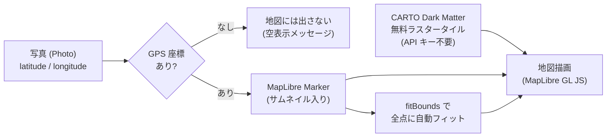

# ADR 005: 地図に MapLibre GL JS を採用（Google Maps ではなく）

- ステータス: 採用
- 日付: 2026-06-18

> **ADR とは**: Architecture Decision Record（アーキテクチャ決定記録）。「何を・なぜ選んだか」を後から読み返せるよう短く残すメモです。

> このドキュメントの記述は、実際のソースコード（`app/` ディレクトリ）と依存定義（`app/package.json`）を確認したうえで書いています。

---

## 背景 (Context)

kskphotos の差別化機能の 1 つが **地図ギャラリー**です。写真の EXIF（撮影時にカメラが埋め込むメタデータ）から GPS 座標を取り出し（抽出は `app/src/lib/exif.ts` が `exifr` の `gps` オプションで担当）、地図上に撮影地点をプロットします。地図描画は `app/src/components/gallery/photo-map.tsx` の `PhotoMap` コンポーネントで、座標を持つ写真だけを抽出してマーカーを並べます。

```ts
const withCoords = photos.filter(
  (p): p is Photo & { latitude: number; longitude: number } =>
    p.latitude != null && p.longitude != null
);
```

この機能を作るうえで、地図ライブラリ（地図を画面に描く部品）と地図タイル（地図の画像そのもの）をどう調達するかを決める必要がありました。kskphotos には次の制約・前提があります。

- **個人運営・低コスト前提**: インフラは Cloud Run の「スケール to ゼロ」（アクセスが無いとコンテナ数 0 まで縮む = 待機コストほぼゼロ）をはじめ、月額数ドル規模で抑える設計。地図のためだけに従量課金リスクを抱えたくない。
- **ポートフォリオ = 公開デモ**: 採用担当者など不特定多数が閲覧する。アクセス数が読めず、**従量課金が突発的に膨らむ事故（いわゆる課金事故）**を避けたい。
- **クライアント完全分離**: `photo-map.tsx` は `"use client"` のクライアントコンポーネント。地図描画に必要な認証情報（API キー）はブラウザに露出する性質があり、キーをそもそも持たない構成が望ましい。
- **ダークな世界観**: サイトは暗色基調（現像室＝セーフライトのモチーフ）。地図もダークテーマで統一したい。

つまり「**API キー不要・無料・従量課金なし**で、ダークテーマに馴染み、マーカー／ズーム／自動フィットといった基本機能を満たす」地図手段が必要でした。

---

## 決定 (Decision)

地図ライブラリに **MapLibre GL JS**（`maplibre-gl` v5.24.0）を採用し、地図タイルは **CARTO の Dark Matter ラスタータイル**（OpenStreetMap データ由来）を利用します。**Google Maps（および Google Maps JavaScript API）は採用しません。**

実際、`app/package.json` の依存に `maplibre-gl` は存在しますが、`@googlemaps/*` など Google Maps 由来のパッケージは一切含まれていません（コードベースを検索しても Google Maps の参照はありません）。

```json
"maplibre-gl": "^5.24.0",
```

---

## 理由 / 代替案との比較

### なぜ MapLibre + 無料タイルなのか

| 観点 | MapLibre GL JS + CARTO タイル（採用） | Google Maps JavaScript API（不採用） |
|------|------|------|
| ライセンス | **OSS（BSD-3-Clause）**。ベンダーロックインなし | プロプライエタリ（Google 提供） |
| API キー | **不要**。`photo-map.tsx` 内のタイル URL は公開エンドポイントを直書き | 必須。キー管理・リファラ制限の運用が発生 |
| 課金 | タイルは無料利用。**従量課金の概念がない**ため課金事故リスクが低い | 表示回数ベースの**従量課金**。無料枠超過で課金 |
| ブラウザへの露出 | キーが無いので**漏洩する秘密がない** | キーがクライアントに露出（仕様上）。制限設定が必須 |
| 機能・エコシステム | 基本機能は十分だが、経路・場所検索・ストリートビュー等は無い | 経路探索・Places・StreetView 等が**豊富** |
| ダークテーマ | CARTO Dark Matter で**標準対応** | スタイル設定で対応可（要設定） |

ポイントは「**この用途には Google Maps の強み（経路探索や場所検索）が要らない**」ことです。地図ギャラリーがやることは「点を置く・ズームする・全点が収まるよう寄る」だけで、`photo-map.tsx` の実装もまさにその 3 つに集約されています。

> このサイトの技術選定は「**両面のショーケース**」を意識しています。Next.js（App Router/RSC）によるフルスタック実装力と、GCP（Cloud Run / Terraform / GitHub OIDC デプロイ）のクラウド運用力です。地図ライブラリの選定でも、後者の「**従量課金・秘密情報を持ち込まない低コスト運用**」という方針を一貫させています。

### 実装が証明する「必要十分」

`photo-map.tsx` を読むと、無料タイル + MapLibre の標準 API だけで地図ギャラリーが成立していることが分かります。

**1. タイル（地図画像）— API キーなしの公開 URL を直書き**

CARTO の Dark Matter ラスタータイルを、負荷分散用のサブドメイン a/b/c と高解像度ディスプレイ向けの `@2x` で指定。OpenStreetMap と CARTO の帰属表示（attribution、データ提供元のクレジット）も併記しています。

```ts
const MAP_STYLE: maplibregl.StyleSpecification = {
  version: 8,
  sources: {
    carto: {
      type: "raster",
      tiles: [
        "https://a.basemaps.cartocdn.com/dark_all/{z}/{x}/{y}@2x.png",
        "https://b.basemaps.cartocdn.com/dark_all/{z}/{x}/{y}@2x.png",
        "https://c.basemaps.cartocdn.com/dark_all/{z}/{x}/{y}@2x.png",
      ],
      tileSize: 256,
      attribution:
        '&copy; <a href="https://www.openstreetmap.org/copyright">OpenStreetMap</a> contributors &copy; <a href="https://carto.com/attributions">CARTO</a>',
    },
  },
  layers: [{ id: "carto", type: "raster", source: "carto" }],
};
```

**2. マーカー — サムネイル入りのカスタム DOM 要素**

ピンの代わりに、写真サムネイルを丸く切り抜いた `<a>` 要素を MapLibre の `Marker` の中身に差し込み、クリックで写真詳細（`/gallery/[id]`）へ遷移させています。地点クリックでタイトル・撮影地を出す `Popup` も標準機能です。

```ts
const marker = new maplibregl.Marker({ element: el })
  .setLngLat([photo.longitude, photo.latitude])
  .setPopup(popup)
  .addTo(map);
```

**3. フィットバウンド — 全マーカーが収まるよう自動でズーム**

全写真の座標から矩形範囲（`LngLatBounds`）を作り、`fitBounds` で「全点が画面に収まる最小のズーム」へ寄せます。`maxZoom: 13` で寄りすぎを抑え、`padding: 80` で端に余白を確保しています。

```ts
const bounds = new maplibregl.LngLatBounds();
for (const p of withCoords) bounds.extend([p.longitude, p.latitude]);
map.fitBounds(bounds, { padding: 80, maxZoom: 13, duration: 0 });
```

ズームイン／アウトの操作 UI（`NavigationControl`）も標準コントロールで賄っています（方位コンパスは不要なため `showCompass: false` で非表示）。GPS 座標付きの写真が 1 枚も無いときは、地図上に「GPS 情報付きの写真がまだありません」というメッセージを出します。

### データの流れ



---

## 結果 (Consequences)

### 良い点

- **課金事故ゼロ設計**: 地図タイルは無料利用で従量課金の概念がないため、公開デモがバズってアクセスが急増しても地図起因の青天井な請求が発生しない。Cloud Run の低コスト方針と整合する。
- **秘密情報を持たない**: API キーが不要なので、クライアントコンポーネント（`"use client"`）にキーを埋め込む必要がなく、漏洩・制限設定運用の手間がない。環境変数の管理対象も増えない。
- **ベンダーロックインなし**: MapLibre は OSS。タイル提供元も差し替え可能で、特定ベンダーに縛られない。
- **世界観の統一**: CARTO Dark Matter により、設定の作り込みなしでサイトのダークテーマに馴染む地図が手に入る。
- **必要十分な実装の軽さ**: マーカー・ポップアップ・フィットバウンド・ズーム UI まで、標準 API だけで `photo-map.tsx` 1 ファイルに収まっている。

### トレードオフ / 注意点

- **機能・エコシステムは Google Maps より限定的**: 経路探索、場所名検索（Places）、ストリートビューといった Google の高機能は使えない。ただし地図ギャラリーの用途（点の表示・ズーム・自動フィット）には現状不要。
- **タイルは無料公共サービスへの依存**: CARTO の無料タイルは利用規約・帰属表示の遵守が前提で、提供条件は提供側の都合で変わり得る。コードでは OpenStreetMap / CARTO の attribution を必ず表示している。大量・高負荷の本格運用が必要になった段階で、有償プランや自前タイルホスティングへの移行を検討する余地がある。
- **ラスタータイル採用**: ベクタータイル（拡大しても滑らかで多言語・スタイル変更に強い）ではなくラスタータイル（画像）を使っているため、地図スタイルの動的な作り替えには向かない。ダークテーマ固定の現状要件では問題にならない。

---

## 補足: 既存ドキュメントとの整合

`docs/01-project-overview.md` には地図ライブラリを「Mapbox GL JS / Google Maps」と記す古い記述が残っていますが、実装・依存・本 ADR の決定は **MapLibre GL JS + CARTO 無料タイル**です（`docs/05-tech-stack-rationale.md` も MapLibre で統一済み）。本 ADR が現時点の正です。
